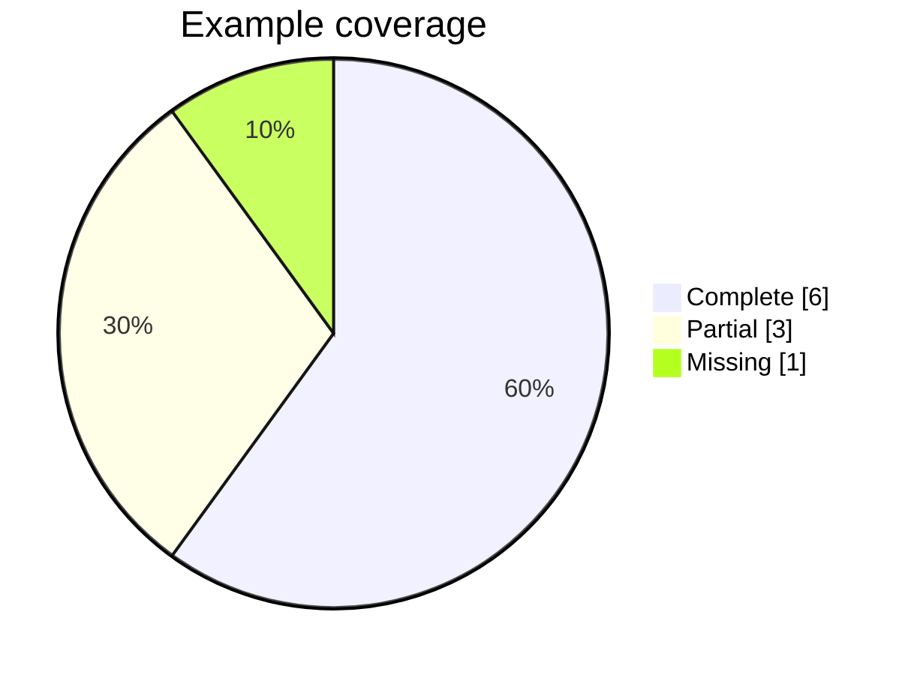

# Output Style — Readable Plan Outputs & Logs (added 2026-06-29)

Plan outputs (`docs/plans/**/output/**`, `output-review/**`) and session logs (`docs/progress/sessions/**`)
are read by humans first. Make them **scannable**: structured facts in tables, relationships/flows in
**charts**, at-a-glance status in glyphs, and heavy visuals as **saved artifacts**. This file is the
canonical convention; `log-format.md` and each plan README point here.

## Pick the right device

| Content | Use | Notes |
|---|---|---|
| Structured facts (fields, gates, criteria, counts) | **Table** | Default. One row per item. |
| A flow, graph, dependency, lifecycle, or sequence | **Mermaid chart** (text, renders in GitHub / VS Code / Obsidian) | Version-controllable; the fenced source stays readable even where it doesn't render. |
| A proportion / progress / distribution | **Mermaid `pie`**, or an inline progress bar | Keep to one idea. |
| At-a-glance status in a table cell or list | **Status glyph** | `✅ pass · ⚠️ debt · ❌ fail · ⛔ blocked · 🔔 PO action · ⏱ temp default · ◷ pending` |
| Screenshot / rendered PNG·SVG / large image | **Saved artifact** referenced from the doc | Store under `…/output/evidence/` (plan) per `core.md §32` — **never the repo root**; reference relatively (`evidence/01-x.png`). |

## Mermaid rules (so charts stay readable, not decorative)

- Fence with ```` ```mermaid ````. One diagram = one idea.
- **≤ ~12 nodes per diagram.** More than that → split into overview + detail, or use a table.
- Prefer `flowchart LR/TD`, `stateDiagram-v2`, `sequenceDiagram`, `pie`, `gantt`.
- Label edges when the relationship isn't obvious (`-->|derives-from|`).
- Encode status with a tiny class/style set + a one-line legend; don't rely on color alone (add a glyph).
- A chart must **carry information a sentence wouldn't carry better.** No ornamental diagrams.

### Status styling pattern (reuse this)

Legend: ✅ done · 🔵 active · ⛔ gated (PO) · ◷ pending.

### Proportion example


## In-chat vs in-repo

- **In repo docs** (plan outputs, reviews, logs): use **Mermaid + tables + glyphs + saved artifacts** — these persist and render for any reader.
- **In a chat reply to the PO**: the visual tool may render an inline SVG/chart for the moment; if that visual should persist, also add a Mermaid/table version (or a saved artifact) to the doc.

## Proportionality
Match the device to the payload. A two-row fact set is a table, not a chart. Don't add a diagram per
section. Readability comes from **fewer, well-chosen** visuals — not more.
