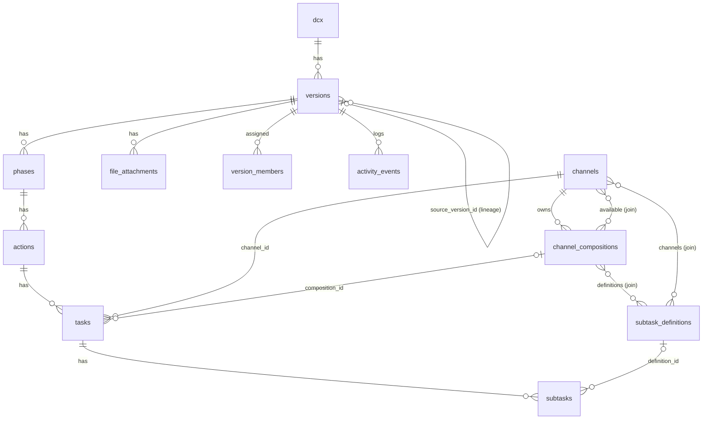

# Proposed Schema — ERD (BE3-R2)

Derived from `src/types/api.ts`. Diagram companion to [`schema.sql`](./schema.sql). Proposal only — never
applied (D-BE3-NO-APPLY).

## Entity → table map (parity with plan §4)

| `Api*` type | Table | Notes |
|---|---|---|
| `ApiDCX` | `dcx` | root; `client_id` → future workspace/client (BE3-R3) |
| `ApiVersion` | `versions` | FK `dcx_id`; self-FK `source_version_id`; enums `status`, `source_type` |
| `ApiPhase` | `phases` | FK `version_id`; enum `icon` |
| `ApiAction` | `actions` | FK `phase_id` |
| `ApiTask` | `tasks` | FK `action_id`, `channel_id`, `composition_id?`; jsonb `date`, `specs_state`, `missing_data_state` |
| `ApiSubtask` | `subtasks` | FK `task_id`, `definition_id?` |
| `ApiChannel` | `channels` | M:N to compositions (availability) |
| `ApiChannelComposition` | `channel_compositions` | FK `channel_id`; M:N to definitions |
| `ApiSubtaskDefinition` | `subtask_definitions` | M:N to channels |
| `ApiFileAttachment` | `file_attachments` | FK `version_id`; enum `source` |
| `ApiAssignedMember` | `version_members` | join (`version_id`,`user_id`) |
| `ApiActivityEvent` | `activity_events` | FK `version_id`; enum `type` |
| `ApiBuilderTree` | *(view / composite read)* | version + phases tree — **not a table** |

Join tables (M:N): `channel_available_compositions`, `composition_definitions`, `subtask_definition_channels`.

## Relationship diagram

## Enums (5)

| Enum type | Values | Source |
|---|---|---|
| `version_status` | Draft · In Progress · Ready for Approval · Approved · Superseded | `VersionStatus` |
| `version_source_type` | scratch · duplicate · import · template | `VersionSourceType` |
| `lifecycle_event_type` | version_created · in_progress_started · ready_submitted · approved · superseded · duplicated · import_applied | `LifecycleEventType` |
| `phase_icon_type` | awareness · teaser · launch · scale · maintenance | `ApiPhaseIconType` |
| `file_source` | google-drive · link | `ApiFileAttachment.source` |

**Table count:** 15 (12 entity tables + 3 M:N joins). `ApiBuilderTree` is a composite read, not a table.
