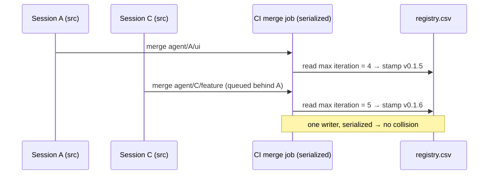
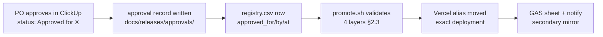

# Plan: CI/CD & Release Governance — EXECUTABLE PLAN (Path 1)

> **Status: ACTIVE (PO-activated 2026-07-01).** The Codex final-approval re-audit
> `audit/2026-07-01-codex.md` returned **READY** (0 blocking, 4 advisory). Per PO instruction
> ("codex marked the plan as ready, move it to active"), this plan moved from `docs/plans/drafted/` to
> `docs/plans/active/` on 2026-07-01. Execution proceeds **one sprint at a time, in dependency order**
> (`RG-R0a → RG-R0b → RG-R1 → RG-R2 → RG-R3 → RG-R4 → RG-R5/RG-R6 → RG-R7 → RG-R8`), with a session log
> and carry-forward update after each sprint before the next begins.
>
> **Activation preconditions (PO-owned):**
> 1. **`no .git` blocker** — PO has **approved git/GitHub setup** under a no-`src/**` boundary (see
>    *Decisions* below, D-RG-GIT); the actual init/connect is RG-R0b (execution step).
> 2. ✅ **Requirement intake DONE (2026-06-30)** — 19 `REQ-RG-*` nodes are **canonical, approved, and
>    PO-locked** in the graph (ledger `LDG-2026-06-30-create-node-REQ-RG-*`; sign-off
>    `PO-2026-06-30-RG-INTAKE-SIGNOFF`). Every sprint trace now cites real graph IDs. OD-RG-07 closed.
> 3. ✅ §9.2 open decisions resolved (OD-RG-01..09 — see §3.2a + §9.2).
>
> **Remaining to executable-READY:** a confirming re-audit (the 3 NEEDS-REVISION blockers are now all
> resolved). Then PO activates.
>
> **No source-code (`src/**`) changes occur in any RG sprint.** Governance/setup work (git, `.github/**`,
> docs, release tooling/config, external connections) is allowed per D-RG-GIT; product source is untouched
> until the PO explicitly starts implementation outside this plan.

## Purpose

Introduce the **simplest** mechanically-enforced release workflow that satisfies four PO requirements:

1. Every source-code change automatically gets a **preview/test deployment**.
2. PO-approved builds are promoted to a **stable staging URL** — the *exact same build*, not a rebuild.
3. PO-approved builds are promoted to the **production URL** — again the exact same build.
4. **Nothing is ever promoted without explicit PO approval.**

Plus a **4-part versioning scheme** with split ownership, a **CSV release registry** as the operational
record, and a **parallel-session safety model** so multiple agents/devs never collide on version numbers,
logs, previews, or promotions.

**Design bias (PO-stated):** prefer *mechanical enforcement* (GitHub rules, Vercel behavior, env
separation, CSV registry, approval records, automated checks) over *AI prompt discipline*. Every rule
below has a mechanical owner; markdown instructions are the fallback, not the control.

---

## Deliverable index

| # | Deliverable | Section |
|---|---|---|
| 1 | Current gap summary | [§1](#1-current-gap-summary) |
| 2 | Proposed release architecture | [§2](#2-proposed-release-architecture) |
| 3 | Versioning and log model | [§3](#3-versioning-and-log-model) |
| 4 | Parallel-session safety model | [§4](#4-parallel-session-safety-model) |
| 5 | GitHub/Vercel/Supabase/ClickUp/GAS responsibilities | [§5](#5-platform-responsibilities) |
| 6 | Required documentation and CSV updates | [§6](#6-required-documentation--csv-updates) |
| 7 | Sprint-level incorporation plan | [§7](#7-sprint-level-incorporation-plan) |
| 8 | Requirement traceability matrix | [§8](#8-requirement-traceability-matrix) |
| 9 | Risks and open decisions | [§9](#9-risks-and-open-decisions) |

---

## Decisions (PO-recorded)

These are **decided** — not open. Open items live in §9.2.

| ID | Decision | Recorded | Boundary / detail |
|---|---|---|---|
| **D-RG-PATH** | Lock architecture now; build deferred until after active polish (G1); this is an executable plan but stays in `drafted/` until PO activates | 2026-06-30 | — |
| **D-RG-GIT** | **git/GitHub setup is approved** as governance/setup work | 2026-06-30 (PO: "we start using git as long as no src code changes unless I start implementing the plan") | May create repo metadata, `.github/**`, docs, release tooling/config, and external connections. **Must NOT change `src/**`** until the PO explicitly starts implementation. RG-R0b executes within this boundary. |
| **D-RG-VER** | 4-part `Major.Stage.Iteration.Revision`; bootstrap **`v0.3.5.0`** (carry `v0.3.5` as-is); manual "version 0"; automation only after GitHub setup; no jump to v0.4 | 2026-06-30 | OD-RG-01; see §3.2a |
| **D-RG-DOMAIN** | All envs hang off `dotment.com` (no new domain): production **`dcx.dotment.com`**, staging **`staging.dcx.dotment.com`** (DNS CNAME → Vercel, manual-promote aliases), previews use auto **`*.vercel.app`** immutable URLs | 2026-06-30 | Branded `*.preview.*` wildcard + deployment protection need Vercel Pro — verified in RG-R4 |
| **D-RG-ENV** | Supabase: **separate project for production** (hard isolation); preview branches for preview/staging (OD-RG-05) | 2026-06-30 | Chosen to make prod-data exposure structurally impossible (the one fatal-class decision) |

## Carry-forward contract — current structural state (`core.md §27`)

Single source of forward truth for this plan. **Every sprint's Step 0 reads this; every sprint's final
step updates it.** A sprint is not closeable until its carry-forward update is written.

### Canonical homes (reuse — never recreate)
| Concern | Canonical home (created by) | Reuse rule |
|---|---|---|
| Release operational record | `docs/releases/registry.csv` (RG-R2) | append-only; one writer `append-release-row.sh`; corrections = superseding row |
| Approval artifacts | `docs/releases/approvals/<version>-<env>.md` (RG-R2) | the promotion gate artifact; never edited after sign-off |
| Source vs non-source classifier | `scripts/release/classify-change.sh` (RG-R2) | path-set is source of truth, not the `Type:` label |
| Version stamping | CI merge job (RG-R3) | serialized; agents never hand-pick Iteration/Revision |
| Promotion | `scripts/release/promote.sh` (RG-R4) | the only path that moves a stable alias; enforces §2.3 |
| Version semantics | `docs/VERSION.md`, `core.md §26` (RG-R1) | 4-part split ownership; PO owns Major.Stage |
| Log version fields | `log-format.md §0` + `build-log-index.sh` (RG-R1) | additive `Version:` / `Change-Class:`; old logs untouched |

### Facts each sprint leaves behind
_To be appended by each sprint as it closes (RG-R0a first). At drafting time: nothing built yet — the
repo has no `.git`, no `docs/releases/`, no `scripts/release/`, no `.github/`, no `vercel.json`._

**RG-R0a (2026-07-01, Completed)** — capability report: `output/RG-R0a-capability-report.md`.
- Confirmed: no `.git`, no `docs/releases/`, no `scripts/release/`, no `vercel.json`, no `CODEOWNERS`,
  `gh` CLI not installed.
- **Correction to the drafting-time assumption above:** `.github/workflows/ci.yml` and
  `.github/workflows/req-validate-on-graph-change.yml` already exist (pre-date git). They are orphaned
  config with no `.git` to drive them yet. RG-R0b (init) and RG-R3 (wire/validate CI gates) must read and
  reconcile these existing files rather than assuming a blank slate.
- Vercel, Supabase, and ClickUp MCP servers are connected **in this session**, but no live project
  linkage was verified (out of RG-R0a's audit-only scope) — verify live in RG-R4 / RG-R5 / RG-R6
  respectively.
- No GAS endpoint is configured anywhere in `docs/` outside this plan's own references — confirmed
  non-blocking per RG-R6 design (secondary sink only).
- Full gap → sprint map in the report §7.

**RG-R0b (2026-07-01, Partial — PO-credentialed steps pending)** — runbook + evidence:
`output/RG-R0b-setup-runbook.md`.
- `.git` now exists. First commit `648dbf6` ("chore: initial commit — bootstrap v0.3.5.0 baseline
  (RG-R0b)"), follow-up evidence commit `e9f005d`. On branch `main`.
- Pre-commit secret scan (FATAL gate) ran clean before the first commit — see runbook Step 2a. `gitleaks`
  not installed; grep-based scan + manual review used as the recorded fallback (core.md §28).
- `.gitignore` written (repo root) — anchored (`/output/`, `/tmp/`, etc.) so it does NOT swallow
  `docs/plans/**/output/` plan deliverables, which the unanchored sprint-spec pattern would have.
- Local branches `staging` and `integration` created alongside `main` (OD-RG-08: `integration`
  confirmed). Not yet pushed — no remote exists.
- **Still BLOCKED on PO credentials/account access** (not agent-executable): GitHub repo creation +
  remote + push, Vercel project link + domains (`dcx.dotment.com`, `staging.dcx.dotment.com`), and
  adding platform secrets. `gh` CLI is not installed in this environment. See runbook "Steps NOT executed"
  table for the exact PO actions needed.
- `src/**` unchanged (shasum diff empty); existing source was committed as-is, not edited.

### Retained by policy (intentionally NOT changed)
- `src/**` — untouched by every RG sprint (D-RG-GIT).
- Existing historical logs — never rewritten; `Version:` is additive (§3.4).
- The active `frontend-polish-implementation-v0.3.5` plan — runs in parallel, no contention.

---

## 1. Current gap summary

What exists today, and what is missing for any CI/CD + release governance to work.

| Area | Current state (verified 2026-06-30) | Gap |
|---|---|---|
| **Version control** | The working copy is **not a git repository** — no `.git` directory. No commits, no branches, no remote wired locally. | **Blocker.** CI/CD, branch protection, preview-per-commit, and merge-time version assignment all require the project to live in git/GitHub. PO-owned setup (RG-R0b); gates RG-R3. |
| **CI pipeline** | No `.github/workflows/`. Gates (`typecheck`, `lint`, `verify.sh`, `validate:architecture`, `test`, `req:validate`) run **only manually** by agents. | No automated gate-on-change; nothing blocks a bad merge or stamps a version mechanically. |
| **Deployments** | No `vercel.json`, no recorded Vercel project link, no preview/staging/prod mapping in-repo. A Vercel integration is configured for the workspace but is **not confirmed in the current tool snapshot** (`build-current-state.sh` lists eslint/shadcn/playwright operational) — capability must be **verified in RG-R4**. | No preview-per-change, no promotion path, no build→URL record. |
| **Versioning** | 3-part `vMajor.Minor.Patch` (`v0.3.5`), **PO-only** (`VERSION.md`, `core.md §26`, `scripts/version-bump.sh` patch/minor). | Cannot express preview vs staging vs production builds, has no per-build/per-iteration number, and forbids the agent-controlled increments the new scheme requires. |
| **Build → environment identity** | None. Nothing records "build X is at preview URL Y / staging / prod." | No way to promote *the exact build* or to audit what shipped where. |
| **Bookkeeping** | Log-centric: markdown session logs → `scripts/build-log-index.sh` → `docs/progress/index.csv`; PO actions → `build-po-actions.sh` → `po-actions.md`. | No **release registry**, no approval record, no preview/staging/prod link map. The pattern exists and should be reused — only the release dataset is missing. |
| **Approval** | Undefined and manual. Nothing mechanically prevents an accidental promotion. | No recorded, tamper-evident PO approval gate. |
| **Concurrency** | Docs/logs handled: session folders (`§31`), carry-forward contract (`§27`), per-agent log ownership (`§29a`). | No model for parallel **branches**, **version reservation**, **preview-link mapping**, or **promotion eligibility**. Two sessions could both claim the "next Iteration." |
| **Source vs non-source signal** | Already exists mechanically: the "**no writes under `src/`**" gate (`core.md §19/§28`) and the `Type:` log field (`user-request-code` vs `user-request-planning`). | Not yet wired to versioning or previews. This is the lever the 4-part scheme reuses. |
| **GAS** | Endpoints exist; **no MCP**. | Usable as a record sink / env guard, but cannot be an authority or be driven by MCP tooling. |

**One-line gap:** the integrations (GitHub/Vercel/Supabase/ClickUp/GAS) are connected, but **nothing is
wired to source changes**, there is **no git repo locally**, and the **version scheme cannot express
environments or per-build identity**.

---

## 2. Proposed release architecture

### 2.1 The four states and the single automatic step


- **Only the preview step is automatic.** Push to any working branch → Vercel builds an **immutable
  deployment** with a unique URL (keyed by commit SHA + Vercel deployment ID).
- **Staging and Production are promotions of that *exact* immutable deployment** — Vercel re-points the
  stable alias at an already-built deployment. **No rebuild.** This is what guarantees "that exact build
  is promoted."
- Each promotion is **gated by a recorded PO approval** (see §2.3). Absent an approval row, the promotion
  script refuses and the stable aliases never move.

### 2.2 Two candidate Vercel patterns (recommend **A**)

| | **A — Promote an exact deployment (RECOMMENDED)** | B — Git-branch-per-environment |
|---|---|---|
| Mechanism | Staging/Prod are **aliases** re-pointed at a specific already-built deployment ID | `staging`/`main` branches are Vercel "production" branches that rebuild on merge |
| "Exact build" guarantee | **Yes** — same artifact promoted | **No** — each environment rebuilds from source (build can drift) |
| Approval point | Promotion = an alias action gated by an approval record | Merge to the branch (PR approval) |
| Matches PO requirement | "that exact build should be promoted" → **A is required** | Weaker |
| Cost/complexity | Slightly more tooling (a `promote` step) | Native Vercel, simpler, but violates exact-build |

**Recommendation: Pattern A.** The PO explicitly requires the *exact build* to be promoted; only
promotion-of-a-deployment delivers that. Pattern B is documented as the fallback if Vercel plan limits
block aliasing on the chosen tier (verify in RG-R4).

### 2.3 The promotion gate (mechanical, layered)

A build is promotable only when **all** of these hold — each has a mechanical owner:

| Layer | Owner | Check |
|---|---|---|
| Build is verified | GitHub Actions | required status checks green (typecheck, lint, verify.sh, validate:architecture, req:validate) |
| Build is merged to integration | GitHub branch protection | the deployment's commit is on the integration branch |
| Release row exists & is `verified` | `validate-release-registry.sh` | the registry row for this build is present and not `failed` |
| **PO approval recorded** | approval record + ClickUp status | a signed approval row exists for the target environment |
| Promotion executed | `promote.sh` → Vercel alias | refuses to run unless the four rows above are satisfied |

**No single human prompt can promote.** Promotion requires the recorded approval artifact; the script is
the only path that moves the alias, and it reads the artifact, not a chat instruction.

### 2.4 Branch ↔ environment mapping

| Branch pattern | Builds | Auto-deploy | Stable alias |
|---|---|---|---|
| `agent/<session>/<topic>`, `feature/*` | yes | Preview (per commit) | none |
| `integration` (or `develop`) | yes | Preview | none (candidates pool) |
| `staging` | yes (Pattern B) / alias-only (Pattern A) | — | **staging URL**, moved only on approval |
| `main` | yes | — | **production URL**, moved only on approval |

---

## 3. Versioning and log model

### 3.1 The scheme — `vMajor.Stage.Iteration.Revision`

Example: `v0.1.4.2`.

| Field | Meaning | Owner | Increments when |
|---|---|---|---|
| **Major** | Production version | **PO only** | a build is promoted to Production |
| **Stage** | Staging version | **PO only** | a build is promoted to Staging |
| **Iteration** | Source-code implementation version | code workflow / agents / devs (mechanical) | a **source** change lands (creates a preview) |
| **Revision** | Non-source planning/docs/testing/governance/bookkeeping | agents / devs (mechanical) | a **non-source** change lands (no preview) |

This **changes `core.md §26`** ("agents never change the version"). New rule: **PO owns the first two
numbers; the system/agents own the last two, under the mechanical rules below.** §26 is rewritten in
RG-R1, not silently overridden.

### 3.2 Increment & reset rules

| Event | Major | Stage | Iteration | Revision | Preview? |
|---|---|---|---|---|---|
| Source-code change lands | — | — | **+1** | **→ 0** (recommended; see OD-RG-02) | **Yes** |
| Non-source change lands | — | — | — | **+1** | **No** |
| Promote to **Staging** | — | **+1** | **→ 0** | **→ 0** | (promotes existing build) |
| Promote to **Production** | **+1** | **→ 0** | **→ 0** | **→ 0** | (promotes existing build) |

> **OD-RG-02 (open):** does an Iteration bump reset Revision to 0? Recommended **yes** — Revision counts
> non-source changes *since the last code change*, so a new Iteration restarts it. Flagged for PO
> confirmation in §9.

### 3.2a Migration & bootstrap — `v0.3.5` → `v0.3.5.0` (PO-DECIDED 2026-06-30)

The system **stays in the `v0.3.x` line** — there is **no jump to `v0.4`**. The existing 3-part version is
carried **as-is** into the 4-part scheme:

| Old (3-part) | → | New (4-part) | Mapping |
|---|---|---|---|
| `v0.3.5` | → | **`v0.3.5.0`** | Major `0` · Stage `3` (old Minor) · Iteration `5` (old Patch, carried) · Revision `0` |

**Go-live sequence (PO-decided):**

1. **First deployment = "version 0" — set MANUALLY.** At go-live the PO stamps `v0.3.5.0` by hand,
   inheriting the existing version unchanged. No automation runs yet.
2. **Automation triggers only AFTER GitHub is set up** (RG-R0b → RG-R3). From that point the mechanical
   rules in §3.2 apply: next source change → Iteration `5 → 6` (`v0.3.6.0`) **with a preview**; next
   non-source change → Revision `+1` (`v0.3.5.1`, no preview).
3. PO continues to own promotions: a Staging promotion bumps **Stage** and resets Iteration/Revision; a
   Production promotion bumps **Major** and resets the rest.

This makes the **manual bootstrap** the bridge: existing version in by hand, then the counters take over
once the GitHub wiring exists — never the other way around.

### 3.3 Source vs non-source — decided **mechanically**, not by trust

The classifier reuses infrastructure that already exists (`core.md §19/§28` "no writes under `src/`"):

```
A change is SOURCE  ⟺ the diff touches any of:
    src/**, index.html, vite.config.ts, tsconfig*.json, package.json,
    package-lock.json, components.json, eslint.config.js, .dependency-cruiser.cjs
A change is NON-SOURCE ⟺ the diff touches ONLY:
    docs/**, *.md, scripts/**, semgrep/**, .storybook/**, test fixtures, agent config
```

- A proposed `scripts/release/classify-change.sh` runs on the branch diff and emits `source` |
  `non-source`. **The path set, not the human `Type:` label, is the source of truth** — the `Type:` field
  (`user-request-code` vs `user-request-planning`) is the human-readable mirror and must agree (a mismatch
  is a validation warning).
- Source → Iteration bump + preview. Non-source → Revision bump + **no preview** (CI skips the deploy).
- Final field boundaries are confirmed in RG-R1 (OD-RG-03).

### 3.4 How versions appear in logs

Add **one field** to the identity block in `docs/agent-rules/log-format.md §0`:

```
Version: v0.1.4.2      # the 4-part version this entry's work belongs to (— if pre-governance)
Change-Class: source | non-source   # mechanical classifier result for this entry's diff
```

- Additive and backward-compatible: existing logs have **no** `Version:` field and are left untouched —
  they are pre-governance and render as `—`. **No historical log is rewritten.**
- `scripts/build-log-index.sh` gains a `version` and `change_class` column in `docs/progress/index.csv`
  (additive columns; old rows get empty values). The index builder is the only writer, as today.

### 3.5 Markdown stays documentation; CSV becomes the operational record

This mirrors the **already-established** pattern (`md logs → index.csv`):

| Layer | Role | Authority |
|---|---|---|
| Markdown (session logs, plan READMEs, decision docs) | Human narrative — *why*, context, findings | Documentation |
| **`docs/releases/registry.csv`** | Machine record — *what* shipped, *where*, *when*, approved by *whom* | **Operational record of record** (queryable, diff-able, conflict-detecting) |

The registry is the operational truth for releases the way `index.csv` is for sessions. Markdown links to
it; agents and CI query it; it is the artifact that gates promotion.

### 3.6 The release registry schema (`docs/releases/registry.csv`)

One row per build/version event. Append-only; one writer script.

```
version, change_class, commit_sha, branch, session_folder, clickup_task,
deployment_id, preview_url, staging_url, production_url,
status, approved_for, approved_by, approved_at, gates, notes
```

| Column | Meaning |
|---|---|
| `version` | 4-part version this row stamps |
| `change_class` | `source` / `non-source` (classifier) |
| `commit_sha` | exact commit (immutable build identity) |
| `branch` / `session_folder` | provenance — ties to the owning session (§4) |
| `clickup_task` | linked ClickUp release task id |
| `deployment_id` | Vercel deployment id (the promotable artifact) |
| `preview_url` / `staging_url` / `production_url` | link map; staging/prod filled only on approval |
| `status` | `reserved` → `building` → `verified` → `failed` → `promoted-staging` → `promoted-prod` |
| `approved_for` / `approved_by` / `approved_at` | the recorded PO approval (the gate) |
| `gates` | `typecheck=PASS;lint=PASS;…` snapshot |
| `notes` | free text / related work |

Each future **log entry links to its registry row by `version`**, so a four-part version is the join key
between human logs and the operational record.

---

## 4. Parallel-session safety model

Goal: with Session A (UI source), Session B (docs/planning), Session C (another implementation branch)
running at once — **no version conflicts, broken logs, overwritten records, accidental promotions, or
preview confusion.** Built on the existing session-identity primitives (`§31`, `§27`, `§29a`).

### 4.1 The seven concurrency controls

| Concern | Mechanism | Mechanical detector |
|---|---|---|
| **Branch naming** | One branch per session folder: `agent/<session-folder>/<topic>` (e.g. `agent/2026-06-30-claude-02/cicd-governance`). Doc-only sessions: `docs/<session-folder>/<topic>`. Ties git identity to the existing §31 session identity. | branch-name lint in CI; one active branch per session |
| **Version assignment** | **Iteration/Revision numbers are assigned at *merge time by CI*, not claimed up front** (recommended — see §4.2). During work, previews are keyed by commit SHA, so no number is needed yet. | merge job computes `max(registry.version)+1` atomically in one job; serialized by the merge queue |
| **Log ownership** | Each session owns its **own** session folder and branch; no cross-writing (existing `§29a`). | path check — a log under another session's folder fails review |
| **Preview-link mapping** | Each preview is keyed by `commit_sha → deployment_id → preview_url → branch → session` in the registry. One commit = one preview = one row. | no two rows share a `commit_sha`; preview URL is never ambiguous |
| **Conflict detection** | The registry is a **single CSV under git**. Two sessions stamping the same version = a **git merge conflict on that line**. Plus `validate-release-registry.sh`: no duplicate `version`, no two `verified`/`approved` rows for the same env at different builds. | git merge conflict + validator (CI required check) |
| **Promotion eligibility** | A build is promotable only if its row is `verified`, its commit is on `integration`, **and** an approval row exists (§2.3). | `promote.sh` refuses otherwise; CI enforces |
| **Two sessions, same next number** | With **CI merge-time assignment**, the number is stamped by a single serialized job — collisions are impossible. **Fallback without CI:** an explicit reservation row claimed via `claim-version.sh` (optimistic; first commit wins, loser re-claims; the conflict is a visible git conflict). | merge queue serialization (preferred) / git conflict on `reservations.csv` (fallback) |

### 4.2 Why assign-at-merge beats reserve-up-front



- **Preferred (once GitHub Actions exists):** numbers assigned by the merge job. Stale reservations are
  impossible; no agent needs to "know" the next number — the system stamps it. This is the **seed for
  agent collaboration**: a mechanical coordination substrate that does not depend on markdown or token
  memory.
- **Fallback (pre-CI / local):** `claim-version.sh` appends a `reserved` row; the shared CSV makes a
  double-claim a git conflict. Works without CI but can leave stale reservations (a janitor check expires
  them).

### 4.3 What each session can and cannot do

| | Session A (src) | Session B (docs) | Session C (src) |
|---|---|---|---|
| Branch | `agent/A/ui` | `docs/B/planning` | `agent/C/feature` |
| Version effect | Iteration (preview) | Revision (no preview) | Iteration (preview) |
| Owns | its folder + branch + preview rows | its folder + branch | its folder + branch + preview rows |
| Can promote? | **No** — only the PO-approval path can | No | No |
| Collision risk | resolved at merge (serialized) | none (non-source, different paths) | resolved at merge (serialized) |

**Accidental promotion is structurally impossible:** no session branch maps to a stable alias, and the
only path that moves an alias (`promote.sh`) requires a recorded approval it cannot fabricate.

---

## 5. Platform responsibilities

Each platform owns a mechanical control. Markdown/AI discipline is never the primary control.

| Platform | Owns (mechanical control) | Specific responsibilities | Notes / gaps |
|---|---|---|---|
| **GitHub** | Source of truth + gates + version stamping | Repo + branches; **branch protection** on `integration`/`staging`/`main`; **required status checks** (typecheck, lint, verify.sh, validate:architecture, req:validate, registry-validate); PR-based merges; **CODEOWNERS = PO** on `docs/VERSION.md`, `docs/releases/**`, promotion config; **Actions**: classify-change, assign Iteration/Revision, append registry row, trigger preview | **Blocker:** repo is not in git locally — **RG-R0b (PO-owned)** must init + connect first |
| **Vercel** | Preview-per-commit + exact-build promotion | Auto preview on every branch commit; **staging/prod as manual-promotion aliases** of an exact deployment (Pattern A); **deployment protection** on prod; **per-environment env vars** (preview/staging/prod scoped) | Verify plan tier supports aliasing/promotion + protection (RG-R4) |
| **Supabase** | Environment data separation | Separate **preview/staging/prod** data (preview branches or separate projects); migrations gated — **prod migrations only on a production-approved release**; previews never point at prod data; scoped keys per Vercel environment | Decide branches-vs-projects (cost) — OD-RG-05 |
| **ClickUp** | Approval mirror + human-visible release board | One **release task per version**; approval recorded as **status/custom field** ("Approved for Staging/Prod"); registry mirrored into the task; promotion script reads ClickUp approved-state as one approval layer | Decide canonical authority: **git registry canonical, ClickUp mirror** (recommended, OD-RG-06) |
| **GAS** (no MCP) | Secondary record sink / env guard | Existing endpoints used to **log releases to a sheet** and/or **validate env separation**; a notification/audit mirror — **never an authority** | No MCP → driven via HTTP from CI, not from agent MCP tools |

**Approval flow across platforms:**



---

## 6. Required documentation & CSV updates

Nothing here is created yet — this lists what RG sprints will add/change. **No source files. No rewrite of
historical logs.**

### New artifacts
| Path | Purpose |
|---|---|
| `docs/releases/README.md` | How the release system works; how to read the registry; promotion runbook |
| `docs/releases/registry.csv` | **Operational record** (schema §3.6); appended by one script |
| `docs/releases/approvals/<version>-<env>.md` | Tamper-evident PO approval records (the gate artifact) |
| `docs/releases/reservations.csv` | Fallback version-claim ledger (only if CI assign-at-merge isn't used) |
| `.github/workflows/*.yml` | CI: gates, classify-change, version-assign, registry-append, preview trigger |
| `vercel.json` | Vercel project/env/promotion config |
| `scripts/release/classify-change.sh` | source vs non-source from branch diff |
| `scripts/release/append-release-row.sh` | **append-only** writer — adds a new registry row; never edits existing rows (mirrors `build-log-index.sh`). Corrections are a **superseding row**, not an in-place edit |
| `scripts/release/build-release-views.sh` | regenerates derived/summary views from the registry (disposable, like generated requirement views) |
| `scripts/release/validate-release-registry.sh` | CI check: no dup versions, no conflicting env approvals |
| `scripts/release/promote.sh` | the only path that moves a stable alias; enforces §2.3 |
| `scripts/release/claim-version.sh` | fallback reservation claim |

### Edits to existing docs (governance changes — `Type: process-governance`)
| File | Change |
|---|---|
| `docs/VERSION.md` | Extend to **4-part** scheme; document split ownership; supersede 3-part semantics; add migration note (`v0.3.5` → `v0.3.5.0`, carry as-is, manual bootstrap — §3.2a) |
| `docs/agent-rules/core.md §26` | Rewrite: PO owns Major.Stage; system/agents own Iteration.Revision under the §3.2 rules |
| `docs/agent-rules/core.md` (new §) | Add a **Release Governance** section pointing to this system + the promotion gate |
| `docs/agent-rules/log-format.md §0` | Add `Version:` + `Change-Class:` fields (additive) |
| `scripts/build-log-index.sh` | Add `version`, `change_class` columns to `index.csv` (additive) |
| `scripts/version-bump.sh` | Rewrite for 4-part, or **retire** in favor of mechanical assignment (OD-RG-04) |
| `AGENTS.md` / `CLAUDE.md` | Add pointers to `docs/releases/` and the promotion runbook |

---

## 7. Sprint-level incorporation plan

**Non-disruption guarantee:** this plan touches `docs/`, new `scripts/release/**`, and external config
**only**. It **never writes under `src/`**, so it runs in parallel with the active
`frontend-polish-implementation-v0.3.5` plan (which works on `src/`) without contention. The only
intersections are (a) frontend-polish logs begin carrying 4-part `Version:` once RG-R1 lands, and (b)
preview deploys begin covering frontend-polish branches once RG-R3/R4 land. Both are additive.

Each sprint below has a full file in `sprints/RG-*.md` with Requirement Trace, Step 0, exact commands,
output schema, acceptance criteria, gates, fallbacks, and a carry-forward close step.

| Sprint | Title | Executor (skill/tool) | Scope (allowed writes) | Depends on | Disrupts polish? |
|---|---|---|---|---|---|
| **[RG-R0a](sprints/RG-R0a.md)** | Discovery & capability report (audit-only) | any agent | `output/RG-R0a-*.md` only | — | No (audit) |
| **[RG-R0b](sprints/RG-R0b.md)** | Repo + integration setup (**PO-owned**; agent writes checklist) | PO executes; agent (any) writes the runbook | repo metadata, `.github/` scaffolding, `output/`; **no `src/**`** (D-RG-GIT) | RG-R0a | No — PO action; gates RG-R3 |
| **[RG-R1](sprints/RG-R1.md)** | Versioning model + rule changes | Claude/Codex/opencode | `docs/VERSION.md`, `core.md §26`+new §, `log-format.md §0`, `scripts/build-log-index.sh`, README decision register | RG-R0a | No (docs) |
| **[RG-R2](sprints/RG-R2.md)** | Release registry + scripts | Claude/Codex/opencode | `docs/releases/**`, `scripts/release/{classify-change,append-release-row,build-release-views,validate-release-registry,claim-version}.sh` | RG-R1 | No (docs/tooling) |
| **[RG-R3](sprints/RG-R3.md)** | GitHub CI wiring | Claude/opencode (browser for checks) | `.github/workflows/**`, `CODEOWNERS`, branch protection (PO-applied) | RG-R0b (git), RG-R2 | No (config) |
| **[RG-R4](sprints/RG-R4.md)** | Vercel preview/promote wiring | Claude/opencode (Vercel + browser) | `vercel.json`, env scoping, `scripts/release/promote.sh` | RG-R3 | No (config) |
| **[RG-R5](sprints/RG-R5.md)** | Supabase env separation | Claude/Codex/opencode (Supabase) | env/key scoping config; migration gating | RG-R4 | No (config) |
| **[RG-R6](sprints/RG-R6.md)** | ClickUp release board + GAS sink | Claude/Codex/opencode (ClickUp) | ClickUp release list/fields; GAS endpoint config; mirror script | RG-R4 | No (config) |
| **[RG-R7](sprints/RG-R7.md)** | Concurrency enforcement + dogfood | Claude/opencode (browser for live proof) | `scripts/release/*` (branch lint, conflict validation); dogfood evidence | RG-R3..R6 | No |
| **[RG-R8](sprints/RG-R8.md)** | **First-production bootstrap** (one-time) | Claude/opencode + PO approval | seed `v0.3.5.0` registry row; bind existing build; record PO approval; set prod alias once | RG-R4, RG-R7 | No |

**Sequencing vs the active plan:** once this brief is converted to Path 1 (done) and the PO activates,
RG-R0a/RG-R1/RG-R2 (docs + tooling) can run **without touching `src/**`**. RG-R3+ require RG-R0b
(PO-owned git/GitHub init) and should be scheduled at a polish-sprint checkpoint so branch cutover is clean.

**Requirement grounding (`core.md §35a`):** every sprint file carries a `## Requirement Trace` section
citing the `REQ-RG-*` IDs from §8. **Intake is DONE (2026-06-30):** all 19 are **canonical, approved,
PO-locked** graph nodes (ledger `LDG-2026-06-30-create-node-REQ-RG-*`), so every trace cites real graph
IDs and reads `Status: approved`. OD-RG-07 is closed.

**First-production nuance (RG-R8):** the very first production release is **not** an ordinary promotion —
there is no prior verified registry row or promoted-artifact lineage. RG-R8 is a one-time bootstrap that
seeds the `v0.3.5.0` row, binds it to the manually-approved existing build, records the PO approval, sets
the production alias **once**, and only then hands control to the normal §2.3 promotion rules.

---

## 8. Requirement traceability matrix

Each PO requirement → requirement ID → plan section → mechanism → mechanical enforcement owner.
**All 19 IDs are now canonical, approved, PO-locked graph nodes (2026-06-30; OD-RG-07 closed).**

| Req ID (canonical) | PO requirement (verbatim intent) | Plan § | Mechanism | Enforced by |
|---|---|---|---|---|
| REQ-RG-PREVIEW-001 | Every source change auto-gets a preview/test deploy | §2.1, §3.3 | classify-change=source → CI triggers Vercel preview per commit | GitHub Actions + Vercel |
| REQ-RG-NOPREVIEW-002 | Non-source changes get **no** preview | §3.3 | classify-change=non-source → CI skips deploy | GitHub Actions |
| REQ-RG-STAGING-003 | Approved build promoted to stable staging URL (exact build) | §2.2A, §2.3 | promote.sh re-aliases the exact deployment_id | Vercel alias + promote.sh |
| REQ-RG-PROD-004 | Approved build promoted to production URL (exact build) | §2.2A, §2.3 | same, prod alias | Vercel alias + promote.sh |
| REQ-RG-APPROVAL-005 | Nothing promoted without explicit PO approval | §2.3, §5 | approval record + ClickUp status; promote.sh refuses without it | approval artifact + script + branch protection |
| REQ-RG-VER-006 | 4-part `vMajor.Stage.Iteration.Revision` | §3.1 | scheme defined; VERSION.md/core.md rewritten | docs + validator |
| REQ-RG-OWN-007 | PO owns Major.Stage; system owns Iteration.Revision | §3.1, §3.2 | CODEOWNERS on VERSION.md; CI stamps only Iteration/Revision | CODEOWNERS + CI |
| REQ-RG-ITER-008 | Source change → Iteration++ + preview | §3.2, §3.3 | classifier + merge-assign | CI |
| REQ-RG-REV-009 | Non-source change → Revision++ , no preview | §3.2, §3.3 | classifier + merge-assign | CI |
| REQ-RG-RESET-010 | Staging resets Iteration+Revision=0; Prod increments Major, resets rest | §3.2 | promote.sh stamps reset version | promote.sh + registry |
| REQ-RG-LOG-011 | Version appears in logs; source vs non-source distinguished; existing logs preserved | §3.4 | additive `Version:`/`Change-Class:` fields; old logs untouched | log-format.md + index builder |
| REQ-RG-CSV-012 | CSV tracks versions, approvals, preview/staging/prod links, related work | §3.6 | registry.csv schema + scripts | build/validate scripts |
| REQ-RG-MD-013 | Markdown stays docs; CSV is operational record | §3.5 | layered authority (mirrors index.csv pattern) | convention + validator |
| REQ-RG-CONC-014 | Parallel sessions: no version conflict / broken logs / overwrite / accidental promo / preview confusion | §4 | branch-per-session, merge-assign, single-CSV conflict, eligibility gate | git + CI + validator |
| REQ-RG-BRANCH-015 | Branch naming model | §4.1 | `agent/<session>/<topic>` lint | CI branch lint |
| REQ-RG-MAP-016 | Preview-link mapping | §4.1, §3.6 | commit→deployment→url row, unique per commit | registry + validator |
| REQ-RG-SEED-017 | Seed future agent collaboration without markdown/token reliance | §4.2 | CI merge-assign as mechanical substrate | GitHub Actions |
| REQ-RG-PLAT-018 | GitHub/Vercel/Supabase/ClickUp/GAS responsibilities | §5 | per-platform mechanical ownership table | each platform |
| REQ-RG-AUTO-019 | Prefer mechanical enforcement over AI discipline | all | every control has a non-AI owner | this matrix |

---

## 9. Risks and open decisions

### 9.1 Risks

| Risk | Impact | Mitigation |
|---|---|---|
| **No local git repo** | Blocks all CI/CD, branch protection, preview-per-commit, merge-assign | RG-R0b (PO-owned): PO inits/connects git+GitHub before RG-R3 |
| 4-part scheme contradicts `core.md §26`, `VERSION.md`, `version-bump.sh` | Agents could auto-bump wrongly or fight the old PO-only rule | Rewrite §26/VERSION.md in RG-R1 **before** any auto-assign; CODEOWNERS locks Major.Stage |
| Vercel plan tier may not support aliasing/promotion/deployment-protection | Pattern A unavailable | RG-R4 verifies tier first; Pattern B documented fallback (with the exact-build caveat) |
| Supabase prod data exposed to previews | Data safety | env/key scoping + preview branches; prod migrations gated to approved releases |
| ClickUp vs registry authority ambiguity | Two "sources of truth" diverge | Declare git registry canonical, ClickUp mirror (OD-RG-06) |
| GAS has no MCP | Cannot be agent-driven or be an authority | Use as secondary HTTP sink/guard only |
| Stale reservations (fallback path) | Version numbers leak | Prefer CI merge-assign; janitor expiry for reservations |
| Governance change lands mid-polish | Confusion in active plan logs | Additive only; RG-R0/R1 docs-first; RG-R3+ at a polish checkpoint |

### 9.2 Open decisions (PO-gated — recommended defaults shown)

> **✅ PO-confirmed 2026-06-30:** OD-RG-02..09 are accepted at their defaults, with **OD-RG-05 = separate
> production Supabase project** (the one fatal-class choice — see D-RG-ENV). OD-RG-07 (graph intake)
> proceeds. The table below is now decided record, not open.

| ID | Decision | Decided value (PO-confirmed 2026-06-30) |
|---|---|---|
| **OD-RG-01** | ✅ **DECIDED** (2026-06-30) — introduction version | **`v0.3.5.0`** — carry existing `v0.3.5` as-is (Major0.Stage3.Iteration5.Revision0); manual "version 0" bootstrap; **no jump to v0.4**; automation only after GitHub setup (§3.2a) |
| **OD-RG-02** | Does an Iteration bump reset Revision to 0? | **Yes** (Revision = non-source changes since last code change) |
| **OD-RG-03** | Exact path boundary for source vs non-source | Per §3.3 set; confirm `scripts/**` and `package-lock.json` placement |
| **OD-RG-04** | Keep or retire `scripts/version-bump.sh` | Retire in favor of mechanical merge-assign; keep a thin PO-only Major/Stage helper |
| **OD-RG-05** | ✅ Supabase env model | **Separate production project** (hard isolation); preview branches for preview/staging — see D-RG-ENV |
| **OD-RG-06** | Canonical approval authority | **git registry canonical**; ClickUp status is a mirror + human gate |
| **OD-RG-07** | ✅ **CLOSED** (2026-06-30) — requirement intake | 19 `REQ-RG-*` nodes proposed via `req:propose`, PO-approved ("i approve them all"), applied + finalized **approved/PO-locked**; ledger `LDG-2026-06-30-create-node-REQ-RG-*` |
| **OD-RG-08** | Integration branch name | `integration` (or reuse `develop`) — PO preference |
| **OD-RG-09** | How PO physically signs an approval | ClickUp status flip → CI writes `docs/releases/approvals/` record (tamper-evident) |

**Each OD is gated by the sprint that consumes it** (temporary default applies until the PO confirms;
the sprint records the decision before closing):

| OD | Consuming sprint | Temporary default in force until PO confirms |
|---|---|---|
| OD-RG-02 (Revision reset) | RG-R1 | reset Revision to 0 on Iteration bump |
| OD-RG-03 (source path set) | RG-R1 / RG-R2 | §3.3 path set (`package-lock.json`=source; `scripts/**`=non-source) |
| OD-RG-04 (version-bump.sh) | RG-R1 | retire; keep a thin PO-only Major/Stage helper |
| OD-RG-05 (Supabase model) | RG-R5 | preview branches for non-prod; separate project for prod |
| OD-RG-06 (approval authority) | RG-R6 | git registry canonical; ClickUp mirror |
| OD-RG-08 (integration branch) | RG-R0b | `integration` |
| OD-RG-09 (approval signature) | RG-R6 / RG-R8 | ClickUp flip → `approvals/` record |

No sprint closes against an undecided OD without recording the applied temporary default and a PO gate
(`core.md §14`: never silently decide a ❓ — use a temporary default and label it).

---

## Executable-audit response (`audit/2026-06-30-codex-executable-reaudit.md` — NEEDS REVISION, 3 blockers)

The executable-plan audit accepted the structure (Ready checklist 6/7; only "all blockers resolved"
unchecked). Resolution:

| # | Blocker | Resolution | Status |
|---|---|---|---|
| 1 | Requirement traces cite proposed IDs not in the graph | **DONE (2026-06-30).** 19 `REQ-RG-*` nodes proposed via `req:propose`, PO-approved, applied + finalized **approved/PO-locked**; all sprint traces now read `Status: approved` and cite canonical IDs. Ledger `LDG-2026-06-30-create-node-REQ-RG-*`. | ✅ |
| 2 | Close steps used bare `sprint-doctor.sh` | **Fixed** — every sprint now `bash scripts/agent/sprint-doctor.sh cicd-release-governance <id> <agent>` | ✅ |
| 3 | Requirement close gates (§35c) not wired | **Fixed** — every sprint Close runs `req:validate` + `req:reconcile -- --mode changed` + `req:completion-gate` (or `dcx-sprint-close`, which bundles them) | ✅ |

| Adv | Issue | Resolution |
|---|---|---|
| 1 | RG-R0a no-`src/**` proof weak before git | **Fixed** — pre/post `shasum` manifest, then `git diff` once git exists |
| 2 | RG-R7 source-dogfood path underspecified | **Fixed** — dedicated disposable fixtures `dogfood/source-probe.txt` (source) + `dogfood/doc-probe.txt` (non-source), allowlisted in RG-R2 |
| 3 | OD-RG-02..09 open | **Mapped** — §9.2 now ties each OD to its consuming sprint + temporary default + PO gate (`core.md §14`) |

**All three blockers are now resolved** (2026-06-30). The plan is ready for a **confirming re-audit** →
expected executable-READY → PO activation.

---

## Next step (PO action)

Architecture READY (Path 2), sprint files exist (Path 1), **all 3 executable-audit blockers resolved**,
requirement intake **done** (19 approved/locked nodes), decisions **locked**. Remaining path:

1. ✅ Requirement intake — done (OD-RG-07 closed).
2. ✅ Open decisions — resolved (OD-RG-01..09).
3. **Confirming re-audit** — `dcx-plan-audit` against the executable plan → expected READY (the 3 blockers
   in `audit/2026-06-30-codex-executable-reaudit.md` are all fixed).
4. **On READY** → PO moves this folder to `docs/plans/active/`; sprints execute in order (RG-R0a → RG-R8).
   Execution step 0 is the **git init (RG-R0b)**. **No execution until that move** (`core.md §34`).

**Do not begin execution until the re-audit passes and the PO activates.**
