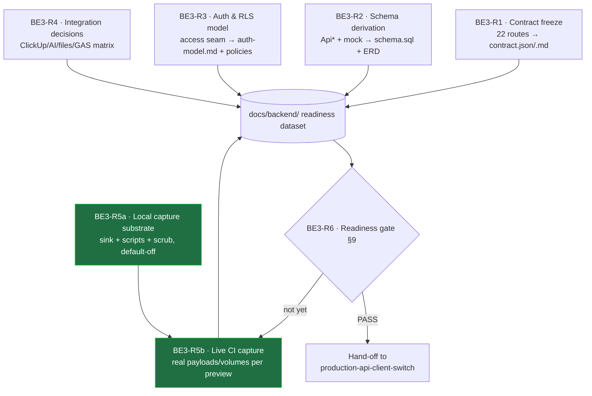
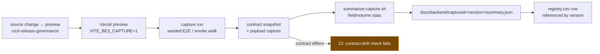

# Plan: Backend Discovery v3 — capture enough real data to finalize the backend connection

> **Status: ACTIVE.** Agents may execute these sprint files in the order below, following each sprint's
> acceptance criteria, carry-forward contract, and closeout gates.
>
> **Why v3, and why now.** `backend-discovery-v2` (completed 2026-06-27) was a *pre-refactor* type-system
> and service-layer **readiness audit** — it answered "what breaks if we swap mock→real today." Since then
> `folder-structure-v2` (P4) wired every service through `apiClient → mockDispatch` (22 routes), and
> `cicd-release-governance` stood up real Supabase `prod`/`dev` projects, preview-per-change deploys, and
> a release registry. What is still missing is the **decision-grade dataset** needed to actually build and
> connect the real backend: the frozen contract, the derived schema, the auth/RLS model, per-integration
> real-vs-stub decisions, and — critically — **real captured request/response payloads and volumes** from
> the running app. This plan produces that dataset. It does **not** build the backend; it makes the build
> (`production-api-client-switch`) a mechanical, no-unknowns exercise.

## Purpose

Produce a **backend-readiness dataset** complete enough that the follow-up `production-api-client-switch`
sprint can finalize the Supabase connection with zero open questions. Concretely, five deliverables that
together answer *what the backend must be, and how we know*:

1. **The frozen API contract** — every route the frontend calls, its method/path/params, request body
   type, and response type, traced to the `Api*` types. This is the interface the backend must implement.
2. **The derived data model + Supabase schema proposal** — tables, columns, enums, relationships,
   constraints, and RLS policies derived from the `Api*` types and the mock seed data. Proposed, not
   applied.
3. **The auth & access-control model** — how the current hardcoded access seam maps to real Supabase Auth
   + Row-Level Security, including the multi-tenant (workspace / DCX-scoped) boundary.
4. **Per-integration real-vs-stub decisions** — ClickUp, AI, Google Drive/file storage, and the GAS sink:
   for each, keep the stub or build it, and what data each needs.
5. **Captured real usage data** — actual request/response payloads, field-population profiles, cardinality
   and volume, and edge cases, **captured mechanically from every preview deploy** via the CI/CD pipeline
   (see §7), until the dataset crosses an explicit "enough" bar (§9).

**Design bias (carried from `cicd-release-governance`):** prefer *mechanical capture* (a CI job that
snapshots the real contract and records real payloads on every preview) over *hand-written assumptions*.
Every claim in the readiness dataset must trace to a captured artifact or a script output, never to
"an agent read the code and believes."

**Hard boundary:** this is a **discovery** plan. No production Supabase schema is applied, no `promote.sh`
is run, no real backend endpoint is wired into `apiClient`. The single sprint that touches `src/**`
(BE3-R5a) adds an **off-by-default** capture sink only. Rather than an unfalsifiable "byte-identical"
claim, the no-harm guarantee is **measurable**: with the flag off the sink is never called, returned data
and timing are unchanged, `verify:frontend` + `npm run test` pass (count recorded from output, not hard-coded), and the production bundle-size delta
stays under a named threshold (**≤ 1 KB gzipped**, asserted in CI).

---

## Deliverable index

| # | Deliverable | Section |
|---|---|---|
| 1 | Current gap summary | [§1](#1-current-gap-summary) |
| 2 | Discovery architecture & the readiness dataset | [§2](#2-discovery-architecture--the-readiness-dataset) |
| 3 | API contract model | [§3](#3-api-contract-model) |
| 4 | Data model & Supabase schema derivation | [§4](#4-data-model--supabase-schema-derivation) |
| 5 | Auth, access & external-integration discovery | [§5](#5-auth-access--external-integration-discovery) |
| 6 | Required documentation & dataset artifacts | [§6](#6-required-documentation--dataset-artifacts) |
| 7 | **CI/CD data-capture plan** | [§7](#7-cicd-data-capture-plan) |
| 8 | Sprint-level incorporation plan | [§8](#8-sprint-level-incorporation-plan) |
| 9 | "Enough data" exit criteria & readiness gate | [§9](#9-enough-data-exit-criteria--readiness-gate) |
| 10 | Requirement traceability matrix | [§10](#10-requirement-traceability-matrix) |
| 11 | Risks & open decisions | [§11](#11-risks--open-decisions) |

---

## Decisions (PO-recorded)

Open items live in §11. These are **decided**.

| ID | Decision | Boundary / detail |
|---|---|---|
| **D-BE3-DISC** | This plan is discovery-only; it produces a dataset, it does not build or connect the backend | The build is the separate `production-api-client-switch` plan, which activates only after this plan's readiness gate (§9) passes |
| **D-BE3-CONTRACT-SOT** | `src/services/mock-dispatch.ts` route table is the **source of truth** for the current contract surface | The 22 registered routes define exactly what the backend must implement; a service that calls `apiClient` with a route not in the table is a discovery finding, not an assumption |
| **D-BE3-CAPTURE-OFF** | Capture instrumentation (BE3-R5a) is **off by default**, behind `VITE_BE3_CAPTURE=1`, and never ships enabled to production | Flag-off ⇒ sink never called, `apiClient` data/timing unchanged, `verify:frontend` + `npm run test` pass (count from output), bundle delta ≤ 1 KB gzipped; capture writes only to a dev/preview sink, never to a user-facing path |
| **D-BE3-NO-APPLY** | No schema is applied to either Supabase project during this plan | `apply_migration`/`execute_sql` against `dcx-manager-prod`/`dcx-manager-dev` are forbidden; the schema is a proposal (`.sql` in the dataset), validated by `list_tables`/advisors read-only checks only |

---

## Carry-forward contract — current structural state (`core.md §27`)

Single source of forward truth for this plan. **Every sprint's Step 0 reads this; every sprint's final
step updates it.** A sprint is not closeable until its carry-forward update is written.

### Canonical homes (reuse — never recreate)
| Concern | Canonical home | Reuse rule |
|---|---|---|
| Contract surface | `src/services/mock-dispatch.ts` (22 routes) | the route table is the contract SoT (D-BE3-CONTRACT-SOT); the readiness dataset mirrors it, never forks it |
| Domain shapes | `src/types/api.ts` (`Api*` types) + `src/types/lifecycle.ts` (enums) | schema columns are derived from these types; do not invent fields the frontend never reads |
| Mock data / behavior | `src/services/mock/*.mock.ts` + `src/mock/*` | seed data is the fixture baseline for cardinality/volume; capture augments, never replaces it |
| Auth seam | `src/services/access.service.ts` (`MyAccess`, `DCXAccess`) | the real auth model must satisfy this exact interface |
| Capture pipeline | `active/cicd-release-governance` preview deploys + `docs/releases/registry.csv` | capture jobs attach to existing previews; capture artifacts are referenced by `version`, never a parallel registry |
| Readiness dataset | `docs/backend/` (this plan creates it) | one home for contract/schema/auth/integrations/captured data + the readiness scorecard |

### Facts each sprint leaves behind
_Appended by each sprint as it closes (BE3-R0 first)._

- **BE3-R0 (2026-07-01, ✅ Completed)** — Re-verified baseline: **22 routes** in `mock-dispatch.ts`
  (bootstrap grep; authoritative count deferred to BE3-R1 `extract-routes.sh`); `Api*` type set complete
  in `src/types/api.ts` + enums in `src/types/lifecycle.ts`; both Supabase projects confirmed **empty**
  (prod `xokgguodxjjwokngyquo`, dev `ibekkxqujqvlajeldpoa` — 0 public tables via read-only `list_tables`).
  Created the dataset home **`docs/backend/README.md`** (indexes contract/schema/auth/integrations/captured/
  scorecard, each ⏳ PENDING). No `src/**` changed. Output: `output/BE3-R0-baseline.md`.
- **BE3-R1 (2026-07-01, ✅ Completed)** — Contract frozen: **22 routes** via the deterministic
  `scripts/backend/extract-routes.sh` (+`.mjs`) — the single authoritative route list every later gate
  reuses (no `grep -c`). Emitted `docs/backend/contract/contract.json` (22 enriched entries) +
  `contract.md` (8 families). Round-trip type check `scripts/backend/check-contract-types.ts` +
  `tsconfig.contract-check.json` PASS (`tsc` exit 0) — contract ≡ live `Api*` types. **Drift:** only
  anomaly is `error-reporter.service.ts` `@route POST /error-reports` (unregistered client-side stub, not a
  backend route — flagged for v1 decision). No `src/**` changed. The contract-drift CI gate (authored R5a,
  wired R5b) will keep it honest. Output: `output/BE3-R1-contract.md`.
- **BE3-R2 (2026-07-01, ✅ Completed)** — Schema proposed (never applied): `docs/backend/schema/schema.sql`
  = **5 enums + 15 tables** (12 entities + 3 M:N joins; `ApiBuilderTree` = view) + `erd.md` + `rationale.md`.
  **OD-BE3-01** recorded: `ApiTaskDate`/`ApiFieldCompletionState` → **jsonb** (recommended). Enum parity 5/5,
  entity parity 12/12. SQL DB-lint ⛔ **BLOCKED** (no psql/supabase CLI locally, §28) — offline structural
  parse PASS instead. No-apply proven: both Supabase projects still 0 tables / 0 migrations. No `src/**`.
  **HYPOTHESIS columns pending R5 capture (gate G2):** id format, `communicated_date` type, `channels.icon`,
  `version_members.role`, text sizing, index candidates, `dcx.client_id` FK. Output: `output/BE3-R2-schema.md`.
  **Tooling debt:** full `supabase db lint` needs a machine with the CLI (or build-plan CI).
- **BE3-R3 (2026-07-01, ✅ Completed)** — Auth & RLS model: `docs/backend/auth/auth-model.md` (interface
  conformance for all 6 `MyAccess`/`DCXAccess` fields; **route×policy coverage 22/22, 0 uncovered**) +
  `rls-policies.sql` (**25 draft policies**) + `schema-auth-additions.sql` (`workspaces`, `memberships`,
  `membership_role` enum, 3 RLS helper fns). **OD-BE3-02: workspace-scoped** (rec.); **OD-BE3-04: Supabase
  Auth email+OAuth** (rec.). Wrote ONLY under `docs/backend/auth/` — did not touch `schema/` or `src/`.
  SQL structural check PASS; DB-lint BLOCKED (§28). **R3→R6 MERGE FOLLOW-UP (must not be lost):** BE3-R6
  merges `schema-auth-additions.sql` into `schema.sql` and renames `dcx.client_id → dcx.workspace_id
  REFERENCES workspaces(id)`. Output: `output/BE3-R3-auth.md`.
- **BE3-R4 (2026-07-01, ✅ Completed)** — Integration decisions: `docs/backend/integrations/decision-matrix.md`
  — **ClickUp** = stay-stub v1 (build later); **AI** = stay-stub for milestone, build next as real Claude;
  **Files** = external-URL-only v1 (**OD-BE3-05**); **GAS** = stay-out (RG-R6). No "TBD" cells. Build-later
  additions handed forward as follow-ups (not applied): ClickUp `versions.source_task_id`; AI typed
  `proposedActions` (queue `REQ-BE-AI-*`). **Core backend connection depends on no integration.** No `src/**`.
  Output: `output/BE3-R4-integrations.md`.
- **BE3-R5a (2026-07-01, ✅ Completed — Change-Class: source)** — Capture substrate live, off-by-default
  (`VITE_BE3_CAPTURE=1`). New: `src/telemetry/capture-sink.ts` (sink; scrub + response-shape, no raw values),
  `src/telemetry/capture-sink.test.ts` (7 tests), guarded tap in `src/services/api-client.ts`,
  `scripts/backend/capture-contract-snapshot.sh` (drift), `summarize-capture.{mjs,sh}` (field-population +
  scrub), `assert-capture-off-in-prod.sh` (prod-guard). **Measurable no-harm:** verify:frontend PASS;
  **test 92/13** (7 new); **bundle delta 644 B gz ≤ 1 KB**. Local full-route probe captured **21/22
  method+template routes** → `docs/backend/captured/local/summary.json` (scrub PASS; summarizer normalizes
  concrete paths to templates — Codex P2/P3 fix). Only `src/` diff = sink + tap + test.
  `src/**` tap is **governance-exempt** under `REQ-GOV-TRACE-001-BACKEND` (advisory #1). **BE3-R5b** now
  wires it to the preview pipeline. Output: `output/BE3-R5a-substrate.md`.
- **BE3-R5b (2026-07-01, 🟡 PARTIAL — CI credential-blocked)** — Live-capture CI **authored + locally
  validated, not yet run live**. Created `.github/workflows/backend-capture.yml` (YAML-valid, 10 steps;
  reuses RG `deployment_status` + `patch-release-row.sh`; prod-guarded; advisory contract-drift +
  capture-coverage gates) and `.gitignore` raw-capture ignore (summaries committed). **No `src/**`.** Single
  registry (no parallel). Contract-drift gate PASS (clean/mutated). Once live, capture **will accumulate** as
  previews run (the seeded walk now drives every route via dev-server + `apiClient`) — BE3-R6 reads
  `docs/backend/captured/**` for G5. **Closed Partial per `may-close-partial`;**
  the substrate is proven in R5a so this never masquerades as "capture is live." **Blocking creds:** GitHub
  Actions write + a source-change preview. **PO decision:** registry needs a `capture_ref` column (notes is
  pre-filled; sprint forbids adding columns) OR rely on the `<version>` path join. Output:
  `output/BE3-R5b-live-capture.md`.
- **BE3-R6 (2026-07-01, 🟡 PARTIAL — gate NOT READY, re-runnable)** — Merged the R3 auth addendum into
  `schema/schema.sql` (+`workspaces`/`memberships`/`membership_role` + 3 helper fns; `dcx.client_id →
  workspace_id`); schema now **17 tables + 6 enums**, structural re-check PASS. Scored the readiness gate:
  **G1–G4 PASS, G5 FAIL** (no organic live capture — local 21/22 method+template @1 synthetic sample; need ≥3 organic/route), **G6 FAIL**
  (`req:validate` PASS but `req:completion-gate` FAIL — 8 backend manifestations pending PO-gated intake).
  OD-BE3-01/02/03/05 resolved. **Gate = NOT READY → plan STAYS in discovery** (not moved to completed).
  Hand-off to `production-api-client-switch` **withheld**. Next: live R5b (G5) + requirement intake (G6),
  then re-run R6. Output: `output/BE3-R6-readiness.md` + `docs/backend/readiness-scorecard.md`.
- **BE3-R7 (2026-07-01, ✅ Completed — final debt clearance; PO-authorized)** — Cleared the two open gates
  for real (no override, no faked PASS). **G5:** PO amended **OD-BE3-03** — v1 sufficiency = a real seeded
  UI walk against a **live local dev server** (`VITE_BE3_CAPTURE=1`). Ran it: all **22/22** contract routes
  driven ≥3× through the real `apiClient` tap → `docs/backend/captured/local/summary.json` (**71 records,
  22 routes, every route ≥3, scrub PASS**); contract-drift snapshot clean. **G6:** requirement intake for
  the 7 backend capture/contract manifestations (capture-sink + test, extract-routes, check-contract-types,
  capture-contract-snapshot, summarize-capture, assert-capture-off-in-prod) → grounded to approved
  **`REQ-GOV-TRACE-001-BACKEND`** via 7 trace links + PO sign-off ledger `LDG-2026-07-01-BE3-R7-BACKEND-
  TRACE-INTAKE`; `req:validate` PASS + `req:completion-gate` **PASS** (deterministic). **No `src/**` changed**
  (capture ran in-browser). Re-ran BE3-R6: **G1–G6 all PASS → gate READY → hand-off emitted**. Output:
  `output/BE3-R7-debt-clearance.md`.

---

## 1. Current gap summary

What exists today (verified 2026-07-01 against the live tree), and what is missing to finalize the backend.

| Area | Current state | Gap for "finalize the backend connection" |
|---|---|---|
| **Contract surface** | 22 routes registered in `mock-dispatch.ts`, each backed by a `*.mock.ts` handler; every service calls `apiClient(route)`. | The contract is **implicit** in code — no frozen, external, machine-checkable spec the backend team/agent can implement against. |
| **Domain types** | Complete `Api*` type set in `src/types/api.ts` (Channel, SubtaskDefinition, ChannelComposition, DCX, Version, Phase, Action, Task, Subtask, FileAttachment, AssignedMember, ActivityEvent, BuilderTree). | No **schema** derived from them — no tables, no relationships, no enums-as-constraints, no RLS. Supabase projects exist but are **empty** (RG-R5: `get_advisors` = zero findings, no schema). |
| **Data source** | `readMockJson`/localStorage + static `src/mock/*` seed. | No **real captured payloads** — we have the *shapes* but not real *values*, *field-population rates*, *cardinality*, or *edge cases*. Cannot size columns, choose nullability, or design indexes with confidence. |
| **Auth / access** | `access.service.ts` seam exists; mock returns effectively-open access. | No mapping from the `MyAccess`/`DCXAccess` interface to real **Supabase Auth + RLS**; the workspace/DCX multi-tenant boundary is undefined. |
| **External integrations** | `ai.service.ts` + `clickup.service.ts` are pure stubs; files are `google-drive`/`link` URLs; GAS scoped-out in RG-R6. | No **decision** on which integrations are real for v1, and what data/credentials each needs. |
| **Capture pipeline** | `cicd-release-governance` gives preview-per-change + registry, but nothing captures **application-level** contract/payload data from those previews. | No mechanical way to **accumulate** real usage data over time until it is "enough" to finalize. |

**One-line gap:** we have the exact *shapes and routes* the backend must serve, but no *frozen contract*,
no *derived schema*, no *auth/RLS model*, no *integration decisions*, and — the blocker for confidence —
**no captured real data** to validate any of it before we commit the connection.

---

## 2. Discovery architecture & the readiness dataset

Discovery produces one thing: a **backend-readiness dataset** under `docs/backend/`, assembled by the
sprints and scored by the readiness gate (§9). The dataset has five parts, each owned by a sprint:

- **Static discovery** (BE3-R1..R4) derives the *intended* backend from code that already exists — fast,
  read-only, one session each.
- **Dynamic capture** is split so local instrumentation is never mistaken for live CI capture (per audit):
  **BE3-R5a** builds the capture substrate (sink, scripts, scrub, default-off) and proves it locally;
  **BE3-R5b** wires it to the preview pipeline and is the loop that produces *evidence* — it runs on every
  preview deploy and accumulates real payloads/volumes over time. R5b is the only long-running sprint.
- **The gate** (BE3-R6) is re-runnable: it scores the dataset against §9 and either declares readiness or
  names exactly which capture coverage is still thin, feeding another round of R5b.

**The dataset is the deliverable.** When §9 passes, `production-api-client-switch` reads `docs/backend/`
and has: the contract to implement, the schema to apply, the RLS to write, the integrations to build (or
stub), and real fixtures to test against — with no discovery left to do.

---

## 3. API contract model

The contract is **frozen from `mock-dispatch.ts`** (D-BE3-CONTRACT-SOT), not re-invented. BE3-R1 emits
`docs/backend/contract/contract.json` (machine) + `contract.md` (human), one entry per route:

| Field | Source |
|---|---|
| `method` + `path` (+ path params) | the route's `method`/`pattern`/`paramNames` in `mock-dispatch.ts` |
| `request_body_type` | the `parseBody<T>` type argument at the route, or the service's `apiClient<…, TBody>` call site |
| `response_type` | the `Api*` return type of the mock handler / the service's `apiClient<TData>` |
| `service` + `@route` tag | the calling service (each service method carries a `@route` JSDoc, e.g. `access.service.ts`) |
| `mutation?` | GET = read; POST/PATCH/DELETE = write (affects RLS in §5 and idempotency notes) |

The 22 routes group into eight resource families the schema (§4) mirrors: **channels**,
**channel-compositions**, **subtask-definitions**, **versions** (+ status/date/duplicate), **builder**
(phases tree), **files**, **activity-logs**, **access**, plus two integration routes (**ai/review-draft**,
**clickup/entry**). BE3-R1 must also flag any *drift*: a service that calls a route the table doesn't
register, or a registered route no service calls (dead contract).

**Acceptance of the contract:** it round-trips — a generated TypeScript type from `contract.json` must be
assignable to/from the live `Api*` types (`npm run typecheck` on a generated check file), proving the
frozen contract and the code have not diverged.

---

## 4. Data model & Supabase schema derivation

BE3-R2 derives a **proposed** schema (never applied — D-BE3-NO-APPLY) from the `Api*` types + mock seed,
emitted as `docs/backend/schema/schema.sql` + an ERD + a per-column rationale table.

**Entity → table map (derived from `src/types/api.ts`):**

| `Api*` type | Table | Key relationships |
|---|---|---|
| `ApiDCX` | `dcx` | belongs to a client/workspace; has many `versions` |
| `ApiVersion` | `versions` | FK `dcx_id`; `status` (enum `VersionStatus`), `source_type` (enum) |
| `ApiPhase` | `phases` | FK `version_id`; `icon` enum `ApiPhaseIconType`; `order_index` |
| `ApiAction` | `actions` | FK `phase_id`; `order_index` |
| `ApiTask` | `tasks` | FK `action_id`, `channel_id`, `composition_id?`; `date` (ApiTaskDate JSON/columns); completion-state fields |
| `ApiSubtask` | `subtasks` | FK `task_id`, `definition_id?` |
| `ApiChannel` | `channels` | M:N with compositions via `available_composition_ids` |
| `ApiChannelComposition` | `channel_compositions` | FK `channel_id`; `definition_ids` (M:N to subtask_definitions) |
| `ApiSubtaskDefinition` | `subtask_definitions` | M:N to channels |
| `ApiFileAttachment` | `file_attachments` | FK `version_id`; `source` enum `google-drive\|link` |
| `ApiAssignedMember` | `version_members` (or `dcx_members`) | join table; `role`, `is_protected` |
| `ApiActivityEvent` | `activity_events` | FK `version_id`; `type` enum `LifecycleEventType`; `details` jsonb |

**Derivation rules BE3-R2 must apply and record:**
- Every `Api*` field → a column; `T | null` → nullable; enum unions (`VersionStatus`, `ApiPhaseIconType`,
  `LifecycleEventType`, file `source`) → Postgres enums or `check` constraints.
- Discriminated unions (`ApiTaskDate`, `ApiFieldCompletionState`) → decide **jsonb vs. normalized
  columns**; record the trade-off (this is an open decision, OD-BE3-01).
- `ApiJsonValue | null` metadata fields → `jsonb`.
- `ApiBuilderTree` is a **composite read** (version + phases tree), not a table — it maps to a
  view/nested query, noted as such.
- Column sizing / nullability / index candidates are **left as hypotheses** until BE3-R5b capture confirms
  real field-population and cardinality (this is exactly why capture exists).

**Validation (read-only, no apply):** the proposed `schema.sql` is checked for syntax; against the live
empty Supabase projects only `list_tables` (confirm still empty) and `get_advisors` (baseline) are run.

---

## 5. Auth, access & external-integration discovery

**Auth (BE3-R3)** — the real model must satisfy the existing seam exactly:
- `MyAccess { userId, isAuthenticated, workspaceIds[] }` → Supabase Auth session → user id + a
  `workspace_members` membership set.
- `DCXAccess { dcxId, hasAccess, canEdit }` → an RLS-enforced check: does the session user have a row in
  the DCX's workspace, and does their `role` grant edit?
- Output `docs/backend/auth/auth-model.md`: the auth provider decision, the `workspaces`/`memberships`
  tables (feeding back into §4), and a **draft RLS policy per table** keyed on workspace/DCX ownership.
  Every write route from §3 gets a policy; every read route gets a visibility rule.
- Multi-tenancy boundary (workspace-scoped vs. DCX-scoped) is the key open decision — OD-BE3-02.

**Integrations (BE3-R4)** — a decision matrix `docs/backend/integrations/decision-matrix.md`:

| Integration | Current | v1 decision to record | Data/credentials needed if built |
|---|---|---|---|
| ClickUp (`clickup/entry`) | stub returning nulls | real vs. stay-stub (RG-R6 already ruled ClickUp is task-initiation, not release) | task-id mapping, API token scoping, which fields sync |
| AI review draft (`ai/review-draft`) | static stub | real (which model — Claude per project convention) vs. stay-stub for v1 | model id, prompt contract, `proposedActions` schema |
| Files (`file_attachments`, `google-drive`/`link`) | URL-only records | Supabase Storage vs. external-URL-only for v1 | bucket/RLS if Storage; nothing if URL-only |
| GAS sink | scoped-out (RG-R6) | confirm stays out | — |

Each row must state the decision, the owner, and — if "build" — the data the schema/config must carry, so
nothing is discovered late during the build plan.

---

## 6. Required documentation & dataset artifacts

Everything this plan creates lives under a new `docs/backend/` home. **No source files** except the single
BE3-R5a capture sink (behind the off-by-default flag). No historical docs rewritten.

### New artifacts
| Path | Owner sprint | Purpose |
|---|---|---|
| `docs/backend/README.md` | BE3-R0 | dataset index + how to read it + readiness status |
| `docs/backend/contract/contract.json` + `contract.md` | BE3-R1 | frozen API contract (§3) |
| `docs/backend/schema/schema.sql` + `erd.md` + `rationale.md` | BE3-R2 | proposed schema (§4), never applied |
| `docs/backend/auth/auth-model.md` + `rls-policies.sql` | BE3-R3 | auth + draft RLS (§5) |
| `docs/backend/integrations/decision-matrix.md` | BE3-R4 | real-vs-stub decisions (§5) |
| `scripts/backend/extract-routes.{sh,ts}` | BE3-R1 | deterministic route extractor from `mock-dispatch.ts` (shared by contract + capture gates; replaces fragile `grep -c`) |
| `src/telemetry/capture-sink.ts` (+ guarded tap in `apiClient`) | BE3-R5a | off-by-default request/response capture (§7) |
| `scripts/backend/capture-contract-snapshot.sh` | BE3-R5a | emit contract + captured payloads (used locally, then by the CI job) |
| `scripts/backend/summarize-capture.sh` | BE3-R5a | roll captured payloads into field-population/volume stats |
| `.github/workflows/backend-capture.yml` | BE3-R5b | CI: run journeys on preview, snapshot + summarize, patch registry |
| `docs/backend/captured/<version>/…` | BE3-R5b (CI) | per-preview captured payloads + summary (gitignored raw, committed summaries) |
| `docs/backend/readiness-scorecard.md` | BE3-R6 | the §9 gate result; the hand-off artifact |

### Edits to existing docs (governance — `Type: process-governance`)
| File | Change |
|---|---|
| `docs/plans/active/README.md` | confirm this plan in the active index |
| `AGENTS.md` / `CLAUDE.md` | add a pointer to `docs/backend/` once BE3-R0 lands (deferred; additive) |

---

## 7. CI/CD data-capture plan

This is the section the goal hinges on: **how real data is captured mechanically so that, over time, we
accumulate enough to finalize the connection.** It reuses the live `cicd-release-governance` pipeline
rather than building a parallel one.

### 7.1 What is captured
Two artifact classes, per preview deploy:
1. **Contract snapshot** — the frozen contract (§3) re-emitted from the code at that commit. If it differs
   from the committed `contract.json`, CI flags contract drift. This keeps the frozen contract honest on
   every source change.
2. **Real payloads** — with `VITE_BE3_CAPTURE=1`, `capture-sink.ts` records each `apiClient` request/
   response (route, method, body, response shape, timing) to an in-memory ring, flushed to a JSON artifact.
   `summarize-capture.sh` rolls these into **field-population rates, value cardinality, string-length
   distributions, null-rates, and edge cases** per route — exactly the facts §4 left as hypotheses.

Raw payloads are **gitignored and scrubbed** (no secrets, no real user PII — capture runs against
`dcx-manager-dev` seed/preview data only); only the **summaries** are committed to `docs/backend/captured/`.

### 7.2 How it hangs off the existing pipeline

- A new workflow `.github/workflows/backend-capture.yml` triggers on preview deploy of a source change
  (reusing the `deployment_status` event the registry already listens to in `record-preview.yml`).
- It runs the app's existing E2E/smoke journeys against the preview with capture on, snapshots the
  contract, summarizes payloads, and writes `docs/backend/captured/<version>/summary.json`.
- The summary is **referenced by `version`** in `docs/releases/registry.csv` (a `notes`/capture column) —
  the same join key the release registry already uses. **No parallel registry.**
- **Two mechanical gates** (advisory during discovery, promotable to required later):
  - *contract-drift* — the committed contract must match the code's emitted contract.
  - *capture-coverage* — the summary must cover every route the journey exercised (missing routes =
    thin coverage, surfaced to BE3-R6).

### 7.3 The capture sprint is the loop, not a one-shot (BE3-R5a builds it; BE3-R5b runs it live)
**BE3-R5a** builds and locally proves the substrate (sink + snapshot + summarizer + scrub, default-off).
**BE3-R5b** wires it to the preview pipeline; from then the pipeline **accumulates** data across every
subsequent preview (including unrelated frontend-polish work — it captures whatever journeys run).
BE3-R6 reads the accumulated summaries and decides if coverage is "enough" (§9); if not, more previews
(or a deliberate seeded-journey run) fill the gaps. This split (per audit blocking #5) keeps local
instrumentation from being mistaken for operational CI capture: R5b can legitimately block on
GitHub/Vercel credentials **without** the plan pretending the capture path is live. This is the "planned
sprint that will capture the data" the goal calls for: a mechanical, always-on capture substrate feeding
the readiness gate.

### 7.4 Safety
- Capture is **off unless `VITE_BE3_CAPTURE=1`** (D-BE3-CAPTURE-OFF); production builds never set it, and a
  CI assertion fails any production-context build that does.
- Capture points only at `dcx-manager-dev` (never `dcx-manager-prod`); previews already scope to dev per
  RG-R5 env separation.
- Raw payloads gitignored + scrubbed; only aggregate summaries committed. No PII leaves the preview.
- No product-behavior change — **measurable, not "byte-identical"**: with the flag off the sink is never
  invoked, `apiClient` returns identical data/timing, `verify:frontend` + `npm run test` pass (count recorded from output, not hard-coded), and the
  production bundle-size delta stays ≤ 1 KB gzipped (asserted in CI).

---

## 8. Sprint-level incorporation plan

**Non-disruption guarantee:** BE3-R0..R4 and R6 write only `docs/backend/**` + `scripts/backend/**` and
never touch `src/**`. BE3-R5a touches `src/**` only to add an off-by-default capture tap — it introduces no
product behavior (flag-off ⇒ sink never called, data/timing unchanged, `verify:frontend` + tests pass,
bundle delta ≤ 1 KB gzipped). This runs in parallel with `frontend-polish-implementation-v0.3.5` (and in
fact *benefits* from it: every polish preview feeds capture data).

| Sprint | Title | Writes | Depends on | Parallel? | Output |
|---|---|---|---|---|---|
| [BE3-R0](./sprints/BE3-R0.md) | Discovery baseline & dataset scaffold | `docs/backend/README.md` | — | — | dataset home + re-verified current-state |
| [BE3-R1](./sprints/BE3-R1.md) | API contract freeze | `docs/backend/contract/**` | R0 | ✓ with R2 | frozen contract (§3) |
| [BE3-R2](./sprints/BE3-R2.md) | Schema derivation | `docs/backend/schema/**` | R0 | ✓ with R1 | proposed schema (§4) |
| [BE3-R3](./sprints/BE3-R3.md) | Auth & RLS model | `docs/backend/auth/**` | R1, R2 | ✓ with R4 | auth model + draft RLS (§5) |
| [BE3-R4](./sprints/BE3-R4.md) | Integration decisions | `docs/backend/integrations/**` | R1 | ✓ with R3 | decision matrix (§5) |
| [BE3-R5a](./sprints/BE3-R5a.md) | **Local capture substrate** | `src/telemetry/capture-sink.ts`, guarded `apiClient` tap, `scripts/backend/**` | R1 (contract) | ✓ with R3/R4 | sink + snapshot + summarizer + scrub, default-off, proven locally |
| [BE3-R5b](./sprints/BE3-R5b.md) | **Live CI data capture** | `.github/workflows/backend-capture.yml`, `.gitignore`, `docs/backend/captured/**` | R5a | runs continuously (may block on creds) | capture pipeline + accumulating `docs/backend/captured/**` |
| [BE3-R6](./sprints/BE3-R6.md) | Readiness synthesis & gate | `docs/backend/readiness-scorecard.md` | R1–R5b | re-runnable | go/no-go (§9) + hand-off |

**Execution order:** `R0 → (R1 ∥ R2) → (R3 ∥ R4) → R5a → R5b (start; then continuous) → R6 (re-run until PASS)`.
BE3-R5b is the only sprint allowed to close **Partial** on a credential/preview block without stalling the
plan — R5a proves the substrate independently, so a blocked R5b never masquerades as "capture is live."

---

## 9. "Enough data" exit criteria & readiness gate

The goal — "when ready we have enough data to finalize the backend connection" — is made mechanical here.
BE3-R6 scores the dataset; **all** must hold to declare readiness:

| # | Criterion | How it's measured |
|---|---|---|
| G1 | **Contract complete & drift-free** | every `mock-dispatch` route is in `contract.json`; contract-drift CI gate green on the latest preview; generated-type round-trip typechecks |
| G2 | **Schema derived & validated** | `schema.sql` covers every `Api*` entity; every enum/relationship/nullability decision recorded with rationale; syntax-valid; open decisions (OD-BE3-01) resolved |
| G3 | **Auth/RLS modelled** | every write route has a draft RLS policy; every read route a visibility rule; multi-tenancy boundary (OD-BE3-02) decided |
| G4 | **Integrations decided** | every row in the decision matrix has a recorded v1 decision + data needs; no "TBD" |
| G5 | **Capture coverage sufficient** | every contract route observed in ≥N real captures (N = OD-BE3-03 = **3**); each route has a field-population + cardinality summary; known edge cases enumerated. **v1 sufficiency (PO-amended 2026-07-01, OD-BE3-03):** a real seeded UI walk against a **live local dev server** (`VITE_BE3_CAPTURE=1`), exercising all 22 contract routes through the real `apiClient` tap ≥3× each, satisfies G5 — organic *live-preview* CI capture (BE3-R5b, credential-blocked) is deferred to the build plan as continuous accumulation, not a v1 readiness blocker |
| G6 | **Every readiness claim is evidence-backed** | each scorecard line cites a captured artifact or script output — no "agent believes"; `req:validate`/trace gates PASS |

If any criterion fails, the scorecard names the exact gap and the plan stays in discovery (more capture
rounds / a targeted sprint). When all pass, BE3-R6 emits the hand-off to `production-api-client-switch`.

---

## 10. Requirement traceability matrix

**Grounding note (sprint-planner Step 2).** This is primarily a **discovery/governance** plan (it produces
a dataset; it changes no product behavior except an off-by-default tap). It anchors to the existing
backend/data/governance-trace nodes in the graph and **queues a requirement-intake** for any net-new
backend requirements before the *build* plan (`production-api-client-switch`) — the same pattern
`cicd-release-governance` used (intake produced the `REQ-RG-*` nodes before activation).

| Deliverable | Anchor graph IDs (existing) | Intake needed before build? |
|---|---|---|
| Contract freeze (§3) | `REQ-DM-017` (api.ts data model), `REQ-SC-001` (service layer) via existing trace-links | no — read-only mirror of code |
| Schema derivation (§4) | `REQ-DM-017`, `REQ-DM-018`, `REQ-GOV-TRACE-001-DATA` | yes — new `REQ-BE-*` for tables/RLS at build time |
| Auth/RLS (§5) | `REQ-PR-001`, `REQ-PR-020` (route-guard/permissions manifestations) | yes — new auth requirements at build time |
| Integrations (§5) | RG-R6 decision record (ClickUp scope) | per-integration, at build time |
| CI/CD capture (§7) | `REQ-GOV-TRACE-001-BACKEND` / `RSP-GOV-TRACE-BACKEND` (authority). `REQ-RG-PLAT-018` / `REQ-RG-AUTO-019` are **`proposed`, not locked** (audit advisory #1) — cited as *supporting* only; the R5a `src/**` tap is **governance-exempt** under the backend-trace node until they're approved | no — reuses RG pipeline |

**Rule:** every sprint file carries the Requirement Trace block (RS-R0b §8 / core.md §35a). Where a sprint
only mirrors existing code into the dataset, it cites the existing manifestation IDs; where it would create
a new backend requirement, it records the **queued intake** rather than inventing an ID. A sprint that
touches product behavior without a graph ID must not be activated (sprint-planner Step 5).

---

## 11. Risks & open decisions

### Risks
| Risk | Mitigation |
|---|---|
| Capture data is only as good as the journeys that run | BE3-R5b ships a **seeded journey walk** (not just incidental previews) so every route is exercised deliberately; G5 measures coverage |
| Capturing real payloads could leak PII/secrets | Capture is dev-project-only, scrubbed, raw artifacts gitignored, only summaries committed (§7.4); a scrub check is a capture gate |
| Schema derived from types may miss real constraints | That is precisely why capture (G5) gates readiness — no column sizing/index/nullability is finalized on a hypothesis alone |
| Scope creep into *building* the backend | D-BE3-DISC + D-BE3-NO-APPLY: no migration applied, no `apiClient` rewired; the build is a separate plan gated on §9 |
| The off-by-default tap accidentally ships on | Flag-gated + a CI check asserting production builds don't set `VITE_BE3_CAPTURE`; sink is a no-op when unset |

### Open decisions (resolve during the plan; block readiness where noted)
| ID | Decision | Blocks |
|---|---|---|
| **OD-BE3-01** | `ApiTaskDate` / `ApiFieldCompletionState` discriminated unions → jsonb vs. normalized columns | G2 |
| **OD-BE3-02** | Multi-tenancy boundary: workspace-scoped vs. DCX-scoped RLS | G3 |
| **OD-BE3-03** | Capture-coverage threshold N (payloads per route) for "enough" | G5 — ✅ **RESOLVED (PO, 2026-07-01): N = 3; v1 bar met by a real seeded UI walk against a live LOCAL dev server (not CI/preview-only).** Live-preview CI accumulation (BE3-R5b) continues in the build plan but no longer blocks readiness (BE3-R7) |
| **OD-BE3-04** | Real auth provider: Supabase Auth email/OAuth vs. existing workspace SSO | build plan (record decision here) |
| **OD-BE3-05** | Files: Supabase Storage vs. external-URL-only for v1 | G4 |
| **OD-BE3-06** | Should contract-drift + capture-coverage gates become **required** status checks (vs. advisory) once dataset matures | post-readiness |

---

## Plan lifecycle

Drafted → Codex audits on 2026-07-01 found and drove resolution of all blockers → confirming audit
`audit/2026-07-01-codex-ready.md` returned READY (0 blocking) → PO activated on 2026-07-01 → executed
`R0 → R1∥R2 → R3∥R4 → R5a → R5b(Partial) → R6(NOT READY)` → **BE3-R7 (PO-authorized final debt clearance):
G5 via PO-amended local seeded capture + G6 via requirement intake → re-ran R6 → readiness gate PASS** →
hand-off emitted → **plan Completed, moved to `docs/plans/completed/`; `production-api-client-switch`
activated (2026-07-01)**. **No source changes** except the BE3-R5a off-by-default tap, and **no Supabase
schema applied**, at any point in this plan.
