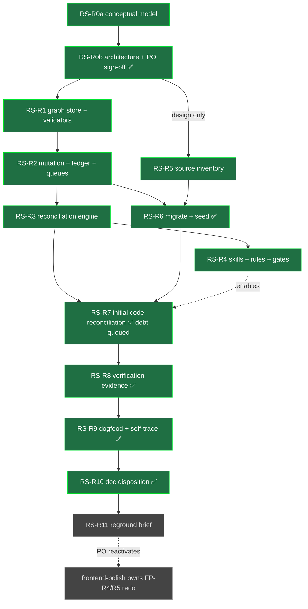

# Plan: DCX Product-Intelligence & Governance Graph (the "requirements system")

## Status: COMPLETED (2026-06-30) — all 11 sprints (R0a–R11) done; DoD reconciled; plan moved to `docs/plans/completed/requirements-system/`. The graph (`docs/product/requirements/graph/`) is the live source of truth and remains in place. Hand-off ready: PO reactivates `frontend-polish-v0.3.5` for the FP-R4/R5 re-grounding (RS-R11 brief).

The PO activated this plan after the passing re-audit (`audit/2026-06-29-codex-redesign-ready.md`).
**RS-R0a + RS-R0b are complete and the methodology is signed off** (recorded 2026-06-29 at PO direction —
see `output-review/RS-R0b-review.md` and the checklist in `output/RS-R0b-architecture.md` §14). The build
sprints are therefore unblocked: **RS-R1** (graph store + validators) is next on the critical path and
**RS-R5** (source inventory) may run in parallel. RS-R1 must build the **exact** command names/paths from
`output/RS-R0b-architecture.md` §1–§2. Lifecycle loop: `core.md §34`. (The prior flat-model READY verdict
`audit/2026-06-29-codex-ready.md` remains stale; the active verdict is `…-codex-redesign-ready.md`.)

---

## What changed, in one paragraph

The earlier plan treated this as a **requirements logging + governance store** (flat records, a ledger,
relationship checks, an intake skill). The PO has corrected the direction: this is no longer a logger, an
implementation tracker, a folder structure, or a standalone app. It must become a **living
product-intelligence and governance architecture** — a typed, validated graph plus the skills, agent
rules, generated context, scripts, validators, hooks, completion gates, ledgers, code indexes and PO
workflows that continuously **explain and enforce** the chain below, in **both directions**, and that
**survives across Claude, Codex, and future agents** without depending on conversational memory or an
agent voluntarily reading docs. Full old→new mapping and conflicts: `CHANGE-SUMMARY.md`.

---

## Why this plan exists (unchanged root cause, larger answer)

`frontend-polish-v0.3.5` missed entire authoritative requirement families because the project's
requirements lived in **six overlapping, drifting, partly-contradictory sources** under two ID schemes
(evidence: `on-hold/frontend-polish-v0.3.5/output/requirements-recovery.md`). The deeper failure was that
**nothing connected product intent to the code that implements it, in either direction, and nothing
enforced that connection mechanically.** A flat store would have re-documented the requirements; it would
not have prevented an agent from building unjustified code or from missing requirements with no
manifestation. The answer is a **governed graph from intent to the smallest meaningful manifestation and
its verification evidence**, enforced by tooling and agent rules so this class of miss cannot recur.

---

## System goal

One **living, validated product-intelligence graph** that is the grounded source of truth for the whole
chain and that mechanically enforces it for every agent:

```
product intent → requirement → rules & behaviors → system responsibilities
   → expected manifestation categories → actual technical manifestations → verification evidence
```

It must answer, on demand and as a gate, in **both directions**:

- **Top-down:** how a given product intent becomes requirements, behaviors, responsibilities,
  implementation, and proof — and where coverage is missing, partial, or stale.
- **Bottom-up:** which approved intent or requirement justifies a given technical manifestation — or that
  the manifestation is **explicitly classified governed exempt technical work**. Nothing meaningful is
  silently unlinked.

`frontend-polish` (FP-R4/R5) is later re-grounded onto this graph (handoff brief only — RS-R11).

## Operating mode during rollout — test / calibration mode

The architecture is **not weakened** and the remaining sprints are **not rewritten**. The system still aims
for canonical requirements, governed manifestation structure, bidirectional traceability, reconciliation,
verification evidence, agent rules, validators, gates, explicit planning before implementation, and full
auditability/reversibility.

During rollout, however, the graph is operated in **test / calibration mode**:

- Run the plan as written and keep building the intended automation, reconciliation, views, validators,
  skills, gates, and evidence layers.
- Use graph data as the default planning context, but do not assume first-population mappings are perfectly
  accurate.
- Allow provisional, incorrect, duplicate, weak, or incomplete links to exist temporarily when they are
  visible, auditable, reversible, and queued for cleanup.
- Record uncertainty and cleanup debt rather than blocking the whole plan for low-risk mapping
  imperfections.
- Validate and improve accuracy through actual planning and implementation use; correct the model when
  real work exposes mistakes.
- Tighten enforcement gradually as repeated real-world use proves graph accuracy.

This does **not** mean accuracy does not matter. It means the architecture aims for accuracy, while rollout
validates and improves it through use instead of demanding perfect initial graph data before progress.

### Calibration blockers

Block work for serious safety or governance failures:

- A graph/tool operation attempts to change `src/**`.
- Locked product truth changes silently or without governed supersession/sign-off.
- An agent uses an inferred/provisional link as automatic authorization for product-code changes.
- Invalid canonical data prevents the requirements system from functioning.
- A high-risk implementation proceeds without investigating uncertain requirements.

Do **not** block remaining sprints solely for low-risk calibration debt:

- Misclassified manifestations.
- Weak candidate links.
- Duplicate identities already recorded for cleanup.
- Missing low-risk mappings.
- Imperfect coverage percentages.
- Incomplete enrichment of older requirements.

### When agents must investigate deeper

Graph data remains authoritative planning context, but agents must investigate beyond the stored mapping
when:

- The task is risky or architecturally important.
- The graph contains conflicting links.
- The requirement is ambiguous.
- The planned code change does not match the stored manifestation.
- Tests fail or runtime behavior contradicts the graph.
- A decision could alter locked product intent.
- Confidence is too low to plan safely.

Operating principle:

> Build the full system as planned, but operate it in calibration mode until repeated real-world use proves
> its accuracy. Treat graph data as authoritative planning context, while allowing investigation,
> correction, and deferred cleanup where confidence is low.

---

## Core conceptual model (what RS-R0 must design to)

### 1. Progressive, graph-based — not a flat record made in one step
A requirement is **not** a fully-populated flat row created at once. It **starts from PO intent and grows**
as agents, skills, code analysis, implementation, and verification add structure. The conceptual growth is
tree-like:

```
intent → requirement → behavior → responsibilities → manifestations → evidence
```

…but the **canonical storage is a typed graph**, because the relationships are many-to-many:
one requirement needs many manifestations; one manifestation serves many requirements; one test verifies
many acceptance outcomes; one responsibility is shared; requirements depend on / conflict with / derive
from / supersede each other. (Trees are views over the graph, not the storage model.)

### 2. Node types (first-class objects in the graph)
At minimum: **Intent · Requirement (scoped) · Behavior/Rule · AcceptanceOutcome · SystemResponsibility ·
ExpectedManifestationCategory · Manifestation · TraceLink · Evidence · Exemption · DecisionLedgerEntry ·
OpenQuestion.** RS-R0a finalizes the taxonomy; it must support many-to-many links and different *meanings*
of linkage (see Trace links).

### 3. Three SEPARATE state dimensions (never one lifecycle for everything)
A node carries up to three orthogonal states. **`locked` means "stable approved truth, not silently
editable" — it does NOT mean implemented or complete.** The model must represent combinations like
*locked + not-started*, *locked + partially-implemented*, *locked + implemented-but-unverified*,
*superseded + still-manifested-in-code*.

| Dimension | Question it answers | Example values (RS-R0 may refine names, not the distinction) |
|---|---|---|
| **Governance** | Is it authoritative & mutable? | `draft → proposed → approved → locked → superseded → archived` |
| **Maturity / readiness** | How structurally complete is it? | `intent-captured → logic-defined → behavior-defined → decomposed → implementation-ready` |
| **Delivery / verification** | Is it built and proven? | `not-assessed → not-started → planned → in-progress → partially-implemented → implemented → verified → blocked → deprecated` |

### 4. Progressive maturation — required vs optional fields per state
A **draft** may carry only: product intent; problem/desired outcome; initial logic; source/provenance;
open questions. As it advances, skills/agents progressively add: normalized statement; rules; conditions;
exceptions; acceptance outcomes; dependencies; related/conflicting requirements; derived technical
requirements; system responsibilities; expected manifestation categories; actual manifestations;
verification evidence. **A draft must not fail validation for missing implementation fields. Validation
becomes stricter as the requirement matures.** RS-R0a defines the required/optional matrix per
(governance × maturity) state; RS-R1 (store) enforces it progressively.

### 5. Provenance & confidence on fields/nodes (epistemic honesty)
Where useful, a field or node preserves: **value · source · authoring actor · inference source ·
confidence · confirmation status · derivation reason · last-checked date · evidence.** The system must
clearly distinguish: **what the PO explicitly decided · what an agent proposed · what a skill derived ·
what code analysis discovered · what has been confirmed · what has been verified.** These are not the same
and must never collapse into one another.

### 6. The missing layer — System Responsibilities (between requirement and code)
The PO must not be expected to write functions, components, schemas, tests, or code paths. A first-class
**System Responsibility** layer sits between product requirements and technical manifestations:

```
product requirement → derived scoped requirements → system responsibilities
   → expected manifestation categories → actual manifestations
```

Responsibility types (RS-R0a finalizes): UI/presentation · interaction · domain logic · state · data ·
persistence · service/integration · validation · security · operations · governance · agent-workflow ·
verification. The system defines **expected manifestation categories before implementation** so it can
compute whether coverage is **complete or partial**. *A requirement is never "fully implemented" merely
because one code link exists* — every expected category must be covered.

### 7. Manifestations as first-class objects with durable identity
A **manifestation** is the *smallest independently meaningful place where product or system behavior
materially exists*: React components, functions, hooks, store actions, state-machine transitions, types,
schemas, API endpoints, services, DB structures, selectors, scripts, configuration, **agent skills, agent
rules, validators, CI/automation hooks**, infrastructure objects, test cases, evidence artifacts.

- **Boundary (RS-R0a must define "smallest meaningful"):** do **not** trace every local variable or
  trivial helper. Minor internals inherit a parent manifestation's trace **unless** they encode a distinct
  rule or responsibility.
- **Durable identity & lifecycle** across creation, modification, rename, movement, deletion, replacement,
  deprecation. **Identity must not be a file path** (paths move) — RS-R0a designs a stable identity scheme
  reconciled against `code-index/`.

### 8. Trace links as first-class typed records (not path strings)
A TraceLink is a node, not a string. It carries: **source · target · relationship type · coverage ·
confidence · evidence · inference source · confirmation status · last-checked date · verification refs ·
stale/broken state.** Relationship types (RS-R0a may refine; must stay many-to-many): `derives-from ·
decomposes-into · implements · partially-implements · enforces · displays · persists · configures ·
validates · verifies · supports · depends-on · conflicts-with · supersedes · exempt-from-trace`.

### 9. Automatic manifestation reconciliation (first-class capability)
**For existing code:** scan & inventory meaningful manifestations *without changing product code*; map to
requirements/responsibilities; detect manifestations with no requirement link, requirements with no
manifestation, partial implementation, stale/broken/deleted/moved/renamed/replaced traces, **superseded
requirements still manifested in code**, and **tests disconnected from active requirements**.
**For new or materially-changed manifestations:** a reconciliation check is **automatically triggered
before work can be marked done**, asking: *Which requirement/responsibility does this serve? Is it already
linked? Is it a new candidate requirement? Is it exempt technical work? Did it invalidate existing trace
or verification evidence? Did coverage improve, regress, or go stale?*

- **Reuse `code-index/` + `scripts/agent/code-query.sh`** (names, imports, usages, selectors, labels,
  tests, plans, diffs, existing links, graph context to propose candidate mappings). **Do not build a
  competing indexer** unless the current infrastructure is proven insufficient and the plan documents why.
- Every automatic inference carries **confidence · evidence · reason · whether confirmation is needed.**
  **No silent approval of ambiguous mappings; no automatic modification of product truth.** High-confidence
  *technical* links may auto-apply only under clearly designed rules **and with an audit record**;
  ambiguous mappings enter a **review queue**.

### 10. Explicit exemptions (unlinked must never become ignored)
Every meaningful manifestation either **links to an approved requirement/responsibility** or is
**explicitly classified as valid exempt work**, typed and reasoned: infrastructure · refactoring ·
generated code · build tooling · internal dev tooling · observability · security hardening · defect
correction · dependency maintenance · migration/compatibility. Exemptions are **typed, reasoned,
reviewable, and visible.**

### 11. Reconciliation & governance queues (human + low-token agent views)
Queryable views/queries for: requirements needing classification · needing decomposition · missing
expected-manifestation definitions · lacking actual manifestations · partially implemented · implemented
but unverified · manifestations lacking requirements · candidate trace links awaiting confirmation ·
stale/broken traces · moved/deleted/replaced manifestations · superseded requirements still in code ·
tests disconnected from active acceptance outcomes · verification made stale by code change · exemptions
awaiting review.

### 12. Verification model — `implemented` and `verified` are separate
- A requirement is **implemented** only when its required responsibilities have **sufficient actual
  manifestation coverage** (every expected category, not one link).
- A requirement is **verified** only when **evidence proves its acceptance outcomes**. Evidence attaches to
  **specific acceptance outcomes**, not to the requirement in general.
- Support: partially-verified · unverified conditions · missing edge-case evidence · stale verification ·
  invalidated verification · evidence that remains valid after a change *with a reason*. **A material change
  to a linked manifestation can mark related verification stale / recheck-required.**

### 13. The system must govern and trace ITSELF
A **locked source product requirement** governs the whole behavior, e.g.: *"Every meaningful product or
system manifestation must be traceable to approved product intent or explicitly classified as governed
exempt technical work."* From it, derive requirements across **product · frontend · backend/data ·
devops/tooling · test-qa · security/operations · governance · agent-workflow.** The system traces its own
schema, stores, validators, scripts, agent skills, `AGENTS.md`/`core.md` rules, generated views, query
mechanisms, hooks, tests, and gates. **This self-tracing is part of dogfooding and acceptance (RS-R9).**

---

## Behavior-sustaining architecture (MANDATORY for every major behavior)

The solution must **not** depend on conversational memory or on an agent voluntarily reading docs. For
**every major required behavior**, RS-R0b must produce a row in a **Behavior-Sustaining Map** stating all
ten of:

1. **Authoritative data** — where the canonical truth lives (the governed graph/store).
2. **Process** — which skill or agent process performs the behavior.
3. **Mandate** — which agent rule (`AGENTS.md`/`core.md`) makes it required.
4. **Mechanical check** — which validator / hook / script / CI step / completion gate enforces it.
5. **Generated context** — what narrow low-token slice is auto-supplied to the agent.
6. **Human gate** — where PO/human approval is required.
7. **Failure surfacing** — how ambiguity, failure, stale state, or missing linkage is surfaced (queues).
8. **Test & audit** — how the behavior is tested and audited.
9. **Cross-agent survival** — how it survives across Claude, Codex, and future agents.
10. **Skill distribution** — how skill distribution/sync keeps all agents aligned.

Use the correct layer for each concern (do **not** reduce the architecture to files/folders/schema):

| Concern | Correct layer |
|---|---|
| Canonical truth | the governed graph/store |
| Reusable reasoning procedures | skills (`agent-skills/` → synced) |
| Mandatory behavior | `AGENTS.md` / `core.md` (or equivalent) rules |
| Mechanical enforcement | scripts, validators, hooks, completion gates |
| Task-specific context | generated low-token slices |
| Human decisions | sign-off + append-only ledger workflows |
| Code structure | the existing `code-index/` + the manifestation graph |

### Skills & automation per phase

Every operational phase names the **skill** that performs it, what is **mechanically automated** (validator
/ hook / gate — no skill, no human), and where the **PO gates** (cannot be automated, by design). `*` = a
new skill built in RS-R4; the rest already exist. RS-R0b expands this into the full Behavior-Sustaining Map.

| Phase | Skill(s) | Mechanically automated (no human) | PO gate (not automatable) |
|---|---|---|---|
| 1 Capture intent (msg → candidate) | `dcx-requirement-intake`* (hooks `core.md §33`) | message typing/classification; duplicate/contradiction scan | **Confirm** it is a real requirement |
| 2 Maturate & decompose | `dcx-requirement-maturation`* | progressive field validation; derivation-integrity check; responsibilities/expected-category drafts (flagged confidence) | Approve promotion / **lock** the source requirement |
| 3 Govern mutation (add/change/supersede) | (graph workflow, invoked by 1–2) | block writes without sign-off; append-only ledger; supersession record | **Sign-off** — the write itself |
| 4 Reconcile code ↔ requirements | `dcx-manifestation-reconcile`* + `dcx-code-query` | inventory; candidate-link inference w/ confidence; orphan/partial/stale detectors; **change-triggered pre-done check**; auto-apply high-confidence *technical* links (+audit) | Confirm **ambiguous** mappings / any product-truth change |
| 5 Verify (evidence → outcomes) | `dcx-frontend-verify` | coverage = implemented?; evidence→acceptance binding; staleness flagging | Provide/accept **manual evidence**; sign verified |
| 6 Plan/sprint grounding | `dcx-sprint-planner` + `dcx-plan-audit` | planner **fails** plans missing Requirement Trace; audit **fails** ungrounded traces; completion gate | Approve the plan |
| 7 Close + queues/roll-ups | `dcx-sprint-close` | validators + reconcile gate before close; queue + PO-action roll-up + index regenerated | Review queues / roll-up |
| 8 Cross-cutting infrastructure | — (no skill) | `validate`, ledger, hooks, skill-sync, code-index refresh, low-token `query/trace/justify` | — |

**Cannot be automated (PO/human, by design):** confirming intent is a requirement · sign-off on governed
mutations · locking product-source truth · resolving ambiguous reconciliation/conflicts · legacy-doc
disposition · version changes (`§26`) · accepting manual verification evidence.


Legend: 🟠 PO gate (human) · 🔵 skill (agent, semi-auto) · 🟢 mechanical (auto). The loop is the invariant:
skills propose → mechanics validate/enforce → the PO decides what mechanics must not.

---

## Hard constraints (binding on RS-R0 design)

### A. Preserved from the flat-model plan (all prior audit fixes — DO NOT weaken)
1. **PO sign-off before any build** (RS-R0 gate) and **before any governed mutation**; no silent writes.
2. **Immutable locked records** — change only by governed supersession (new node/ledger event, never
   in-place edit); supersession records what was suppressed, by whom, when, why.
3. **Append-only decision ledger** — the timeline backbone.
4. **Full source corpus + deterministic source manifest** — every "read sources" step emits an
   included/excluded path list with reasons and deterministic counts (`rg --files`, `find`, CSV row
   counts); session logs (`docs/progress/sessions/**`) and `docs/progress/index.csv` are **first-class
   sources**, not afterthoughts.
4b. **Session logs & progress index are first-class sources** (the original failure was decisions buried
    in session evidence).
5. **Relationship validation** — dangling / orphan / cycle / double-supersede all flagged.
6. **Archive-not-delete** — nothing destroyed; legacy docs archived to `docs/archive/`.
7. **File-by-file PO approval before any legacy doc disposition** (keep/merge/remove).
8. **Skill ecosystem wiring** — flows ship as `dcx-*` skills; `dcx-sprint-planner` + `dcx-plan-audit`
   enforce grounding.
9. **Skill sync to ALL agent dirs** — canonical `agent-skills/` → `.claude/skills/` + `.agents/skills/`
   via `scripts/agent/sync-skills.sh` (its hardcoded skill array must be updated for every new skill).
10. **Reuse `code-index/` + `code-query.sh`** — no competing indexer (see Core model §9).
11. **Low-token agent consumption** — agents read a small generated manifest / query result by
    id/scope/feature/layer, never the whole store.
12. **Exact gate commands** — every code/governance sprint lists `npm run …` / `bash …` verbatim.
13. **Carry-forward contract** — read in Step 0, updated in the final step of every sprint (`core.md §27`).
14. **On-hold boundary** — `frontend-polish-v0.3.5` stays on-hold; agents do not execute/resume/re-audit it
    (`core.md §24`); RS-R11 is **handoff-only**.
15. **Mandatory Requirement Trace** in every plan/sprint output; `dcx-sprint-planner` fails plans missing
    it; `dcx-plan-audit` fails ungrounded/unverifiable traces.
16. **Planner/audit fail ungrounded work** — behavior claims must cite graph IDs.
17. **Intake wired to `core.md §33`** (typed-message classification), not reinvented.

### B. New / materially expanded for the graph (this redesign)
18. **Typed graph storage** with the node taxonomy of Core model §2; trees are generated views, not the
    store.
19. **Three separate state dimensions** (governance / maturity / delivery-verification) — Core model §3.
    `locked ≠ implemented ≠ verified`.
20. **Progressive maturation** with per-state required/optional fields; drafts never fail for missing
    implementation fields; validation tightens with maturity — Core model §4.
21. **Provenance & confidence model** on fields/nodes; PO-decided vs agent-proposed vs skill-derived vs
    code-discovered vs confirmed vs verified are distinct — Core model §5.
22. **System Responsibilities layer** (first-class) between requirements and manifestations — Core model §6.
23. **Expected manifestation categories** defined before implementation; coverage = complete/partial —
    Core model §6/§12.
24. **Manifestations as first-class objects** with durable, non-path identity and full lifecycle, and a
    defined "smallest meaningful manifestation" boundary — Core model §7.
25. **Trace links as first-class typed records** with the relationship taxonomy of Core model §8.
26. **Automatic manifestation reconciliation** (existing-code scan + change-triggered pre-done check),
    confidence/evidence/reason on every inference, auto-apply only for high-confidence technical links with
    an audit record, ambiguous → review queue — Core model §9.
27. **Explicit typed exemptions**; unlinked never silently ignored — Core model §10.
28. **Reconciliation & governance queues** (human + low-token agent) — Core model §11.
29. **Verification model**: implemented vs verified separate; evidence binds to acceptance outcomes;
    change can mark verification stale — Core model §12.
30. **Self-governance / self-tracing**: a locked source product requirement governs the behavior; the
    system traces its own artifacts; part of dogfood + acceptance — Core model §13.
31. **Behavior-Sustaining Map** (the 10-point contract above) produced for every major behavior, and the
    architecture must not be reducible to files/folders/schema alone.
32. **Bidirectional answerability as a gate** — top-down and bottom-up queries are first-class and wired
    into completion gates, not just reports.

> **NOT decided here (RS-R0a/RS-R0b deliverables for PO sign-off):** the exact node taxonomy & ID scheme;
> the storage engine/stack; the precise state-value names & the per-state field matrix; the
> provenance/confidence field set; the responsibility & relationship taxonomies; the "smallest meaningful
> manifestation" boundary & manifestation-identity scheme; the auto-apply confidence thresholds & audit
> format; the query/view surfaces; the sign-off mechanism; and the Behavior-Sustaining Map itself. The PO
> rejected premature design — but RS-R0 must show the **final shape with concrete sample records** (see
> RS-R0b). Per PO, the intake spec need not be exhaustive — lock the hooks (§33, skills, code-index), let
> RS-R0 design the mechanism.

---

## First usage — dogfood this session, AND the system itself (PO-requested)

The inaugural dataset (RS-R9) is two things:

1. **The 2026-06-29 decision corpus** entered through the governed workflow as proof: D-01…D-12 (D-02 as highlight-only — PO rejected the FCS-002 opt-in isolation refinement); the 4 core-model alignments;
   the recovered v0.1.4/CSV families (keyboard, copy/paste, deselect, STG-004/DZ-001, SBC, FCS-002,
   RDY-003, IFX-001, KBI-001); the reconciliation + provenance.
2. **The system's OWN chain** (self-tracing, Core model §13): the locked source product requirement, its
   derived requirements across all scopes, their responsibilities, expected manifestation categories,
   **actual manifestations = the schema/stores/validators/scripts/skills/rules/hooks/tests/gates this plan
   builds**, and verification evidence.

Sources: `on-hold/frontend-polish-v0.3.5/output/{decision-register,requirements-recovery,core-interaction-model}.md`
**plus** `docs/progress/sessions/2026-06-29-claude/*` and `docs/progress/index.csv`.

---

## Global sprint requirements (apply to EVERY sprint)

- **Step 0 (mandatory):** run `bash scripts/agent/build-current-state.sh` + `bash
  scripts/agent/verify-tooling-state.sh` (log); **read this README's Carry-forward contract AND the
  previous sprint's `output/*.md`** (`core.md §27`); obey REUSE-don't-RECREATE (`core.md §7`).
- **Final step (mandatory):** update the Carry-forward contract with new facts/decisions/paths/command
  names (§27). A sprint is not closeable until this is written.
- **Source corpus (binding wherever sources are read):** `dcx-requirements-master.csv` +
  `docs/product/{requirements,decisions,open-questions,follow-ups}/**` + `docs/archive/dcx-manager-v0.1.4/**`
  + the on-hold FP `output/` + `audit/` + `output-review/` + **`docs/progress/sessions/**` +
  `docs/progress/index.csv`** + (for manifestations) `code-index/*.json` via `code-query.sh` and `src/**`.
  Any sprint that reads "sources" emits a **source manifest** (included/excluded paths + reasons) with
  deterministic counts — never "read all sources" without a manifest.
- **Gates (exact commands) for any sprint that creates tooling or edits governance docs:**
  `npm run typecheck` · `npm run lint` · `npm run validate:architecture` · `npm run test` ·
  `bash scripts/verify.sh` · plus the new graph commands once they ship (declared exactly in RS-R1/R2/R3).
  Doc/data-only sprints: gates `N/A` with the reason + a `src/` mtime/path no-change check.
- **§28 fallbacks:** every criterion that depends on a not-yet-built tool (`graph validate`, `propose` /
  `apply-after-signoff`, `reconcile`, generated views, queues) names a fallback — direct script path,
  documented manual inspection, or `BLOCKED` logging. RS-R1/R2/R3/R4 declare exact command names before
  later sprints depend on them.
- **Readable outputs:** plan outputs, reviews, and logs follow `docs/agent-rules/output-style.md` — tables
  for facts, **Mermaid charts** for flows/graphs/lifecycles/proportions, status glyphs for scanning, and
  saved artifacts under `output/evidence/` (never the repo root, `core.md §32`). Proportional, not decorative.
- **Mandatory Requirement Trace** in every output (constraint 15) — transition rule: **RS-R0b designs the
  format**; until then early sprints cite the RS-R0a/R0b graph design IDs; **after RS-R4 ships the
  planner/audit enforcement + the format**, every plan/sprint output must carry the full Requirement Trace.
  (RS-R5 is the source-inventory sprint, not the trace-format sprint.)

---

## Sprint Index (redesigned)

| Sprint | Title | Executor | Output | Gate |
|---|---|---|---|---|
| **RS-R0a** | Conceptual model & graph design (chain, node taxonomy, 3 state dims, progressive maturation, provenance/confidence, responsibilities, manifestation identity, trace-link & relationship taxonomy, exemptions, verification model) | Claude | `output/RS-R0a-conceptual-model.md` | part 1 of the design sign-off |
| **RS-R0b** | Operational & enforcement architecture (storage/stack, mutation/sign-off, validator catalog, reconciliation-engine design reusing code-index, queues/views, low-token query, skills+rules+hooks+gates wiring, self-governance, **Behavior-Sustaining Map**, disposition policy, migration strategy, **concrete sample records & worked examples**) | Claude | `output/RS-R0b-architecture.md` | **PO sign-off (covers R0a+R0b) — nothing builds first** |
| **RS-R1** | Graph store + schema + 3-state lifecycle + progressive validators | Codex | tooling + `output/RS-R1-build-notes.md` | typecheck/lint/architecture/test |
| **RS-R2** | Governed mutation/sign-off + append-only ledger + reconciliation/governance queues + generated human views + low-token agent query | Codex | tooling + notes | typecheck/lint/architecture/test |
| **RS-R3** | Manifestation discovery + reconciliation engine (reuse `code-index`/`code-query.sh`) + change-triggered recheck + completion-gate hook | Codex | tooling + notes | typecheck/lint/architecture/test |
| **RS-R4** | Skills (intake/maturation/reconcile) + agent-rule wiring (`AGENTS.md`/`core.md`) + planner/audit grounding + hooks/gates + skill-sync | OpenCode | skills + rules + notes | gates + `sync-skills.sh` clean |
| **RS-R5** | Source & intent inventory + reconciliation map (deterministic, full corpus; classify into chain layers) | Codex | `output/RS-R5-reconciliation.md` | manifest + counts; no `src/` change |
| **RS-R6** | Migrate sources → seed graph (classified into chain & states) + seed ledger + code-true data model | Claude | populated graph | validators pass + gates |
| **RS-R7** | Initial code reconciliation pass (run engine over real codebase; coverage report, candidate links, exemptions, queues; PO confirms batches) | Codex+Claude | reconciliation report + queues | reconcile clean; **PO confirms mappings** |
| **RS-R8** | Verification evidence layer (bind evidence to acceptance outcomes; implemented≠verified; partial/stale/invalidated; change-triggered staleness proven) | Claude | evidence records + notes | validators + gates |
| **RS-R9** | Dogfood — session decisions + **self-trace the system itself** via sign-off | Claude | first entries + ledger + self-chain | **PO sign-off** + validators ✅ |
| **RS-R10** | Legacy document disposition (file-by-file, PO-gated, archive-not-destroy) | Claude | disposition table + archive ✅ | **done** ✅ |
| **RS-R11** | Frontend-polish re-grounding **brief only** (no FP redo, no reactivation) | Claude | `output/RS-R11-reground-brief.md` | no on-hold-boundary cross |

### Dependency sequence & live status

Status legend: ✅ done · 🔵 active · ⛔ PO gate · ◷ pending. (Update node classes as sprints close.)



> ⛔ **PO gate:** RS-R1 cannot start until the PO signs off the RS-R0b methodology. PO gates also at RS-R7
> (confirm mappings), RS-R9 (inaugural batch ✅), RS-R10 (disposition). If your viewer doesn't render Mermaid,
> the **Sprint Index** table above lists the same order.

RS-R5 may run any time after RS-R0b (it only reads sources). RS-R6 needs **both** RS-R2 (store/workflow)
and RS-R5 (inventory). RS-R7 needs **both** RS-R3 (engine) and RS-R6 (a populated graph to reconcile
against). RS-R4 (wiring) must land before RS-R7/R9 so the change-triggered checks and grounding gates are
real when the graph goes live.

## Definition of Done (plan)

> **DoD reconciled 2026-06-30 (plan close):** all items satisfied. Evidence = each sprint's
> carry-forward (above) + `output/*` + `output-review/*`. Boxes were stale (unchecked despite
> completed sprints); corrected at plan-level close.

- [x] PO-approved methodology (RS-R0a+R0b): the chain; node taxonomy & IDs; **three state dimensions**;
      progressive maturation matrix; provenance/confidence model; responsibilities layer; expected
      manifestation categories; manifestation identity & boundary; trace-link & relationship taxonomy;
      exemptions; reconciliation engine (reusing code-index); queues; verification model; sign-off
      workflow; skills+rules+hooks+gates wiring; self-governance; **Behavior-Sustaining Map**; disposition
      policy; stack — **with concrete sample records & worked examples.** *(RS-R0a/R0b; signed off — `output-review/RS-R0b-review.md`.)*
- [x] Graph store enforces the taxonomy + 3-state lifecycle + **progressive** field requirements (drafts
      don't fail for missing impl fields; validation tightens with maturity) + relationship/derivation
      integrity + illegal-edit-to-locked rejection. *(RS-R1; `req:validate`.)*
- [x] Governed mutation/sign-off live; supersession records the suppressed node + reason; append-only
      ledger live; no silent writes. *(RS-R2; `req:propose`/`req:apply-after-signoff` + ledger.)*
- [x] Reconciliation engine (reusing `code-index`/`code-query.sh`) inventories meaningful manifestations,
      proposes confidence-scored candidate links, auto-applies only high-confidence technical links with an
      audit record, routes ambiguity to a review queue, and runs **automatically before work is marked
      done** (change-triggered). *(RS-R3; `req:reconcile`/`req:completion-gate`.)*
- [x] Explicit typed exemptions exist; **no meaningful manifestation is silently unlinked.** *(RS-R3/R7.)*
- [x] Reconciliation & governance **queues** answer the full list in Core model §11, via human views AND a
      low-token agent query (by id/scope/feature/layer) — never the whole store. *(RS-R2; 12 queue keys.)*
- [x] **Bidirectional** answerability works and is wired into a completion gate: top-down
      (intent→evidence, with coverage gaps) and bottom-up (manifestation→justifying intent or exemption). *(RS-R2/R9; `req:trace`/`req:justify`, verified RS-R9.)*
- [x] Verification: `implemented` and `verified` are separate; evidence binds to acceptance outcomes;
      partial/stale/invalidated verification supported; a material change can mark verification stale. *(RS-R8; `verification.ts`.)*
- [x] Agent wiring: planner/audit enforce graph-ID grounding + the mandatory Requirement Trace; mutations
      require sign-off (skills enforce core.md §35b); reconciliation + validators run before "done"
      (sprint-close gate #6, completion hook); skills synced to **all** agent dirs (sync-skills.sh, 9/9). *(RS-R4.)*
- [x] Migration done: reconciled sources seeded into the graph, classified into the chain & states; ledger
      seeded; data-model summary code-true vs `src/types`; drift logged as ledger entries. *(RS-R5/R6.)*
- [x] Initial code reconciliation pass complete: existing manifestations inventoried, duplicate identities
      normalized, questionable mappings surfaced in a deferred cleanup queue, and source-code mutation
      blocked from trace data. PO-confirmation debt remains visible/reversible for frontend-polish
      re-grounding or later implementation planning. *(RS-R7.)*
- [x] Dogfood done: session decisions ingested (PO-signed) **and** the system's own chain self-traced
      across product/frontend/backend/devops/test-qa/security/governance/agent-workflow. *(RS-R9.)*
- [x] Legacy docs dispositioned (PO-approved file-by-file; archived not destroyed). *(RS-R10.)*
- [x] RS-R11 brief produced; `frontend-polish-v0.3.5` ready for PO to reactivate (it owns the FP-R4/R5 redo). *(RS-R11; `output/RS-R11-reground-brief.md`.)*
- [x] **This redesign re-audited READY** (`dcx-plan-audit`) — `audit/2026-06-29-codex-redesign-ready.md`; RS-R11 output audit PASS_WITH_CAVEATS (`output-review/RS-R11-codex-output-audit.md`).

---

## Carry-forward contract (READ in every Step 0; UPDATE in every final step — `core.md §27`)

### Canonical homes (RS-R10 updated — pre-system sources now archived)
| Concern | Pre-archive home | Post-RS-R10 home |
|---|---|---|
| Master requirements | `dcx-requirements-master.csv` (217 rows; `wc -l` = 218 incl. header) | archived to `docs/archive/dcx-requirements-master.csv` ✅; graph is the source |
| Readable builder reqs | `docs/product/requirements/builder/*.md` | archived to `docs/archive/product/requirements/builder/` ✅ |
| Confirmed decisions | `docs/product/decisions/builder-decisions.md` | archived to `docs/archive/product/decisions/builder-decisions.md` ✅; ledger is the source |
| Open decisions | `docs/product/open-questions/builder-open-decisions.md` | archived to `docs/archive/product/open-questions/builder-open-decisions.md` ✅ |
| Follow-ups | `docs/product/follow-ups/builder-follow-ups.md` | archived to `docs/archive/product/follow-ups/builder-follow-ups.md` ✅ |
| Lost-feature recovery | `on-hold/frontend-polish-v0.3.5/output/requirements-recovery.md` | inputs to RS-R5 |
| Session decisions | `docs/progress/sessions/2026-06-29-claude/*` + `index.csv` | dogfood dataset (RS-R9) |
| Code/technical trace | `code-index/*.json` (`components`, `component-usages`, `text-labels`, `unresolved`) + `scripts/agent/code-query.sh` | **reused** by the reconciliation engine + manifestation graph |
| Code-index generator | `scripts/generate-code-index.ts` (`npm run generate:code-index`) | refresh hook for reconciliation |

### Binding facts this plan inherits
- Reconciliation method (timeline): builder/*.md current for what it covers; CSV + v0.1.4 fill gaps; newer
  wins on conflict.
- **Rollout operating mode: test / calibration mode.** The requirements-system architecture remains strict
  and the remaining sprints are not rewritten, but first-population graph imperfections may be treated as
  documented calibration debt when they are visible, auditable, reversible, and queued. Serious safety or
  governance issues still block progress: graph/tool operations attempting to modify `src/**`, silent
  locked-truth changes, inferred links used as automatic code-change authorization, invalid canonical data
  that prevents the system from functioning, or high-risk implementation without uncertainty review.
- Intake front-half already exists: `core.md §33` (typed message classification). Do NOT reinvent it.
- The plan lifecycle loop is `core.md §34`; this redesign is a **Revise** and needs **Re-audit** before
  Implement. The prior READY verdict applied to the archived flat model.
- `frontend-polish-v0.3.5` is **on-hold** (`§24`) blocked on this plan; FP-R1/R2/R3 + core-interaction-model
  stay valid; FP-R4/R5 are redone after reactivation (NOT inside this plan).
- **Skill distribution — portable facts only; DO NOT ASSUME current sync; RS-R4 must verify.** The only
  facts safe to carry forward: (a) canonical skill sources live in `agent-skills/` (`dcx-code-query,
  dcx-frontend-refactor, dcx-frontend-verify, dcx-plan-audit, dcx-sprint-close, dcx-sprint-planner`);
  (b) `scripts/agent/sync-skills.sh` produces the per-agent copies in `.claude/skills/` + `.agents/skills/`;
  (c) **observed distribution differs across worktrees/checkouts** — it has been seen fully synced in one
  tree and as only `.agents/skills/impeccable` in another (`audit/2026-06-29-codex-redesign-reaudit*.md`),
  so the synced state is **not** a reliable inherited fact and must never be assumed. RS-R4 therefore
  **discovers → repairs → proves** sync (runs the `ls` discovery, runs `sync-skills.sh`, re-runs discovery).
  **`sync-skills.sh` has a hardcoded `SKILLS=(…)` array** — every NEW skill (intake/maturation/reconcile)
  must be added to it or it will not sync.
- Package gates available: `typecheck, lint, validate:architecture, test, test:e2e, scan:semgrep,
  inspect:react, generate:code-index`. `verify.sh`, `build-log-index.sh`, `gen-manifest.sh` exist under
  `scripts/`. New graph commands must be added as `npm run` scripts so gate commands stay concrete.
- The flat-model sprint set (old RS-R0..R6) is archived under
  `sprints/_superseded-2026-06-29-flat-model/` — record only, do not execute.

### Update obligation
Each sprint's final step appends its facts here (node taxonomy/IDs/state names after RS-R0; store path +
exact `validate`/`propose`/`apply`/`reconcile`/`query` command names after RS-R1/R2/R3; skill names after
RS-R4; migration & reconciliation counts after RS-R6/R7; etc.) so later sprints inherit the real state.

### RS-R0a carry-forward — conceptual model decisions
- Output path: `output/RS-R0a-conceptual-model.md`.
- Canonical graph chain: `product intent -> requirement -> rules & behaviors -> system responsibilities
  -> expected manifestation categories -> actual technical manifestations -> verification evidence`.
- Node taxonomy/prefixes: Intent `INT-`; Requirement `REQ-`; BehaviorRule `BHV-`; AcceptanceOutcome `AC-`;
  SystemResponsibility `RSP-`; ExpectedManifestationCategory `EMC-`; Manifestation `MAN-`; TraceLink
  `TRC-`; Evidence `EVD-`; Exemption `EXM-`; DecisionLedgerEntry `LDG-`; OpenQuestion `QST-`.
- Requirement family identity preserves CSV/current aliases inside `REQ-` IDs. CSV-style family codes
  (`STG`, `SBC`, `CRD`, `DZ`, `FCS`, `RDY`, `IFX`, `KBI`, `VHB`, `EVI`, etc.) remain valid source-family
  scopes; `BLD-*`, `OD-*`, and decision IDs are aliases/provenance refs, not discarded.
- Cross-scope set: `product | frontend | backend | devops | test-qa | data | security | operations |
  governance | agent-workflow`. Product requirements are usually locked source truth; technical/test
  requirements derive with `derives-from` TraceLinks.
- Three state dimensions:
  - Governance: `draft -> proposed -> approved -> locked -> superseded -> archived`.
  - Maturity/readiness: `intent-captured -> logic-defined -> behavior-defined -> decomposed ->
    implementation-ready`.
  - Delivery/verification: `not-assessed -> not-started -> planned -> in-progress ->
    partially-implemented -> implemented -> verified -> blocked -> deprecated`.
  - Binding rule: `locked != implemented != verified`.
- Progressive maturation matrix: drafts require only intent/problem/outcome/provenance/actor/open questions;
  validation tightens through proposed, approved, locked+decomposed, and locked+implementation-ready states.
- Provenance/confidence metadata set: `value`, `source`, `source_path`, `source_anchor`, `authoring_actor`,
  `inference_source`, `confidence`, `confirmation_status`, `derivation_reason`, `last_checked_date`,
  `evidence_refs`; confirmation statuses distinguish PO-decided, agent-proposed, skill-derived,
  code-discovered, confirmed, verified, disputed, and stale.
- Responsibility types: `ui-presentation`, `interaction`, `domain-logic`, `state`, `data`, `persistence`,
  `service-integration`, `validation`, `security`, `operations`, `governance`, `agent-workflow`,
  `verification`.
- Manifestation identity: semantic durable IDs `MAN-<kind>-<semantic-owner>-<stable-slug>`; paths are
  attributes, not identity. Trace only the smallest independently meaningful behavior/rule/contract/proof
  unit; trivial internals inherit the parent trace.
- TraceLink relationships: `derives-from`, `decomposes-into`, `implements`, `partially-implements`,
  `enforces`, `displays`, `persists`, `configures`, `validates`, `verifies`, `supports`, `depends-on`,
  `conflicts-with`, `supersedes`, `exempt-from-trace`.
- Exemption categories: infrastructure, refactoring, generated-code, build-tooling, internal-dev-tooling,
  observability, security-hardening, defect-correction, dependency-maintenance, migration-compatibility.
- Verification model: implementation requires coverage of expected manifestation categories; verification
  requires evidence bound to specific acceptance outcomes, with partial/stale/invalidated states.

### RS-R0b carry-forward — operational architecture (SIGNED OFF 2026-06-29 — BINDING)
- Output path: `output/RS-R0b-architecture.md`. Sign-off: `output-review/RS-R0b-review.md` + §14 checklist.
- **Status: SIGNED OFF (PO, recorded by Claude at PO direction, 2026-06-29). RS-R1 + RS-R5 unblocked.**
- **Binding decisions** RS-R1+ must honor exactly:
  - Storage: JSON graph nodes + JSONL append-only ledger + generated MD/CSV views, under
    `docs/product/requirements/graph/{nodes,trace-links,ledger,proposals,views,generated}/`.
  - Tooling: `scripts/requirements/*.ts` via `npm run req:*` (validate, propose, apply-after-signoff,
    generate-views, query, trace, justify, reconcile, refresh-code-index, completion-gate).
  - Confidence is numeric `0.00–1.00`; auto-apply only technical TraceLinks ≥ `0.80` with an audit ledger
    entry; everything else → review queue.
  - Locked source self-governance requirement: `REQ-GOV-TRACE-001` (+ derived per scope).
  - **First ledger entry to persist (seed):** the RS-R0a+R0b methodology sign-off
    (`event_type: methodology-signoff`, actor PO, date 2026-06-29, recorded-by Claude-at-PO-direction).
- Recommended storage/stack: structured JSON graph node files + first-class JSON TraceLink files +
  append-only JSONL decision ledger + generated Markdown/CSV/human views + generated low-token JSON slices.
- Canonical paths to build:
  - `docs/product/requirements/graph/nodes/*.json`
  - `docs/product/requirements/graph/trace-links/*.json`
  - `docs/product/requirements/graph/ledger/decision-ledger.jsonl`
  - `docs/product/requirements/graph/proposals/*.json`
  - `docs/product/requirements/graph/views/*.{md,csv}`
  - `docs/product/requirements/graph/generated/*.json`
  - `scripts/requirements/*.ts`
- Exact command names to build:
  - `npm run req:validate`
  - `npm run req:propose -- --type <kind> --from <source>`
  - `npm run req:apply-after-signoff -- --proposal <id> --signoff <ledger-id>`
  - `npm run req:generate-views`
  - `npm run req:query -- --by-id <id>`
  - `npm run req:query -- --scope <scope>`
  - `npm run req:query -- --feature <slug>`
  - `npm run req:query -- --layer <layer>`
  - `npm run req:trace -- --from <intent-or-requirement-id>`
  - `npm run req:justify -- --manifestation <manifestation-id-or-path>`
  - `npm run req:reconcile -- --mode inventory`
  - `npm run req:reconcile -- --mode changed -- --files <paths>`
  - `npm run req:refresh-code-index`
  - `npm run req:completion-gate -- --changed <paths>`
- New skills RS-R4 must create/sync: `dcx-requirement-intake`, `dcx-requirement-maturation`,
  `dcx-manifestation-reconcile`.
- Existing skills RS-R4 must update: `dcx-sprint-planner`, `dcx-plan-audit`, `dcx-sprint-close`;
  `dcx-code-query` remains reused by reconciliation.
- Mandatory Requirement Trace format location: `output/RS-R0b-architecture.md` Section 8.
- Behavior-Sustaining Map location: `output/RS-R0b-architecture.md` Section 10.
- Disposition policy: file-by-file keep/merge/supersede/archive, PO-gated, archive under `docs/archive/`;
  do not use `core.md §32` as archive policy.
- RS-R0a output-review refinements resolved in RS-R0b:
  - Coverage values roll up deterministically into delivery/verification states.
  - Confidence is numeric `0.00..1.00`.
  - Governance/maturity/delivery are stored independently; unusual combinations need queue/ledger reason.
  - Expected manifestation categories are canonical per responsibility type; overrides need ledger reason.

### RS-R1 carry-forward — graph store + validators
- Output path: `output/RS-R1-build-notes.md`.
- Store root: `docs/product/requirements/graph/`.
- Canonical graph folders now exist:
  - `docs/product/requirements/graph/nodes/`
  - `docs/product/requirements/graph/trace-links/`
  - `docs/product/requirements/graph/ledger/`
  - `docs/product/requirements/graph/proposals/`
  - `docs/product/requirements/graph/views/`
  - `docs/product/requirements/graph/generated/`
- Seed ledger exists at `docs/product/requirements/graph/ledger/decision-ledger.jsonl` with
  `LDG-2026-06-29-RS-R0-METHODOLOGY-SIGNOFF`.
- Schema/state files:
  - `scripts/requirements/schema.ts`
  - `scripts/requirements/store.ts`
  - `scripts/requirements/validators.ts`
  - `scripts/requirements/validate.ts`
- Exact validate command: `npm run req:validate`.
- Package command surface declared for later sprints: `req:propose`, `req:apply-after-signoff`,
  `req:generate-views`, `req:query`, `req:trace`, `req:justify`, `req:reconcile`,
  `req:refresh-code-index`, `req:completion-gate`.
- Unit tests live in `src/requirements/__tests__/requirements.validators.test.ts` because the current
  Vitest config only includes `src/**/*.{test,spec}.{ts,tsx}`.
- RS-R1 close status: completed with documented pre-existing lint debt (`src` `no-explicit-any` errors
  outside the new RS-R1 test file).

### RS-R2 carry-forward — mutation workflow, queues, views, query/trace/justify
- Output path: `output/RS-R2-build-notes.md`.
- Version metadata aligned per PO instruction: `package.json` version `0.3.5`, package name
  `dcx-manager-v0.3.5`, `package-lock.json` aligned, and `metadata.json` description corrected to DCX
  Manager.
- Implemented workflow files:
  - `scripts/requirements/args.ts`
  - `scripts/requirements/mutation.ts`
  - `scripts/requirements/queues.ts`
  - `scripts/requirements/query-engine.ts`
- Implemented command internals:
  - `npm run req:propose`
  - `npm run req:apply-after-signoff`
  - `npm run req:generate-views`
  - `npm run req:query`
  - `npm run req:trace`
  - `npm run req:justify`
- Generated views/slices:
  - `docs/product/requirements/graph/views/requirements-summary.md`
  - `docs/product/requirements/graph/generated/query-index.json`
  - `docs/product/requirements/graph/generated/graph-summary.json`
- Queue keys now available: `needsClassification`, `needsDecomposition`, `missingManifestations`,
  `partiallyImplemented`, `implementedUnverified`, `manifestationsLackingRequirements`,
  `candidateLinksAwaitingConfirmation`, `staleBrokenTraces`, `supersededStillInCode`,
  `testsDisconnected`, `verificationStale`, `exemptionsAwaitingReview`.
- RS-R2 tests live in `src/requirements/__tests__/requirements.workflow.test.ts`.
- RS-R2 close status: completed with documented pre-existing lint debt (`src` `no-explicit-any` errors
  outside the new RS-R2 test file). RS-R3 owns `req:reconcile` and `req:completion-gate` internals.
- **Pre-existing lint debt now cleared:** 42 `no-explicit-any` errors fixed across 14 files (task 01 of this session).

### RS-R3 carry-forward — reconciliation engine + completion gate
- Output path: `output/RS-R3-build-notes.md` (inline in README carry-forward).
- **Pre-existing lint debt cleared:** 42 `no-explicit-any` errors fixed across 13 files
  (`BuilderErrorBoundary.tsx`, `import.helpers.ts`, `useImport.ts`, `AIChatPopup.tsx`, `MetadataIsland.tsx`,
  `MetadataModalsContainer.tsx`, `ReviewModal.tsx`, `TemplatePopup.tsx`, `DayGridCardCollapsed.tsx`,
  `KanbanHiddenDropzones.tsx`, `ImportPreviewModal.tsx`, `readiness.rules.ts`, `effects.registry.ts`,
  `import.helpers.test.ts`). All `any` replaced with proper types or unknown.
- Core engine file: `scripts/requirements/reconciliation-engine.ts`.
- Commands now implemented:
  - `npm run req:reconcile -- --mode inventory` — full codebase scan
  - `npm run req:reconcile -- --mode changed -- --files <paths>` — targeted scan
  - `npm run req:completion-gate -- --changed <paths>` — pre-done check
- Engine consumes `code-index/` (components, usages, labels) directly — no competing indexer.
- Manifestation identity scheme: `MAN-<kind>-<owner-dir>-<name-slug>`.
- Inference: token-aware similarity against requirement statements/IDs/aliases.
- Auto-apply threshold: confidence ≥ 0.80 + technical (SystemResponsibility) + no confirmation needed.
  Auto-applied links write a trace-link JSON file + audit ledger entry.
- Detectors implemented: manifestations lacking requirements, requirements lacking manifestations,
  partial implementation (expected categories not covered), stale/broken traces,
  superseded still in code, tests disconnected from acceptance outcomes.
- Unit tests: `src/requirements/__tests__/requirements.reconciliation.test.ts` (14 tests).
- RS-R3 tests pass: 9 test files, 51 tests total.
- All gates pass: typecheck, lint (0 errors, 0 warnings), validate:architecture (0 violations), test (51 pass).

### RS-R5 carry-forward — source inventory + reconciliation map
- Output path: `output/RS-R5-reconciliation.md`.
- Companion RS-R6 seed input: `output/RS-R5-itemized-dataset.csv` (217 data rows; per-row `chain_layer` verified).
- Session logs: `docs/progress/sessions/2026-06-29-opencode/06-RS-R5-source-inventory.md` plus Codex close-out log.
- **13 source groups inventoried** with deterministic counts in `RS-R5-reconciliation.md`:
  - CSV: 1 file, 218 lines (217 rows) — included.
  - Builder docs: 10 files, 704 lines — included.
  - Product decisions: 2 files, 18 `builder-decisions.md` entries + `src-structure-decision.md` — included.
  - Open questions: 1 file, 9 resolved OD entries — included.
  - Follow-ups: 1 file, 11 open follow-up items — included.
  - Component source policy: 1 file, 97 lines — included.
  - On-hold FP output/audit/output-review: included, including evidence image paths.
  - Session logs: included as first-class decision context at RS-R5 close snapshot.
  - Progress index + PO actions: included.
  - v0.1.4 archive: 209 files — included for recovered/lost behavior context.
  - Current `src/`, generated files, plan outputs/reviews, scripts, and agent config are excluded as requirement sources.
- **All 217 CSV rows classified** in the companion CSV: `REQ->BHV->RSP` (91), `REQ->BHV` (26), `REQ->RSP` (96), `INT` (3), `QST` (1).
- **18 gaps** and **4 conflicts** registered between CSV and builder docs, with resolution status for each.
- **RS-R6 seed readiness:** about ~350 pre-dedup seed actions; deduped chain estimate is ~292 chain nodes + 30 ledger entries.
- Classification rules for edge cases: `Needs Decision` → `QST-*`; rows seeded as `INT-*` → Intent; recovery gaps → Requirement with `proposed` confirmation; `PR-020` remains a confirmed requirement.
- **No `src/` files changed** — verified by `find src -newer <output>`. Document/data-only sprint.
- Close-out fix: Codex corrected the CSV chain-layer blocker from RS-R5 re-audits 4/5 and corrected stale decision/count labels before closing the sprint.

### RS-R6 carry-forward — seeded graph + ledger + code-true data model
- Output path: `output/RS-R6-build-notes.md`.
- Seed command: `npm run req:seed-rs-r6`.
- Canonical graph now contains 307 nodes, 455 trace links, and 35 ledger entries.
- Nodes by type: Requirement 226; AcceptanceOutcome 24; SystemResponsibility 20; ExpectedManifestationCategory 20; BehaviorRule 8; Manifestation 5; Intent 3; OpenQuestion 1.
- Requirement scopes: frontend 85; product 54; data 46; security 19; backend 10; operations 10; governance 1; agent-workflow 1.
- State assignment: governance approved 211 / proposed 90 / draft 3 / locked 3; maturity logic-defined 303 / intent-captured 4; delivery not-assessed 302 / implemented 5.
- Historical ledger seeded: 16 product decisions, 2 temporary assumptions, 12 frontend-polish decisions, 1 methodology signoff, 1 seed-migration entry, 3 data-model drift entries.
- Data-model summary is generated from `src/types/` at `docs/product/requirements/graph/views/data-model-summary.md` and `generated/data-model-summary.json`.
- Drift items are ledgered as `LDG-2026-06-29-DMD-001` through `LDG-2026-06-29-DMD-003`.
- `candidateLinksAwaitingConfirmation` is 450 by design; RS-R7 owns manifestation reconciliation and confirmation.
- RS-R6 self-trace manifestations cover the seed script, package script, build notes, sprint file, and README carry-forward so completion-gate passes after the graph is populated.
- Gates: `npm run req:seed-rs-r6`, `npm run req:validate`, and `npm run req:generate-views` pass.

### RS-R7 carry-forward — initial code reconciliation (closed with documented mapping debt)
- Output path: `output/RS-R7-reconciliation-report.md`.
- Identity-normalization output: `output/RS-R7-identity-normalization.md`.
- Deferred cleanup queue: `docs/product/requirements/graph/views/rs-r7-deferred-cleanup-queue.md`.
- Session log: `docs/progress/sessions/2026-06-29-opencode/07-RS-R7-code-reconciliation.md`.
- Engine discovered **387 manifestations** across `src/**`: react-component 259; function 64; hook 32; service 21; type 9; store-action 2.
- Codex persist pass added `npm run req:persist-rs-r7`.
- Codex identity-normalization pass added `npm run req:normalize-rs-r7-identities`.
- **387 code-discovered MAN nodes are now persisted**.
- **121 duplicate manifestation identity groups were normalized** by physical source path + source anchor/exported symbol.
- **121 duplicate MAN IDs are preserved as superseded aliases** of canonical MAN IDs; no historical MAN records were deleted.
- **124 RS-R7 candidate links were redirected** to canonical MAN IDs and **46 exact duplicate candidates were merged** while preserving evidence/confidence/history.
- **238 active RS-R7 candidate links remain** across **54 canonical manifestations** in the PO review queue.
- **223 canonical manifestations remain unlinked** and need confirmation, redirect, rejection, or exemption.
- Per PO close-out direction (2026-06-29), imperfect mappings do **not** block RS-R7 when they are visible,
  auditable, reversible, and queued. The accepted principle is: "Imperfect graph data is acceptable and
  reversible; uncontrolled source-code mutation is not."
- No trace link, inferred requirement, provisional mapping, confirmed mapping, or coverage score from RS-R7
  authorizes product source changes. Every future `src/**` change still requires a separate implementation
  plan naming intended behavior, affected requirements, affected files/manifestations, expected code
  changes, tests/verification, and PO approval or the required gate.
- Review queue views now use canonical-manifestation grouping:
  - `docs/product/requirements/graph/views/rs-r7-review-queue.md`
  - `docs/product/requirements/graph/generated/rs-r7-review-queue.json`
  - `docs/product/requirements/graph/generated/rs-r7-identity-normalization.json`
- Auto-apply path limitation was fixed by Codex: the engine now checks that the source MAN node exists before writing any high-confidence technical trace link. Without a persisted MAN node, the candidate is queued in command output instead of written as a dangling graph link.
- Graph state after identity normalization: 701 nodes, 823 trace links, 40 ledger entries. No `src/` product code changed.
- Duplicate active requirement-manifestation relationships: 0.
- Persisted `candidateLinksAwaitingConfirmation` remains broader than RS-R7 because it includes RS-R6 provisional links, but the RS-R7 PO queue is now canonicalized.
- `manifestationsLackingRequirements`: 223 canonical unlinked manifestations remain; these require confirmation, redirect, or exemption.
- `needsDecomposition`: 218 after Claude's PO-decision graph updates.
- **Mapping cleanup deferred, not erased**: review candidates by batch during frontend-polish re-grounding
  or actual implementation work, then record confirmations/redirects/rejections/exemptions in the ledger
  before claiming implementation coverage from those links.

### RS-R4 carry-forward — skills + rules + hooks + wiring
- **Three new skills** created in `agent-skills/` and synced to both `.claude/skills/` and `.agents/skills/`:
  - `dcx-requirement-intake` — PO message → candidate proposal → contradiction/impact check → PO sign-off
  - `dcx-requirement-maturation` — advance node maturity with progressive-validation matrix
  - `dcx-manifestation-reconcile` — wraps `req:completion-gate` + do-not-close gate
- **Skill sync updated**: `sync-skills.sh` SKILLS=() array now lists all 9 dcx-* skills. Post-sync verification: all 9 present in both `.claude/skills/` and `.agents/skills/`.
- **Updated existing skills:**
  - `dcx-sprint-planner` — includes Requirement Trace section (mandatory) + graph-ID grounding check in Step 2; fails plans missing trace
  - `dcx-plan-audit` — new §0 grounding check; fails plans/claims with no graph IDs (NOT READY)
  - `dcx-sprint-close` — adds Requirement gates (req:validate + req:completion-gate) as gate #6
- **core.md §35 added** — 6 mandatory rules: graph-ID grounding, sign-off before mutation, validate+reconcile before done, no silent unlinked manifestations, system is source of truth, skills enforce rules
- **AGENTS.md updated** — Requirements tool routing table added; 3 new skills in project skills table
- **Completion hook wired**: `scripts/agent/run-completion-hook.sh` created; PostToolUse in `.claude/settings.json` triggers on sprint output writes
- **Smoke tests**: `scripts/requirements/__tests__/rs-r4-smoke-tests.sh` — 33 tests covering all RS-R4 deliverables
- **Audit fix (R4-1):** `req:completion-gate` now detects empty graph (pre-RS-R5) and returns ⏭️ SKIPPED (exit 0) instead of FAIL — see `completion-gate.ts` hasRequirementNodes guard
- **Audit fix (R4-2):** `sync-skills.sh` uses `cp -X` fallback + cat-rewrite last resort for environments where extended attributes (`com.apple.provenance`) block writes to `.agents/skills/`
- All gates pass: typecheck, lint (0 errors, 0 warnings), validate:architecture (0 violations), test (51 pass), verify.sh (pass), req:completion-gate (⏭️ SKIPPED — pre-RS-R5), sync-skills.sh (9 synced)

### RS-R8 carry-forward — verification evidence layer
- Output path: `output/RS-R8-build-notes.md` (inline in README carry-forward).
- Core module: `scripts/requirements/verification.ts`.
- Seed script: `npm run req:seed-evidence-rs-r8` (binds evidence to acceptance outcomes).
- Package script: `npm run req:seed-evidence-rs-r8`.
- Verification commands:
  - `npm run req:validate` (covers evidence node validation, as before)
  - `npm run req:completion-gate` (now reports verification staleness as part of output)
  - Verification report accessed programmatically via `getVerificationReport()` from `verification.ts`
- **Evidence binding:** `bindEvidence(acId, options, graph?, root?)` creates Evidence nodes linked to AcceptanceOutcome via `acceptance_outcome` field. Accepts delivery state, validity, evidence_refs, scope.
- **Implemented ≠ verified:**
  - `isImplemented(reqId)` checks coverage of expected manifestation categories via `implements` trace links from requirement with `coverage: 'complete' | 'exempt'`
  - `isVerified(reqId)` checks every acceptance outcome has Evidence with `delivery: 'verified'` and `validity !== 'stale' | 'invalidated'`
  - `computeVerificationState()` returns combined state: `verified | partially-verified | unverified | stale | invalidated | not-assessed`
- **Verification states:** Evidence nodes carry `validity` field (`current | stale | invalidated | recheck-required`) orthogonal to `delivery` (`verified | blocked | ...`). An outcome can have verified-delivery + stale-validity.
- **Change-triggered staleness:** `markVerificationStaleByManifestation(manifestationId)` finds all `verifies` trace links from the changed manifestation, sets `stale_state: 'stale'` on affected trace links and `validity: 'stale'` on affected Evidence nodes. Writes a ledger entry for audit. Wired into `checkCompletion()` in reconciliation-engine.ts so the completion gate flags stale verification when manifestations change.
- **Queues updated:** `hasVerifiedEvidence()` in queues.ts now filters out stale/invalidated evidence. `verificationStale` queue includes `recheck-required` validity.
- **Seed data:** 3 evidence nodes bound to AC-AIC-SEED, AC-AIM-SEED, AC-BC-SEED with `delivery: verified`, `validity: current`, appropriate scopes.
- **Demonstration:** Simulated manifestation change on `REQ-GOV-TRACE-001-DATA` proved change-triggered staleness works — `TRC-*-TO-*` trace link marked stale, ledger entry written.
- **Unit tests:** `src/requirements/__tests__/requirements.verification.test.ts` — 26 tests covering evidence binding, implemented≠verified separation, verification state computation, staleness detection, change-triggered updater.
- **Gates pass:** typecheck, lint (0 errors, 0 warnings), validate:architecture (0 violations), test (79 pass, 10 files), verify.sh (pass), req:validate (pass), req:generate-views (pass), req:completion-gate (functional — reports verification status).
- **Graph state after RS-R8:** Evidence nodes exist in the graph (3 seeded + any provenance links). The graph's verification queues now properly compute implemented-unverified, verification-stale, and verification-invalidated.

### RS-R9 carry-forward — dogfood + self-trace (COMPLETED 2026-06-29)
- **Status: COMPLETED.** PO sign-off given via ask-user in the executing OpenCode session. All gates pass.
- **Seed script:** `scripts/requirements/seed-rs-r9.ts` + `npm run req:seed-rs-r9`.
- **D-02 correction:** Recorded as "highlight only" (original PO decision). The FCS-002 opt-in isolation refinement proposed in the decision-register was rejected by the PO. This corrects the earlier carry-forward statement at §577. PRDS-1000 resolved.
- **Session decisions ingested (16 Requirement nodes + 1 Intent):**
  - REQ-FP-D01..D12: 12 frontend-polish decisions from the decision register
  - REQ-FP-CMA-001..004: 4 core-model alignments (version-readiness rollup, smart-expand, auto-centre, drag-pill creation)
- **Self-trace chain completed:**
  - Locked source: REQ-GOV-TRACE-001 (pre-existing, governance scope)
  - Derived requirements created: REQ-GOV-TRACE-001-FRONTEND, -BACKEND, -DEVOPS, -TESTQA, -SECURITY, -OPS (6 new, all locked/approved)
  - Pre-existing: REQ-GOV-TRACE-001-DATA, REQ-GOV-TRACE-001-AGENT
  - 6 SystemResponsibility nodes, 6 ExpectedManifestationCategory nodes, 6 AcceptanceOutcome nodes
  - 20 Manifestation nodes for system artifacts (agent-rules, skills, validators, store, reconciliation-engine, queues, completion-gate, folder-index, seed scripts, CI hooks, documentation views, tests)
  - 60 TraceLinks connecting the full chain
  - 2 ledger entries (session-decision sign-off, self-trace sign-off)
- **Validator fix:** `validateDerivationIntegrity` updated to accept `governance` scope as valid source (was only accepting `product`). This allows the self-trace derived reqs to point to REQ-GOV-TRACE-001 (governance scope) as their source.
- **Bidirectional trace verified:**
  - `req:trace --from REQ-GOV-TRACE-001` returns the full self-trace chain including all system-artifact manifestations
  - `req:justify --manifestation MAN-agent-rule-docs-agent-rules-core-md` returns the governing requirement chain
- **Graph state after RS-R9:** 779 nodes (61 new), 883 trace links (60 new), 53 ledger entries (2 new). Validation pass (0 errors, 1 pre-existing warning).
- **Gates:** typecheck ✅, lint ✅ (0/0), validate:architecture ✅ (0 violations), test ✅ (79/79), verify.sh ✅, req:validate ✅, req:generate-views ✅.
- **Key outcome:** The system now self-traces across all 10 scopes (product, frontend, backend, devops, test-qa, data, security, operations, governance, agent-workflow) from locked source requirement to manifestation nodes for every meaningful system artifact.

### RS-R11 carry-forward — FP re-grounding brief + calibration-debt cleanup convention (COMPLETED 2026-06-30, Claude)
- **Status: COMPLETED.** Both tasks done; gates green (`req:validate` PASS 0 errors; 0 `src/`/`on-hold/` writes).
- **RS-R11.1** — brief at `output/RS-R11-reground-brief.md`: maps every old FP-R4 area → canonical graph
  REQ IDs (§2), carries the 2 new reqs (§3), and gives the coverage-gap map (§4). Headline: all **104
  frontend reqs** are `logic-defined / not-assessed / unverified`; **0 implemented, 0 verified**; ~283
  candidate `implements` links exist but **688/898 links `needs_confirmation`**; only **3 Evidence
  nodes**. FP-R4 = confirm/correct links → cover expected categories → bind evidence; not rediscovery.
- **RS-R11.2** — calibration-debt cleanup convention wired durably: "Opportunistic cleanup" subsection in
  `output/RS-rollout-calibration-mode.md` + pointer in `dcx-manifestation-reconcile` and `dcx-code-query`
  (re-synced; pointer confirmed in all 4 `.claude`/`.agents` copies). Convention: agents clear duplicate/
  unlinked/stale debt opportunistically when checking requirements; product-truth changes → `req:propose`
  + PO confirmation only; no link/coverage ever authorizes a `src/**` change.
- **Two new requirements added this plan (PO-signed 2026-06-30):** `REQ-SBT-COPY-001` (subtask copy-paste),
  `REQ-LOAD-SKEL-001` (app-wide skeleton loading). Graph at **781 nodes**. These belong to the FP redo scope.
- **Plan status:** all 11 sprints (R0a–R11) executed. **Hand-off ready for PO reactivation of
  `frontend-polish-v0.3.5`.** Remaining before a clean plan close (§29) — for the next session: (a) flip
  RS-R8 sprint header `Drafted→Completed`; (b) refresh the stale plan Definition-of-Done checkboxes
  (§518–555) to match completed sprints; (c) `dcx-sprint-close` plan-level + move per §24.

## Relationship to the on-hold plan
`frontend-polish-v0.3.5` is on-hold blocked on this plan. Do not resume it until the PO reactivates it
after RS-R11.

## Conflicts / supersessions vs the old (flat-model) plan
This redesign **materially expands and in places supersedes** the archived flat model. The full list lives
in `CHANGE-SUMMARY.md`; the headline conflicts: (a) storage is a **typed graph**, not flat records;
(b) one lifecycle becomes **three state dimensions**; (c) **System Responsibilities** and **expected
manifestation categories** are new mandatory layers; (d) **manifestations, trace links, exemptions, and
evidence** become first-class objects; (e) **automatic + change-triggered reconciliation** and **queues**
are new capabilities; (f) the sprint set grew from 8 to 13 and was resequenced. No prior audit *fix* is
weakened — Section A preserves them all.
