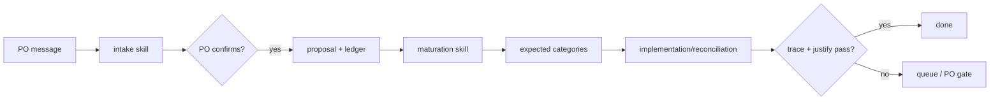

# RS-R0b — Operational & Enforcement Architecture

## 1. Storage engine & stack

Recommendation: **structured JSON graph store + append-only JSONL ledger + generated Markdown/CSV views**.

| Option | Human edit | Machine check | Diffability | Low-token query | Automation cost | Decision |
|---|---|---|---|---|---|---|
| Markdown-only | good preview, weak structure | weak | mixed | weak | low | reject; repeats superseded FP-RC weakness. |
| SQLite graph-as-tables | good query, poorer PR review | strong | weak | strong | medium/high | defer; useful later if scale demands it. |
| JSON/YAML node files | fair with generated views | strong | strong | strong | medium | choose JSON, not YAML, for deterministic parsing. |
| Hybrid JSON + generated views | good preview via generated docs; strong canonical store | strong | strong | strong | medium | **recommended**. |

Canonical paths RS-R1 should build:

| Concern | Path |
|---|---|
| Graph nodes | `docs/product/requirements/graph/nodes/*.json` |
| Trace links | `docs/product/requirements/graph/trace-links/*.json` |
| Append-only ledger | `docs/product/requirements/graph/ledger/decision-ledger.jsonl` |
| Staged proposals | `docs/product/requirements/graph/proposals/*.json` |
| Generated human views | `docs/product/requirements/graph/views/*.md` and `*.csv` |
| Generated low-token slices | `docs/product/requirements/graph/generated/*.json` |
| Tooling | `scripts/requirements/*.ts` exposed through `npm run req:*` |

Storage rules:

- The graph store is canonical; generated views are disposable.
- Nodes are one JSON object per durable ID to keep diffs reviewable.
- TraceLinks are first-class JSON objects, not path strings inside requirements.
- Ledger is append-only JSONL; no old line is edited.
- `src/**` is never a requirements source of truth; it is reconciled as manifestation evidence.

## 2. Command-name table

These are the exact command names later sprints build and use.

| Command | Owning sprint | Purpose |
|---|---|---|
| `npm run req:validate` | RS-R1 | Validate schema, lifecycle, relationships, progressive fields, locks, coverage, exemptions. |
| `npm run req:propose -- --type <kind> --from <source>` | RS-R2 | Create staged proposal records; no canonical mutation. |
| `npm run req:apply-after-signoff -- --proposal <id> --signoff <ledger-id>` | RS-R2 | Apply a PO-signed proposal and append ledger evidence. |
| `npm run req:generate-views` | RS-R2 | Regenerate human Markdown/CSV views and low-token slices from canonical graph. |
| `npm run req:query -- --by-id <id>` | RS-R2 | Return a narrow graph slice for one node. |
| `npm run req:query -- --scope <scope>` | RS-R2 | Return a narrow queue/scope slice. |
| `npm run req:query -- --feature <slug>` | RS-R2 | Return feature-centered graph context. |
| `npm run req:query -- --layer <layer>` | RS-R2 | Return one chain layer. |
| `npm run req:trace -- --from <intent-or-requirement-id>` | RS-R2 | Top-down traversal from intent/requirement to evidence and gaps. |
| `npm run req:justify -- --manifestation <manifestation-id-or-path>` | RS-R2 | Bottom-up traversal from manifestation to intent or exemption. |
| `npm run req:reconcile -- --mode inventory` | RS-R3 | Inventory meaningful manifestations from code-index + targeted source reads. |
| `npm run req:reconcile -- --mode changed -- --files <paths>` | RS-R3 | Check changed manifestations before "done". |
| `npm run req:refresh-code-index` | RS-R3 | Wrapper around `npm run generate:code-index` with stale-state logging. |
| `npm run req:completion-gate -- --changed <paths>` | RS-R3/RS-R4 | Run validate + changed reconciliation + trace/justify gate before sprint close. |
| `bash scripts/agent/sync-skills.sh` | RS-R4 | Sync canonical `agent-skills/` into `.claude/skills/` and `.agents/skills/`. |

Package scripts RS-R1 should add:

```json
{
  "req:validate": "node --experimental-strip-types scripts/requirements/validate.ts",
  "req:propose": "node --experimental-strip-types scripts/requirements/propose.ts",
  "req:apply-after-signoff": "node --experimental-strip-types scripts/requirements/apply-after-signoff.ts",
  "req:generate-views": "node --experimental-strip-types scripts/requirements/generate-views.ts",
  "req:query": "node --experimental-strip-types scripts/requirements/query.ts",
  "req:trace": "node --experimental-strip-types scripts/requirements/trace.ts",
  "req:justify": "node --experimental-strip-types scripts/requirements/justify.ts",
  "req:reconcile": "node --experimental-strip-types scripts/requirements/reconcile.ts",
  "req:refresh-code-index": "npm run generate:code-index",
  "req:completion-gate": "node --experimental-strip-types scripts/requirements/completion-gate.ts"
}
```

## 3. Validator catalog table

| Validator | What it checks | Error class | Owner |
|---|---|---|---|
| `schema-valid` | JSON object shapes, required base fields, unknown fields. | blocking | RS-R1 |
| `id-format-unique` | Prefix format and unique durable IDs. | blocking | RS-R1 |
| `scope-taxonomy` | Scope is one of product/frontend/backend/devops/test-qa/data/security/operations/governance/agent-workflow. | blocking | RS-R1 |
| `state-dimensions-valid` | Governance, maturity, delivery states are valid and independent. | blocking | RS-R1 |
| `progressive-fields` | Required fields per maturity state; draft can pass with intent-only fields. | blocking | RS-R1 |
| `state-combination-policy` | Disallows impossible governance/maturity combinations; allows documented orthogonal delivery combinations. | blocking | RS-R1 |
| `relationship-integrity` | No dangling refs, invalid relationship types, cycles where forbidden, or double-supersede. | blocking | RS-R1 |
| `derivation-integrity` | Technical/test requirements derive from product/governed technical source or exemption. | blocking | RS-R1 |
| `lock-enforcement` | Locked nodes mutate only by supersession proposal + ledger sign-off. | blocking | RS-R1/RS-R2 |
| `provenance-required` | Required source/actor/confidence fields exist for proposed, inferred, and code-discovered data. | blocking | RS-R1 |
| `confidence-scale` | Confidence is numeric `0.00..1.00`; thresholds compare numerically. | blocking | RS-R1 |
| `expected-category-canonical` | Responsibility type uses canonical expected category set or explicit override. | blocking | RS-R1 |
| `coverage-rollup` | TraceLink coverage aggregates deterministically into delivery/verification state. | blocking | RS-R1/RS-R3 |
| `exemption-validity` | Every exemption has category, reason, owner, date, and review status. | blocking | RS-R1 |
| `evidence-binding` | Evidence points to specific `AC-` acceptance outcomes, not only a requirement. | blocking | RS-R1/RS-R8 |
| `stale-evidence` | Changed manifestations mark linked evidence stale unless a reason preserves validity. | blocking | RS-R3/RS-R8 |
| `queue-generation` | Missing links, partials, stale traces, and pending confirmations appear in generated queues. | warning/blocking by queue | RS-R2/RS-R3 |
| `self-trace-required` | Requirements-system artifacts are traced to the locked self-governance requirement. | blocking after RS-R9 | RS-R9 |

RS-R0a refinement F1: coverage rollup rule:

| TraceLink coverage set for required expected categories | Delivery/verification rollup |
|---|---|
| all `complete`; evidence not required yet | `implemented` |
| all `complete` and all acceptance outcomes have valid evidence | `verified` |
| one or more `partial`; none missing | `partially-implemented` |
| any required category `missing`; work planned | `planned` or `in-progress` depending on linked sprint state |
| any linked evidence `stale` or `invalidated` | delivery may remain `implemented`, verification becomes `blocked` or recheck-required queue |
| all uncovered categories have valid `exempt` links | implemented if remaining required categories complete; exemption queue visible |

RS-R0a refinement F2: confidence representation is numeric:

- `0.00..0.39` low: never auto-apply; queue.
- `0.40..0.79` medium: queue with suggested mapping.
- `0.80..0.94` high: may auto-apply technical TraceLinks only if no product truth changes.
- `0.95..1.00` confirmed: only after PO, explicit sign-off, or direct deterministic identity match.

RS-R0a refinement F3: state-matrix policy:

- Governance, maturity, and delivery are stored independently.
- Validators permit unusual combinations only when an `OpenQuestion`, `Exemption`, or ledger reason explains them.
- Product truth normally follows the progressive governance/maturity path, but delivery remains fully independent.
- Example: `approved + intent-captured` is valid only with `needs-maturation` queue; `locked + intent-captured` is invalid unless imported historical truth is temporarily locked with a migration exception.

RS-R0a refinement F4: expected categories are canonical per responsibility type. Overrides require a ledger reason.

## 4. Mutation / sign-off workflow

Workflow:

1. Agent/skill runs `npm run req:propose`.
2. Proposal lands in `docs/product/requirements/graph/proposals/<proposal-id>.json`.
3. Validators run in proposal mode.
4. Human view is generated with `npm run req:generate-views`.
5. PO signs or rejects the proposal.
6. Signed proposal gets a `LDG-` ledger entry with actor, date, reason, source, affected IDs, and sign-off text.
7. `npm run req:apply-after-signoff` applies the mutation to canonical node/link files.
8. Generated views refresh.

Mutation rules:

- No command mutates locked canonical truth without a sign-off ledger ref.
- Supersession creates a new node or new versioned record and a `supersedes` TraceLink; it does not silently edit the old truth.
- Product truth changes always require PO sign-off.
- High-confidence technical TraceLinks may auto-apply only if they do not change product truth and write an audit ledger entry.
- Rejections remain in proposals or ledger as evidence, not deletion.

Supersession ledger minimum:

`id, event_type, actor, date, source, suppressed_node, replacement_node, reason, signoff_by, signoff_text, affected_links`

## 5. Reconciliation engine design

The reconciliation engine reuses existing infrastructure:

- `npm run generate:code-index`
- `code-index/components.json`
- `code-index/component-usages.json`
- `code-index/text-labels.json`
- `code-index/unresolved.json`
- `bash scripts/agent/code-query.sh`

Why no new indexer now:

- Existing indexer already extracts components, usages, labels, unresolved imports, and reverse dependency-style affected files.
- Existing `code-query.sh` provides low-token focused slices.
- RS-R3 can add graph-specific interpretation on top of these outputs without duplicating TS parsing.
- Any insufficiency must be documented by RS-R3 with a missing-signal table before new indexing is added.

Inventory pass:

1. Refresh index if stale: `npm run req:refresh-code-index`.
2. Use code-index files and targeted `code-query.sh` calls to list candidate manifestations.
3. Classify manifestation kind, semantic owner, current path, and smallest meaningful boundary.
4. Create `MAN-` candidates with confidence, evidence, and reason.
5. Compare to existing graph links and generated queues.

Candidate mapping signals:

| Signal | Use |
|---|---|
| component/function names | semantic match to requirement family/responsibility |
| imports/usages | dependency and affected-surface inference |
| text labels | UI requirement and acceptance outcome clues |
| tests | verification candidate links |
| plans/logs | provenance and implementation context |
| existing graph links | dedupe and stale/moved detection |
| changed files | pre-done reconciliation scope |

Change-triggered pre-done check asks:

- Which requirement or responsibility does this changed manifestation serve?
- Is an existing TraceLink still valid?
- Is this a new candidate requirement?
- Is it valid exempt technical work?
- Did it alter expected coverage?
- Did it make evidence stale or invalidated?
- Does bottom-up justification succeed?

Auto-apply rule:

- Only TraceLinks between technical nodes and technical manifestations.
- Confidence >= `0.80`.
- No product truth mutation.
- No conflict, supersession, or stale evidence ambiguity.
- Ledger event written with evidence and reason.

Everything else enters review queues.

## 6. Queues & views + low-token query/trace/justify

Queues are generated views over the graph:

| Queue | Query condition |
|---|---|
| Needs classification | draft/proposed nodes without scope/type or chain layer. |
| Needs decomposition | approved/locked requirements lacking responsibilities or expected categories. |
| Missing manifestation | required expected category has no complete TraceLink or exemption. |
| Partial implementation | one or more expected categories partially covered. |
| Implemented unverified | delivery implemented but acceptance outcomes lack valid evidence. |
| Manifestation lacking requirement | `MAN-` node has no implementing/supporting link and no exemption. |
| Candidate link awaiting confirmation | confidence < 0.80 or product-truth impact. |
| Stale/broken trace | manifestation moved/deleted/replaced or evidence stale. |
| Superseded still in code | superseded requirement has live manifestation links. |
| Test disconnected | test manifestation has no `verifies` TraceLink to active acceptance outcomes. |
| Exemption review | exemption lacks review or has expired review date. |

Human views:

- `views/requirements-by-scope.md`
- `views/coverage-queues.md`
- `views/trace-matrix.csv`
- `views/decision-ledger.md`
- `views/po-signoff-dashboard.md`

Low-token query outputs:

- Must fit one narrow task.
- Must include node IDs, states, responsibilities, expected categories, current links, open queues, and exact source refs.
- Must not dump the whole graph.

Examples:

```bash
npm run req:query -- --by-id REQ-FCS-002
npm run req:query -- --scope frontend
npm run req:trace -- --from INT-FOCUS-CONTROL
npm run req:justify -- --manifestation MAN-react-component-focus-island
```

## 7. Bidirectional answerability as a gate

Completion gate behavior:

1. `npm run req:validate`
2. `npm run req:reconcile -- --mode changed -- --files <changed-files>`
3. `npm run req:justify -- --manifestation <each-new-or-changed-manifestation>`
4. `npm run req:trace -- --from <affected-requirements>`
5. Fail if any meaningful manifestation lacks approved requirement/responsibility or valid exemption.
6. Fail if a locked requirement loses required expected-category coverage.
7. Fail if evidence becomes stale and no recheck queue/evidence update is recorded.

The gate is a completion blocker, not a report. It can return:

- `PASS`
- `PASS_WITH_QUEUED_REVIEW` for non-blocking ambiguity that has a queue record and no product-truth mutation
- `BLOCKED` for missing justification, illegal locked mutation, stale evidence without queue, or failed validators

## 8. Skills + agent-rule + hooks/gates wiring blueprint + mandatory Requirement Trace format

Skills:

| Skill | Status | Purpose |
|---|---|---|
| `dcx-requirement-intake` | new in RS-R4 | Typed PO message -> candidate requirement -> contradiction/impact -> PO confirm -> proposal. |
| `dcx-requirement-maturation` | new in RS-R4 | Advance nodes through maturity with validators and required fields. |
| `dcx-manifestation-reconcile` | new in RS-R4 | Wrap changed-file reconciliation and completion-gate questions. |
| `dcx-sprint-planner` | existing; update in RS-R4 | Require graph grounding and Requirement Trace in plans. |
| `dcx-plan-audit` | existing; update in RS-R4 | Fail ungrounded plans/outputs and unverifiable trace claims. |
| `dcx-sprint-close` | existing; update in RS-R4 | Include `req:completion-gate` in sprint close. |
| `dcx-code-query` | existing | Reused by reconciliation and low-token code discovery. |

Rule wiring:

- `AGENTS.md` routes requirements work to the graph and skills.
- `core.md` mandates graph-ID grounding, sign-off-before-mutation, validate/reconcile-before-done, and no silent unlinked manifestations.
- PostToolUse/log hooks continue indexing logs; requirements hooks add completion-gate checks.

Mandatory Requirement Trace format:

```markdown
## Requirement Trace

| Field | Value |
|---|---|
| Graph IDs | INT-..., REQ-..., BHV-..., AC-..., RSP-..., EMC-..., MAN-..., TRC-..., EVD-... |
| Scope/type | product/frontend/backend/devops/test-qa/data/security/operations/governance/agent-workflow |
| States | governance=..., maturity=..., delivery=... |
| Source/lock | source path + ledger/signoff ref + locked/superseded status |
| Acceptance outcomes | AC-... list |
| Responsibilities | RSP-... list |
| Expected manifestations | EMC-... list |
| Actual manifestations | MAN-... current paths/functions/selectors/scripts/skills/rules/hooks/tests |
| Evidence | EVD-... or queued evidence need |
| Impact/dependencies | depends-on/conflicts/supersedes/supports |
| Coverage | complete/partial/missing/stale/invalidated/exempt |
| Gate result | req:validate + trace/justify/completion-gate result |
```

Before RS-R4 enforcement, RS-R0a/R0b outputs cite graph design IDs and sample IDs. After RS-R4, planner/audit fail missing sections.

## 9. Self-governance design

Locked source requirement:

`REQ-GOV-TRACE-001`: Every meaningful product or system manifestation must trace to approved product intent or be classified as governed exempt technical work.

Derived requirements:

| Node | Scope | Requirement |
|---|---|---|
| `REQ-GOV-TRACE-001-PROD` | product | PO-visible requirements remain authoritative, queryable, and sign-off governed. |
| `REQ-GOV-TRACE-001-FE` | frontend | UI behaviors and generated views cite graph IDs and evidence. |
| `REQ-GOV-TRACE-001-BE` | backend/data | Graph store, schemas, and ledger preserve truth and provenance. |
| `REQ-GOV-TRACE-001-DEVOPS` | devops | Completion gates run validation and reconciliation before done. |
| `REQ-GOV-TRACE-001-TQA` | test-qa | Evidence binds tests/manual proof to acceptance outcomes. |
| `REQ-GOV-TRACE-001-GOV` | governance | Locked records mutate only by signed supersession. |
| `REQ-GOV-TRACE-001-AGENT` | agent-workflow | Skills and agent rules enforce intake/maturation/reconciliation. |

The system traces itself: schemas, validators, scripts, skills, rules, generated views, hooks, tests, and output evidence become `MAN-` nodes during RS-R9 dogfood.

## 10. Behavior-Sustaining Map

| Behavior | Authoritative data | Process | Mandate | Mechanical check | Generated context | Human gate | Failure surfacing | Test & audit | Cross-agent survival | Skill distribution |
|---|---|---|---|---|---|---|---|---|---|---|
| Intake | graph proposals + ledger | `dcx-requirement-intake` | core/AGENTS intake rule | proposal validation | candidate slice | PO confirms product truth | duplicate/conflict queue | intake fixture | skill + rule | RS-R4 sync |
| Maturation | graph nodes | `dcx-requirement-maturation` | progressive validation rule | `progressive-fields` | node state slice | PO for lock | needs-maturation queue | validator tests | generated views | RS-R4 sync |
| Mutation/sign-off | proposals + ledger | propose/apply workflow | sign-off-before-write | lock validator | proposal diff | PO signoff | rejected/stale proposals | ledger tests | append-only ledger | existing scripts |
| Validation | graph store | `req:validate` | sprint close rule | validator suite | error slice | none unless product truth | validation errors | unit tests | npm scripts | n/a |
| Reconciliation | graph + code-index | `dcx-manifestation-reconcile` | reconcile-before-done | `req:completion-gate` | changed-file slice | PO for ambiguous product links | review queue | reconciliation fixtures | command + skill | RS-R4 sync |
| Queues/views | generated views | `req:generate-views/query` | low-token context rule | queue-generation validator | queue slices | PO reviews queues | queue dashboards | snapshot tests | generated files | n/a |
| Verification evidence | Evidence nodes | evidence workflow | implemented != verified rule | evidence-binding/stale-evidence | AC evidence slice | PO/manual when needed | stale evidence queue | test/evidence audit | graph IDs | n/a |
| Grounding in plans | Requirement Trace | planner/audit skills | graph-ID grounding rule | planner/audit failure tests | trace template | PO for plans | missing trace failure | skill smoke tests | skills + AGENTS | RS-R4 sync |
| Self-governance | `REQ-GOV-TRACE-001` chain | RS-R9 dogfood | self-trace rule | self-trace validator | self-chain slice | PO RS-R9 signoff | untraced-system queue | output audit | graph itself | RS-R4 sync |

Per-phase skills x automation x PO-gate view:

| Phase | Skill/process | Automated tier | PO gate |
|---|---|---|---|
| Plain-English intake | `dcx-requirement-intake` | candidate extraction, duplicate/conflict scan, impact draft | confirm product truth |
| Maturation | `dcx-requirement-maturation` | required-field validation, queue generation | lock/approve |
| Implementation planning | `dcx-sprint-planner` | Requirement Trace required | approve plan activation |
| Code change close | `dcx-manifestation-reconcile` + `dcx-sprint-close` | changed-file reconcile, trace/justify, validate | only ambiguous/product truth |
| Initial reconciliation | `req:reconcile --mode inventory` | inventory and technical candidate links | confirm ambiguous batches |
| Dogfood | RS-R9 process | self-chain generation/validation | sign off first batch |



## 11. Disposition/archive policy and migration strategy

Disposition policy for RS-R10:

- No legacy requirement file is deleted directly.
- Each file gets a disposition row: keep, merge, supersede, archive.
- PO approves file-by-file.
- Archived files move under `docs/archive/` with an index that points to the graph replacement.
- `core.md §32` is not archival policy; it remains evidence/screenshot path policy.

Migration strategy:

1. RS-R5 inventories sources with a deterministic manifest and classifies content into chain layers.
2. RS-R6 creates proposals for seed graph data.
3. PO/product-source defaults can become approved/locked only through migration ledger entries.
4. RS-R6 applies signed seed data and generates views.
5. RS-R7 runs initial code reconciliation against the populated graph.
6. RS-R8 binds verification evidence.
7. RS-R9 dogfoods session decisions and self-trace.

## 12. Concrete sample records

Intent:

```json
{"id":"INT-FOCUS-CONTROL","type":"Intent","statement":"Users need focus controls without losing the full campaign picture.","source":"decision-register D-02","governance":"approved","maturity":"intent-captured","delivery":"not-assessed"}
```

Requirement:

```json
{"id":"REQ-FCS-002","type":"Requirement","scope":"product","aliases":["FCS-002","D-02-refined"],"statement":"Focus Isolation Mode hides non-selected cards only as an explicit opt-in visual mode; no data is deleted.","governance":"locked","maturity":"behavior-defined","delivery":"not-started","source":"docs/plans/on-hold/frontend-polish-v0.3.5/output/decision-register.md"}
```

BehaviorRule:

```json
{"id":"BHV-FCS-002-OPT-IN","type":"BehaviorRule","rule":"Isolation is off by default; enabling it hides non-matching cards visually only.","governance":"locked","maturity":"behavior-defined","delivery":"not-started"}
```

AcceptanceOutcome:

```json
{"id":"AC-FCS-002-NO-DATA-DELETE","type":"AcceptanceOutcome","statement":"Toggling isolation never removes or persists card data.","governance":"locked","maturity":"behavior-defined","delivery":"not-started"}
```

SystemResponsibility:

```json
{"id":"RSP-FOCUS-VISIBILITY-FILTER","type":"SystemResponsibility","responsibility_type":"interaction","statement":"Apply transient visibility filtering while preserving canonical builder data."}
```

ExpectedManifestationCategory:

```json
{"id":"EMC-FCS-002-FRONTEND-CONTROL","type":"ExpectedManifestationCategory","responsibility":"RSP-FOCUS-VISIBILITY-FILTER","category":"component + state selector + test"}
```

Manifestation:

```json
{"id":"MAN-react-component-focus-island","type":"Manifestation","kind":"react-component","semantic_owner":"focus-island","current_paths":["src/builder/islands/FocusIsland"],"lifecycle":"created"}
```

TraceLink complete/partial/candidate examples:

```json
{"id":"TRC-FCS002-RSP","type":"TraceLink","source":"REQ-FCS-002","target":"RSP-FOCUS-VISIBILITY-FILTER","relationship_type":"decomposes-into","coverage":"complete","confidence":1.0}
```

```json
{"id":"TRC-FCS002-MAN-PARTIAL","type":"TraceLink","source":"RSP-FOCUS-VISIBILITY-FILTER","target":"MAN-react-component-focus-island","relationship_type":"partially-implements","coverage":"partial","confidence":0.72,"needs_confirmation":true}
```

Exemption:

```json
{"id":"EXM-BUILD-GENERATED-VIEWS","type":"Exemption","category":"generated-code","reason":"Generated graph views are derived artifacts, not product behavior.","owner":"RS-R2","review_status":"pending-review"}
```

Evidence:

```json
{"id":"EVD-FCS002-NO-DATA-DELETE-TEST","type":"Evidence","acceptance_outcome":"AC-FCS-002-NO-DATA-DELETE","kind":"test","status":"planned","validity":"missing"}
```

Locked + superseded example:

```json
{"id":"REQ-FCS-002-OLD-HIDE","type":"Requirement","statement":"Focus hides non-matching cards by default.","governance":"superseded","maturity":"behavior-defined","delivery":"deprecated","superseded_by":"REQ-FCS-002"}
```

Ledger:

```json
{"id":"LDG-2026-06-29-D02","type":"DecisionLedgerEntry","event_type":"supersession","suppressed_node":"REQ-FCS-002-OLD-HIDE","replacement_node":"REQ-FCS-002","reason":"PO refined D-02: highlight default plus opt-in isolation.","signoff_by":"PO"}
```

OpenQuestion:

```json
{"id":"QST-FCS-002-ANIMATION","type":"OpenQuestion","question":"Should isolation transition use reduced-motion fade or instant hide?","owner":"RS-R8 evidence if not decided earlier"}
```

Generated plan-output Requirement Trace example:

```markdown
## Requirement Trace
Graph IDs: INT-FOCUS-CONTROL, REQ-FCS-002, BHV-FCS-002-OPT-IN, AC-FCS-002-NO-DATA-DELETE, RSP-FOCUS-VISIBILITY-FILTER, EMC-FCS-002-FRONTEND-CONTROL
States: governance=locked, maturity=behavior-defined, delivery=not-started
Coverage: partial; MAN-react-component-focus-island candidate requires confirmation
Gate result: req:validate PASS; req:justify BLOCKED until implementation exists
```

Low-token examples:

```json
{"query":"req:trace --from INT-FOCUS-CONTROL","result":{"requirements":["REQ-FCS-002"],"missing":["EVD-FCS002-NO-DATA-DELETE-TEST"],"queues":["partial-implementation"]}}
```

```json
{"query":"req:justify --manifestation MAN-react-component-focus-island","result":{"candidate_requirements":["REQ-FCS-002"],"confidence":0.72,"action":"queue-confirmation"}}
```

## 13. Worked end-to-end examples

D-02 / FCS-002 supersession:

1. RS-R5 inventories `D-02` and CSV `FCS-002`.
2. RS-R6 proposes `REQ-FCS-002` plus `REQ-FCS-002-OLD-HIDE` as superseded.
3. PO signs `LDG-2026-06-29-D02`.
4. `apply-after-signoff` locks the refined product requirement.
5. RS-R7 finds any old hide-by-default manifestations and queues them as superseded-still-in-code.

Plain-English intake:

1. PO says: "Users should be asked before a plain English request becomes a feature."
2. `core.md §33` classifies it as a candidate requirement.
3. `dcx-requirement-intake` creates proposal `REQ-GOV-INTAKE-CONFIRM`.
4. It checks duplicates/conflicts against existing graph.
5. It derives responsibilities: proposal UI/process, contradiction check, impact check, sign-off ledger.
6. It creates expected categories: skill, validator, generated queue, planner/audit rule.
7. PO confirms; proposal becomes locked product/governance truth.

Changed code reconciliation:

1. Agent edits a new validator file.
2. Before done, `req:completion-gate -- --changed scripts/requirements/validate.ts` runs.
3. Reconcile sees a new meaningful manifestation.
4. `justify` links it to `REQ-GOV-TRACE-001` / validator responsibility or asks for exemption.
5. If missing, close is blocked; if ambiguous, review queue is created.

## 14. PO sign-off checklist

PO sign-off covers RS-R0a + RS-R0b methodology. Build sprints RS-R1+ and inventory sprint RS-R5 remain blocked until this is checked.

- [x] Approve storage recommendation: JSON graph + JSONL ledger + generated views.
- [x] Approve command names in Section 2.
- [x] Approve validator catalog and Claude F1-F4 refinements.
- [x] Approve mutation/sign-off workflow.
- [x] Approve reconciliation design reusing code-index/code-query.
- [x] Approve queue/view/query design.
- [x] Approve mandatory Requirement Trace format.
- [x] Approve self-governance requirement `REQ-GOV-TRACE-001`.
- [x] Approve Behavior-Sustaining Map and per-phase skills/automation/PO-gate view.
- [x] Approve disposition/archive policy and migration strategy.
- [x] Approve concrete sample record shapes and worked examples.
- [x] Sign-off recorded by PO: **Mahmoud (PO)** — recorded by Claude at PO's explicit direction — date: **2026-06-29**

> **SIGNED OFF 2026-06-29.** RS-R0a + RS-R0b methodology approved. RS-R1 (build) and RS-R5 (inventory) are
> unblocked. This is the seed `LDG-` ledger entry — RS-R1/RS-R6 must persist it as the first append-only
> ledger record (`event_type: methodology-signoff`). See `output-review/RS-R0b-review.md`.
