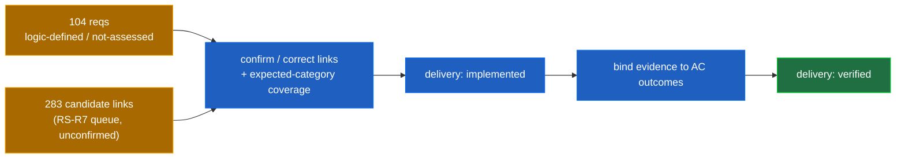

# RS-R11 — Frontend-Polish Re-Grounding Brief

## Requirement Trace (mandatory — `core.md §35a`, format `RS-R0b §8`)

| Field | Value |
|---|---|
| Graph IDs | `REQ-GOV-TRACE-001` (+ `-FRONTEND`), and the FP family set enumerated in §2 |
| Scope/type | governance / agent-workflow — hand-off brief that re-grounds FP-R4/R5 onto the graph |
| Source/lock | Plan README RS-R11 sprint; `core.md §24` on-hold boundary; PO direction 2026-06-30 |
| Acceptance outcome | FP-R4 (after PO reactivation) starts from real graph coverage, cites graph IDs only, carries the mandatory Requirement Trace |
| Responsibilities | agent-workflow (planning grounding) · verification (coverage/evidence states) |
| Evidence | This file; `req:trace`/`req:justify` outputs cited below; RS-R7 queues; RS-R8 verification model |

---

## §0. Purpose & boundary

This brief lets the PO reactivate `frontend-polish-v0.3.5` and redo **FP-R4 (finalize spec)** and
**FP-R5 (synthesis/matrix)** grounded in the product-intelligence graph instead of the old six-source
ID soup. **This sprint does not redo FP-R4/R5 and does not move the on-hold plan** — both would
violate `core.md §24`. It is read-only over `on-hold/` and writes nothing under `src/`.

The old FP-R4 spec (`on-hold/.../output/FP-R4-finalize-spec.md`) used legacy IDs
(`BLD-EDT-001`, `OD-004`, `BLD-CRD-INT-002`, family tags `wire-mockup-data`/`change-component`/
`change-token`). Those IDs survive in the graph as **provenance aliases**, not as the source of
truth. The mapping below replaces them with canonical `REQ-` graph IDs.

---

## §1. Headline coverage finding — FP-R4 does NOT start from a blank slate; it starts from ZERO *delivery-confirmed* coverage

> **Read "0" precisely:** it means **0 frontend requirements are delivery-confirmed as `implemented`
> or `verified`** — NOT "0 linked." The graph already holds 283 candidate `implements` links; they are
> provisional and must be confirmed/corrected, not trusted as proof. (Codex output-audit 2026-06-30.)

Measured from the graph on 2026-06-30:

| Signal | Value | Meaning for FP-R4 |
|---|---|---|
| Frontend-scope requirements | **104** (incl. 2 new — §3) | the FP-R4 universe is fully enumerated in the graph |
| Frontend reqs at `delivery: implemented` | **0** | nothing is confirmed built at requirement level |
| Frontend reqs at `delivery: verified` | **0** | nothing is proven |
| Governance of frontend reqs | **102 `approved` + 2 `proposed`** (`REQ-BC-025`, `REQ-DZ-001-RECOVERY`) | preserve the 2 proposed states — do not flatten to approved |
| Maturity / delivery (all 104) | `logic-defined` / `not-assessed` | defined, decomposable, **not yet assessed for coverage** |
| `implements` trace links in graph | **283** | candidate manifestation→requirement links already inferred (RS-R7) |
| Trace links with `needs_confirmation: true` | **688 / 898** | most links are **provisional** (skill-derived/code-discovered), not confirmed |
| Trace links `confirmed` / `po-decided` | **199 / 11** | the confirmed set is mostly seed structure, not code `implements` |
| Evidence nodes (verification) | **3** (RS-R8 seed) + **1** `verifies` link | verification layer is essentially empty |
| Unlinked canonical manifestations | **223 (RS-R7 queue count)** ≈ **185 direct frontend-scope** | code exists with no requirement link yet — counting boundary differs |

**Interpretation for FP-R4:** the graph already gives FP-R4 (a) the full requirement set, (b) a draft
behavior/responsibility/expected-manifestation chain per family, and (c) ~283 *candidate* code links
sitting in the RS-R7 review queue. What FP-R4 must produce is the **confirmation + evidence**:
confirm/correct candidate links → cover every expected manifestation category (→ `implemented`) →
bind evidence to acceptance outcomes (→ `verified`). It is a coverage-and-proof job, not a
rediscovery job.

---

## §2. The graph requirement IDs FP-R4 must cover (old FP-R4 area → canonical graph IDs)

All recovered families named in the RS-R11 sprint are present
(keyboard, SBC, STG, DZ, FCS-002, RDY-003, IFX, KBI). Top-down chains are retrievable via
`npm run req:trace -- --from <id>` (verified for `REQ-SBC-001`: returns
`AC-SBC-SEED → BHV-SBC-SEED → RSP-SBC-SEED → …`).

| Old FP-R4 area (criteria) | Legacy IDs (now aliases) | Canonical graph requirement IDs |
|---|---|---|
| §1.1 Editor open path (E01–E09) | BLD-EDT-001/002, OD-001 | `REQ-EVI-001` (Editor/Viewer Island), `REQ-EFP-001` (embedded preview) |
| §1.2 Card interactions (C01–C11) | BLD-CRD-INT-002/004/006, OD-004/009 | `REQ-SBC-001..005`, `REQ-SBC-DUP-001`, `REQ-IFX-001` (feedback/highlight) |
| §1.3 Readiness display (R01–R05) | BLD-RED-001, OD-002 | `REQ-RDY-001`, `REQ-RDY-003` |
| §1.4 Kanban view (K01–K07) | kanban.md, stage.md | `REQ-STG-001..005`, `REQ-KBI-001` (creator palette), `REQ-TPL-001` (template popup) |
| §1.5 Timeline view (T01–T08) | timeline.md, BLD-VCX-001, BLD-MOT-001, OD-006 | `REQ-STG-002` (context-preserving switch), `REQ-VHB-001` (cross-view bridge / ViewContext), `REQ-IFX-001` (transition motion) |
| §1.6 Drag and drop (D01–D09) | BLD-CRD-INT-003, OD-003, drag-and-drop.md | `REQ-DZ-001` (typed dropzone engine), `REQ-DZ-001-RECOVERY`, `REQ-SBC-002` (per-card movement) |
| §1.7 SelectionIsland (S01–S07) | BLD-SLC-001/002, OD-008, TA-003 | `REQ-SBC-001` (selection), `REQ-SBC-DES-001` (deselect: Escape/empty-click) |
| §1.8 FocusIsland (F01–F06) | BLD-FOC-001, D-02 | `REQ-FCS-001` (filter engine), `REQ-FCS-002` (isolation — **highlight-only**, opt-in isolation rejected by PO, RS-R9 D-02) |
| §1.9 Theme / light-dark (L01–L08) | brand-ui-interpretation.md | brand-token contract (no `REQ-`); persistence → `REQ-UP-009` |
| §1.10 Reduced motion (M01–M05) | core.md §20, BLD-MOT-001, OD-006 | `REQ-IFX-001` + `core.md §20` (cross-cutting rule) |
| §1.11 Structural tokens (X01–X04) | D-12, brand contract | brand-token contract (no `REQ-`) — optional polish |
| Keyboard (recovered family) | KBI / keyboard | `REQ-KEY-001` (Ctrl+A), `-002` (Ctrl+C), `-003` (Ctrl+V), `-004` (Delete/Backspace), `-005` (Escape), `-006` (Ctrl+S), `-007` (guard while typing) |
| Copy/paste of selection | BLD card dup | `REQ-SBC-DUP-001` (card-level), `REQ-KEY-002/003` |
| Core-model alignments (RS-R9) | — | `REQ-FP-CMA-001..004` (version-readiness rollup, smart-expand, auto-centre, drag-pill creation) |
| FP decision corpus (RS-R9) | D-01..D-12 | `REQ-FP-D01..D12` |

> Theme (§1.9) and structural tokens (§1.11) remain **brand-token contract** work, not requirement
> nodes — FP-R5's `change-token` family. They are listed so FP-R4 doesn't mistake their absence from
> the `REQ-` set for a gap.

---

## §3. The two new requirements (added 2026-06-30, PO-signed) — carry into FP-R4

| Graph ID | Statement (summary) | Extends | State |
|---|---|---|---|
| `REQ-SBT-COPY-001` | **Subtask** copy & paste (duplicate subtask instances; distinct from card-level `REQ-SBC-DUP-001`) | §1.2 / keyboard | approved · logic-defined · not-assessed |
| `REQ-LOAD-SKEL-001` | **App-wide** React skeleton loading states (all surfaces, matches final layout, respects reduced-motion) | progressive load (cf. `REQ-VR-003`) + homepage/version surfaces | approved · logic-defined · not-assessed |

These have **no manifestation/coverage yet** and belong in FP-R4's coverage-gap map from the start.
`REQ-LOAD-SKEL-001` is app-wide, so it also touches the **homepage/version** surfaces FP-R4 had
parked on D-07 (now resolved per FP-R5 §"Decision register — CLOSED").

---

## §4. Coverage-gap map vs the old FP-R4 criteria

For each old FP-R4 area, "expected categories" come from the seeded `EMC-*` per family; "actual
coverage" and "verification" are read from the graph. Because every frontend requirement is
`not-assessed` / unverified with only candidate links, the gap is uniform — captured once here rather
than repeated per row (this is honest, not range-grouping: the per-requirement state is identical and
machine-checkable via `req:query --by-id`).

| Old FP-R4 area | Expected manifestation coverage | Actual (graph) | Verification | FP-R4 action |
|---|---|---|---|---|
| Editor (E) | EVI presentation + interaction + state | candidate links only, unconfirmed | none | confirm links → cover → bind evidence (E01–E09) |
| Cards (C) | SBC presentation/interaction/state/feedback | candidate links only | none | same; resolve duplicate MAN aliases (see §5) |
| Readiness (R) | RDY domain-logic + presentation | candidate links only | none | same; readiness comes via `useCardBehavior` (no UI compute) |
| Kanban (K) | STG/KBI interaction + presentation | candidate links only | none | same |
| Timeline (T) | STG/VHB interaction + state + motion | candidate links only | none | same |
| Drag (D) | DZ interaction + state | candidate links only | none | same — drop zones currently inert (FP-R0) |
| Selection (S) | SBC selection + SBC-DES deselect | candidate links only | none | same |
| Focus (F) | FCS interaction (highlight-only) | candidate links only | none | same — **isolation is highlight, not hide** |
| Theme (L) | brand tokens (no REQ) | n/a (token contract) | n/a | `change-token` family |
| Reduced motion (M) | IFX motion + §20 branches | candidate links only | none | same — `effects.registry.ts` lacks reduced branches |
| Subtask copy (NEW) | SBC/subtask interaction + state | **no link** | none | net-new coverage |
| Skeleton (NEW, app-wide) | loading presentation across surfaces | **no link** | none | net-new coverage incl. homepage/version |

**Bottom line for FP-R4:** start by draining the RS-R7 review/cleanup queues for each family
(confirm/correct/reject candidate links), then drive each requirement to `implemented` (expected-
category coverage) and `verified` (evidence bound to its `AC-*` outcome). `implemented ≠ verified`
(RS-R8) — both gates apply.

---

## §5. Calibration-debt cleanup convention (RS-R11.2 — durable hand-off)

The first-population graph (RS-R6 seed + RS-R7 reconciliation) **intentionally carries calibration
debt**, per the plan's **test/calibration operating mode** (README "Operating mode during rollout";
`output/RS-rollout-calibration-mode.md`). This debt is visible, auditable, reversible, and queued —
it must **not** block work, and it is cleared **opportunistically** by any agent that checks
requirements, not deferred to a dedicated sprint.

**Where the debt lives:**
- `docs/product/requirements/graph/views/rs-r7-deferred-cleanup-queue.md`
- `docs/product/requirements/graph/views/rs-r7-review-queue.md` (+ `generated/rs-r7-review-queue.json`)
- RS-R2 queue keys: `candidateLinksAwaitingConfirmation`, `manifestationsLackingRequirements`,
  `staleBrokenTraces`, `supersededStillInCode`, `exemptionsAwaitingReview`.

**Magnitude (2026-06-30):** 688/898 links `needs_confirmation`; ~238 active RS-R7 candidate links
across 54 manifestations; **223 unlinked manifestations (RS-R7 queue count; ≈185 direct frontend-scope)**;
121 duplicate MAN identities normalized to aliases. *Live example:* `req:justify --manifestation MAN-react-component-taskcard-taskcard`
returns a node at `governance: superseded / delivery: deprecated / lifecycle: replaced` — a normalized
duplicate alias FP-R4 should redirect or confirm when it touches the Task card.

**The convention — what an agent does whenever it checks requirements** (`req:query`/`trace`/`justify`/
`reconcile`/`dcx-code-query`):

| Finding | Action | Gate |
|---|---|---|
| Duplicate identity / alias | record in deferred-cleanup queue or `req:propose --type supersede-node` | **PO confirm** if it changes product truth |
| Unlinked manifestation (no link, no exemption) | propose a candidate link or a typed `Exemption` | **PO confirm** if it asserts product coverage |
| Weak / wrong / stale link | flag in `candidateLinksAwaitingConfirmation` / `staleBrokenTraces` | technical-only ≥0.80 auto-applies + audit ledger; else **PO** |
| Anything touching a locked/approved requirement | `req:propose` only — **never** silent edit | **PO sign-off required** (`core.md §35b`) |

**Hard boundary:** no inferred/provisional/confirmed link or coverage score ever authorizes a
`src/**` change (RS-R7 carry-forward). Cleanup mutates graph/trace/ledger data only — never product
code. Bulk cleanup is **not** done here; it happens opportunistically during FP work or a future
dedicated pass.

This convention is wired durably (not memory-dependent): an "Opportunistic cleanup" subsection in
`output/RS-rollout-calibration-mode.md`, and a pointer in the `dcx-manifestation-reconcile` and
`dcx-code-query` skills (re-synced via `sync-skills.sh`).

---

## §6. Hand-off contract (binding on the reactivated FP plan)

1. **FP-R4 redo cites graph IDs only** (§2/§3) — legacy `BLD-*`/`OD-*` IDs are provenance aliases, not
   the source of truth. Every FP-R4/R5 output carries the mandatory **Requirement Trace** (`core.md §35a`).
2. **FP-R4 starts from the §4 coverage-gap map**, not a blank slate: drain the RS-R7 queues per family,
   then drive `implemented` → `verified` with evidence bound to `AC-*` outcomes (`implemented ≠ verified`).
3. **The two new requirements (§3)** are in scope from the start, including the app-wide skeleton on the
   now-unblocked homepage/version surfaces.
4. **FP-R5 rebuilds its three-family matrix** (`change-token` / `change-component` / `wire-mockup-data`)
   on the graph-grounded FP-R4 — preserving the token-first execution order and the impeccable-only-for-
   `change-token` rule.
5. **Boundaries preserved:** `core.md §10` layout frozen, §17 popups anchored, §20 reduced-motion,
   §13 home/version isolation, §5 preserve-semantic boundaries, calibration-mode blockers (§5 above).

---

## §7. Downstream step (PO action — NOT done here)

Per `core.md §24/§34`, the **PO** moves `frontend-polish-v0.3.5` from `on-hold/` → `active/`. That
reactivated plan owns the FP-R4/R5 redo and the FP-R5 §"Recommended next steps" (reopen homepage/
version finalize specs, draft `frontend-polish-implementation-v0.3.x`, audit, then execute token-first).
RS-R11 does not perform or trigger this move.

---

## §8. Verification of this sprint (RS-R11 acceptance)

- (PO-verifiable) §2/§3 list the graph IDs FP-R4 must cover; §4 is the coverage-gap map using
  expected-vs-actual coverage + verification states. ✅
- (PO-verifiable) §5 documents the calibration-debt cleanup convention + queue locations + workflow +
  the no-`src`-authorization boundary; wired durably (RS-R11.2). ✅
- (code-verifiable) No writes under `on-hold/` or `src/` — see session log gate check. ✅
- States explicitly that PO reactivation is the downstream step (§7). ✅
